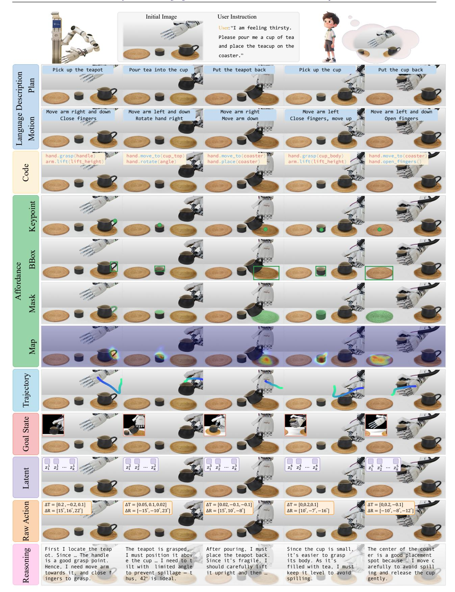
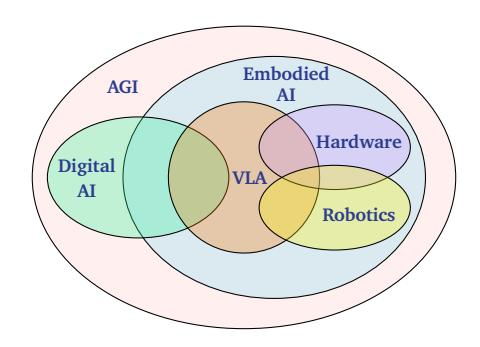

tags:: tier/D, survey, vla-foundation

# 01 — VLA Survey: Action Tokenization Perspective

**Year:** 2025 | **Venue:** arXiv | **Section:** S1 | **Tier:** D | **Status:** (s) skimmed
**Link:** https://arxiv.org/abs/2507.01925

---

## Content

### Problem
No unified framework exists for comparing how different VLA models represent and generate actions. Each paper defines its own action head, making cross-method comparison ad hoc.

### Taxonomy / Framework
Eight action-token types place every VLA variant on a common axis defined by how continuous actions are converted into learnable tokens:

1. **Language description** — actions as natural-language strings
2. **Code** — actions as program snippets
3. **Affordance** — actions as object-level interaction primitives
4. **Trajectory** — actions as parameterized paths
5. **Goal state** — actions implicit in a target observation
6. **Latent representation** — actions as learned embeddings
7. **Raw action** — direct continuous motor commands
8. **Reasoning** — actions mediated by chain-of-thought tokens

*Figure 2: Different VLA models encode the same vision + language input into diverse action tokens, each conveying a different form of actionable guidance.*

*Figure 4: VLA models sit at the intersection of digital AI, hardware, and robotics — a core Embodied AI subfield.*

### Coverage
_To fill on deep read — expected: rough counts per token type, year range, model list._

### Author-flagged gaps
- Taxonomy is **descriptive**; no empirical comparison of which tokenization strategy works best for which task type.
- **Tactile-grounded** action tokens are not covered in the framework.

---

## Connections

- **Complements:** #2 VLA Systematic Review, #63 VLA Real-World Applications Review
- **Taxonomy applies to:** #3 RT-2, #4 Diffusion Policy, #7 pi_0, #8 pi_0.5, #40 SurgVLM
- **Gap ties to:** #51 Forceful Robotic FMs (tactile), #54 TLA (first VLA+tactile exception)

---

## For My Work

- **Steal:** 8-token taxonomy as the organizing axis for any VLA-related related-work section
- **Critique:** descriptive-only — needs empirical validation per task class
- **Baseline?:** N/A (survey)
- **Gap-hook:** which tokenization best suits *surgical / tactile* tasks is unanswered — natural framing if your contribution extends the taxonomy to surgical embodiment

---

## Writing Assets

### Citation
`@zhong2025vla` — Zhong et al. (2025). *A Survey on VLA Models: An Action Tokenization Perspective*. arXiv:2507.01925.

### One-liner
> Zhong et al. [@zhong2025vla] propose a unifying framework for VLA models based on eight action-token types (language description, code, affordance, trajectory, goal state, latent representation, raw action, reasoning), providing a common axis for comparing otherwise heterogeneous architectures.

### Alternative framings
- **As taxonomy foundation:** "Following the action-tokenization taxonomy of [@zhong2025vla], VLA models partition by how they convert actions into learnable tokens."
- **As gap-motivation:** "Despite their unified framework [@zhong2025vla], no empirical comparison exists of which tokenization strategy best suits a given task class."
- **As surgical extension:** "The action-tokenization axis of [@zhong2025vla] does not yet admit a surgical-specific token type, leaving deformable-tissue manipulation unclassified."

### Quotable snippets
- _[add verbatim quotes on deep read]_
