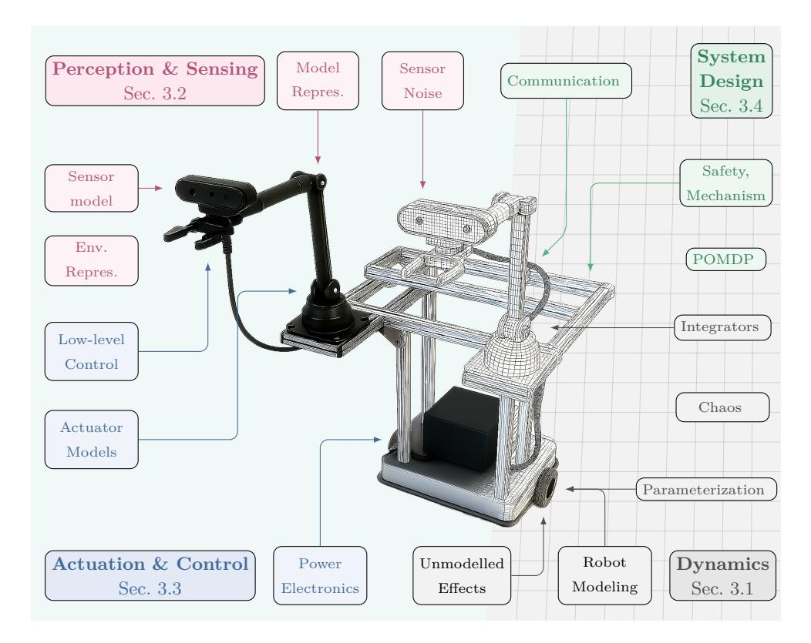
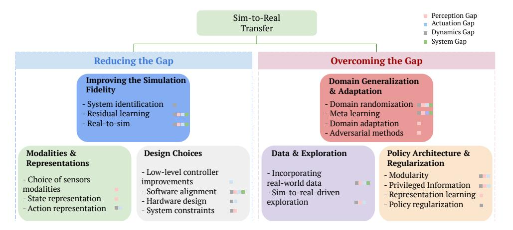

tags:: tier/D, survey, surgical-sim

# 22 — Reality Gap Survey

**Year:** 2025 | **Venue:** arXiv | **Section:** S3 | **Tier:** D | **Status:** (s) skimmed — promote to full deep read
**Link:** https://arxiv.org/abs/2510.20808

**Why deep read:** Sim-to-real is the biggest practical challenge for any surgical AI work. This survey gives you the recipe book and will shape Phase 3 (infrastructure) of your timeline.

> Initial skim notes migrated from `Literature Review.md` archive (2026-04-19). To deepen with technique detail on next pass.

---

## Prediction (before deep read)
_The 6-step recipe is a good procedural summary; deep read should surface which techniques dominate step 3 ("overcome the remaining gap") and how surgical-specific cases deviate._

## Problem
Gap between simulation training and real-world deployment due to sensor noise, dynamics mismatch, tissue mechanics, and tool-tissue interaction modeling.

## Key Insight
Sim-to-real is a **six-step recipe**, not a single technique — design → reduce → overcome → train → evaluate → adjust.

## Method / Sim-to-Real Recipe

1. **Design** a simulation that represents all variables relevant for the target application.
2. **Reduce** the different components of the reality gap as much as possible.
3. **Overcome** the remaining gap with training methods (e.g., domain randomization, domain adaptation).
4. **Train** policies in simulation (ideally under massive parallelization).
5. **Evaluate** policies in the target real-world environment.
6. **Adjust** simulation parameters based on real performance and retrain.

### Figures

## Taxonomy / Techniques
_To fill on deep read — expected: domain randomization, system identification, domain adaptation, real-world fine-tuning, grounded sim, etc._

>

## Key Findings / Numbers

>

## Limitations / Gaps the survey flags

>

## Connections

- Overlaps with: #23 Sim-to-Real RL Survey, #21 Digital Twins Survey
- Platforms that address it: #24 SurRoL, #25 ORBIT-Surgical, #27 SIM1
- Surgical case: #48 SRT-H (ex vivo), #49 Surgical Embodied Intelligence (live animal)
- World-model angle: #18 Cosmos-Surg-dVRK

## For my work

- **Steal:** 6-step recipe as Phase 3 checklist for infrastructure setup
- **Critique:** General-robotics focus; surgical-specific reality-gap components (tissue mechanics, bleeding) under-covered
- **Baseline?** N/A (survey)
- **Gap it opens:** Surgical-specific reality-gap components under-analyzed

---

## Writing-Ready Summary

### Citation
`@realitygap2025` — _Authors_ (2025). *The Reality Gap in Robotics: Challenges, Solutions, and Best Practices*. arXiv:2510.20808.

### One-liner (paper-ready)
> [@realitygap2025] formalize sim-to-real transfer as a six-stage pipeline — design, reduce, overcome, train, evaluate, adjust — providing the canonical recipe for bridging simulation and real-robot deployment.

### Alternative framings
- **As methodology template:** "Following the sim-to-real recipe of [@realitygap2025], we first design a simulator covering the task-relevant variables, then apply [technique] to overcome the remaining reality gap."
- **As surgical gap:** "While the general reality-gap taxonomy [@realitygap2025] covers sensor noise and dynamics mismatch, surgical-specific components — tissue mechanics, bleeding, deformation — remain under-analyzed."

### Gap / what's next (contribution hook)
- Surgical-specific reality-gap components absent
- No recipe for force-feedback transfer specifically
- Digital-twin vs policy-sim integration open

### Quotable snippets
- Six-step recipe (verbatim in Method section above)
- _[add more on deep read]_
