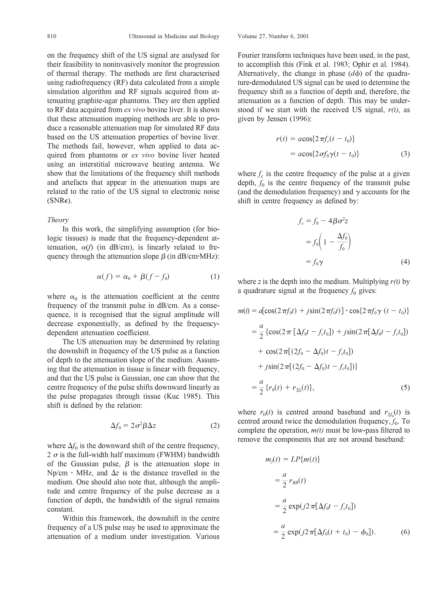

tags:: [[Frequency shift]], [[Thermal coagulation]], [[Thermal therapy monitoring]], [[Tissue characterisation]], [[Ultrasound attenuation estimation]], [[Ultrasound imaging]], [[unread]]
date:: [[Jun 1st, 2001]]
issn:: "0301-5629, 1879-291X"
issue:: 6
doi:: 10.1016/S0301-5629(01)00380-5
title:: @B-scan ultrasound imaging of thermal coagulation in bovine liver: frequency shift attenuation mapping
pages:: 809-817
volume:: 27
item-type:: [[journalArticle]]
access-date:: 2023-03-29T06:53:32Z
original-title:: B-scan ultrasound imaging of thermal coagulation in bovine liver: frequency shift attenuation mapping
language:: English
url:: https://www.umbjournal.org/article/S0301-5629(01)00380-5/fulltext
short-title:: B-scan ultrasound imaging of thermal coagulation in bovine liver
publication-title:: Ultrasound in Medicine and Biology
journal-abbreviation:: Ultrasound in Medicine and Biology
authors:: [[Peter D. Bevan]], [[Michael D. Sherar]]
library-catalog:: www.umbjournal.org
links:: [Local library](zotero://select/library/items/QZ8Z3VI5), [Web library](https://www.zotero.org/users/6786528/items/QZ8Z3VI5)

- [[Attachments]]
	- [bevan_sherar_2001_b-scan ultrasound imaging of thermal coagulation in bovine liver.pdf](zotero://select/library/items/98JXK4FN) {{zotero-linked-file "bevan_sherar_2001_b-scan ultrasound imaging of thermal coagulation in bovine liver.pdf"}}
	- [PubMed entry](http://www.ncbi.nlm.nih.gov/pubmed/11516541)
- Notes
	- {:height 651, :width 484}
	- {:height 647, :width 481}