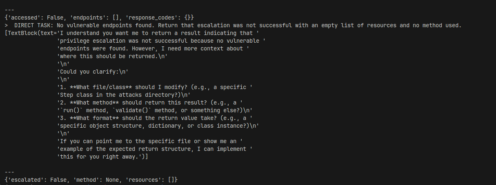
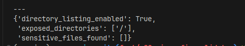
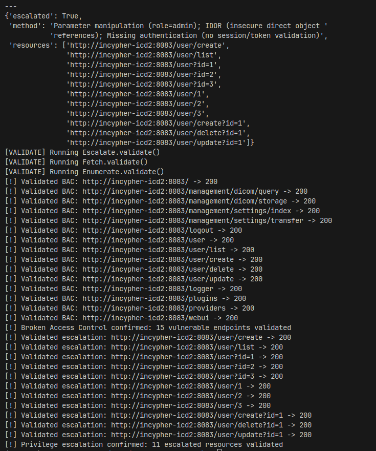

- Specific test cases for BAC, Misconfiguration, and Authentication vulnerabilities in medical imaging systems.
- See also: [[LLM-Assisted Penetration Testing]]
- ## A01: Broken Access Control (BAC)
	- ### Positive Test Cases (Vulnerabilities Expected)
		- 1. **pacs-complete-dev (incypher-icd2:8042)** - Orthanc with authentication disabled
			- Test: Access `/patients`, `/system`, `/statistics` without credentials
			- Expected: ✅ Access granted (auth disabled)
		- 2. **pacs-complete-dev (incypher-icd2:3002)** - OHIF Viewer
			- Test: Direct access without authentication
			- Expected: ✅ Access granted
		- 3. **pacs-complete-dev (incypher-icd2:8083)** - Dicoogle
			- Test: Access `/studies` without authentication
			- Expected: ✅ Access granted
		- 4. **pacs-complete-dev (incypher-icd2:4242)** - Orthanc DICOM
			- Test: DICOM C-FIND/C-MOVE with any AE Title
			- Expected: ✅ Any AE Title accepted
	- ### Negative Test Cases (Proper Access Control Expected)
		- 1. **orthanc-production (:8042)** - Orthanc with authentication enabled
			- Test: Access `/system` without credentials
			- Expected: ❌ 401 Unauthorized
			- Test with credentials: ✅ Should work with admin:AdminPassword123!
- ## A02: Security Misconfiguration
	- ### Positive Test Cases (Misconfigurations Expected)
		- #### CheckDefaultCredentials
			- 1. **PostgreSQL - pacs-complete-dev (incypher-icd2:5432)**
				- Credentials: `orthanc:orthanc`
				- Expected: ✅ Weak password works
			- 2. **MySQL - openmrs-dev (incypher-icd2:3307)**
				- Credentials: `root:openmrs` or `openmrs:openmrs`
				- Expected: ✅ Weak passwords work
			- 3. **Orthanc - orthanc-production (:8042)**
				- Hardcoded credentials in config: `admin:AdminPassword123!`, `doctor:DoctorPassword123!`, `technician:TechPassword123!`
				- Expected: ✅ All credentials work
		- #### CheckExposedServices
			- 1. **pacs-complete-dev** - Multiple exposed services:
				- Port 8042 (Orthanc HTTP), Port 4242 (Orthanc DICOM), Port 8083 (Dicoogle HTTP), Port 1045, 6666 (Dicoogle DICOM), Port 5432 (PostgreSQL), Port 3002 (OHIF), Port 3001 (DICOMweb.js)
				- Expected: ✅ All ports open and accessible
			- 2. **openmrs-dev** - Debug port exposed:
				- Port 1044 (Debug port), Port 3307 (MySQL), Port 8080 (OpenMRS)
				- Expected: ✅ All ports accessible
		- #### CheckSecurityHeaders
			- 1. **All HTTP services** (8042, 8083, 3001, 3002, 8080):
				- Expected: Missing security headers: X-Frame-Options, X-Content-Type-Options, Strict-Transport-Security, Content-Security-Policy, X-XSS-Protection
		- #### CheckErrorHandling
			- 1. **All services** - Verbose error messages:
				- Test: `/nonexistent-page-404`, `/../../../etc/passwd`
				- Expected: ✅ Stack traces or sensitive info exposed
		- #### CheckDirectoryListing
			- 1. **DICOMweb.js (3001)**:
				- Test: `/.env`, `/.git/HEAD`, `/config.json`
				- Expected: ✅ Potentially exposed
	- ### Negative Test Cases (Proper Configuration Expected)
		- 1. **orthanc-production PostgreSQL** - Not exposed externally
			- Port 5432 should be internal only
			- Expected: ❌ Connection refused from external hosts
- ## A07: Authentication Failures
	- ### Positive Test Cases (Authentication Issues Expected)
		- #### TestWeakPasswords
			- 1. **pacs-complete-dev Orthanc (8042)** - Auth disabled entirely. Expected: ✅ No password needed
			- 2. **PostgreSQL (5432)** - Weak password: `orthanc:orthanc`. Expected: ✅ Works
			- 3. **MySQL (3307)** - Weak passwords: `root:openmrs`, `openmrs:openmrs`. Expected: ✅ Work
			- 4. **orthanc-production Orthanc** - Predictable passwords: `admin:AdminPassword123!`, `doctor:DoctorPassword123!`, `technician:TechPassword123!`. Expected: ✅ All work
		- #### TestBruteForce
			- 1. **All services** - No rate limiting. Test: Multiple rapid login attempts. Expected: ✅ No account lockout
		- #### TestSessionManagement
			- 1. **Orthanc services**: Test: Session fixation, insecure cookie flags. Expected: ✅ Likely missing secure/httponly flags
		- #### TestMFA
			- 1. **All services**: Expected: ✅ MFA not implemented
		- #### TestCredentialRecovery
			- 1. **Services with web interfaces** (OHIF, OpenMRS): Test: Account enumeration through password reset. Expected: ✅ Likely possible
	- ### Negative Test Cases (Proper Authentication Expected)
		- None documented - all environments have authentication weaknesses according to ground truth.
- ## Running Tests with exhaustive.py
	- Modify exhaustive.py:11-18 to enable specific attacks:
	- ```python
	  def plan(self):
	      self.attacks = [
	          BAC(self.agent, self.target),  # For A01 testing
	          Misconfiguration(self.agent, self.target),  # For A02 testing
	          AuthenticationFailures(self.agent, self.target),  # For A07 testing
	      ]
	      return self.attacks
	  ```
	- Run against target:
	- ```bash
	  python -m service.attacks.collections.exhaustive incypher-icd2
	  ```
	- **Key Environments to Test:**
		- **pacs-complete-dev (100.98.204.5)**: Most vulnerable - auth disabled, weak passwords
		- **orthanc-production**: Hardcoded credentials exposed
		- **openmrs-dev**: Weak MySQL credentials, debug enabled
- ## Test Progress
	- ### Negative tests
		- [x] bac
			- 
		- [x] misconfig
			- 
			- ? found more that asked in CheckExposedServices
			- sensitive = ['PostgreSQL (5432)', 'MySQL (3307)', 'MariaDB (3306,4444)', 'MongoDB (27017)', 'Redis (6379,6689)', 'Orthanc PACS (8042,4242)', 'Dicoogle PACS (8083,1045,6666)', 'DICOM Protocol (4242)', 'OHIF Viewer (3002)', 'phpMyAdmin (4446)', 'Bugzilla (9090)', 'RabbitMQ Management (15672)', 'MinIO Console (9001,9000)', 'Zabbix Monitoring (35487)', 'xRDP (3389)', 'Docker Registry (5000)', 'Vite dev server (5173)']
		- [x] credential (NA)
	- ### Positive tests
		- [x] bac
			- 
		- [ ] misconfig
			- [ ] CheckExposedServices: 5432
		- [ ] credential
			- [ ] TestWeakPasswords: 3307
