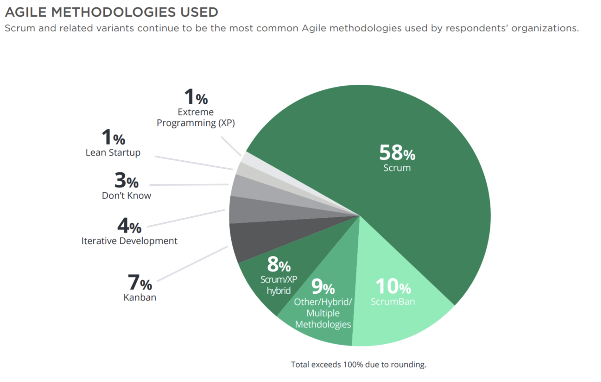

- Values
	- Individuals and interactions over processes and tools
	- Working software over comprehensive documentation
		- Document is created only when it's necessary
		- In research, the final report is necessary
	- Customer cooperation over contract negotiation
		- The third value in the manifesto tells us that we need to collaborate with the customers, to create great products.
	- Responding to change over following a plan
- {:height 303, :width 522}
- Framework
	- [[Real Scrum]]
	- XP Extreme Programming
	- Adaptive Software Development by Jim Highsmith
	- Crystal Clear by Alistair Cockburn
	- Feature Driven Development (FDD) by Jeff De Luca
	- ICONIX process by Doug Rosenberg
- Between teams
	- Scrum@Scale
		- https://www.scrumatscale.com/scrum-at-scale-guide/
- [[Jira Management Software]]