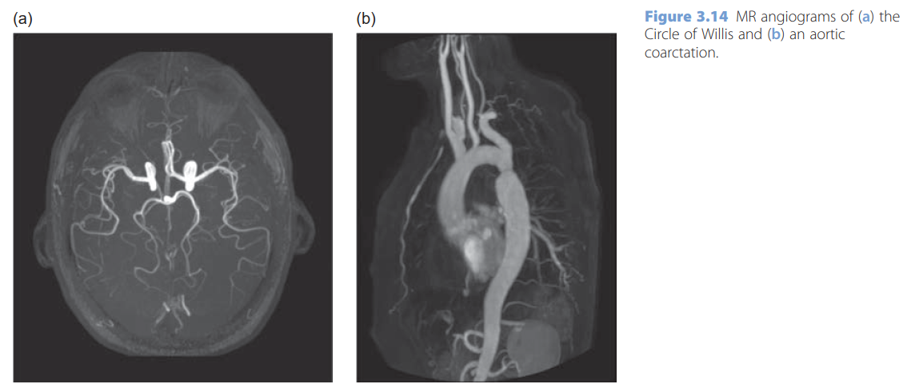

- We can exploit the high signal of flowing blood in MR Angiography (MRA) using a variety of techniques to suppress almost all the signal in static tissues. The three most important sequences are ‘time-of-flight MRA’ (also known as ‘in-flow MRA’), ‘phase-contrast MRA’, and ‘contrast-enhanced MRA’, which uses a very rapid imaging sequence during the injection of gadolinium.
- 