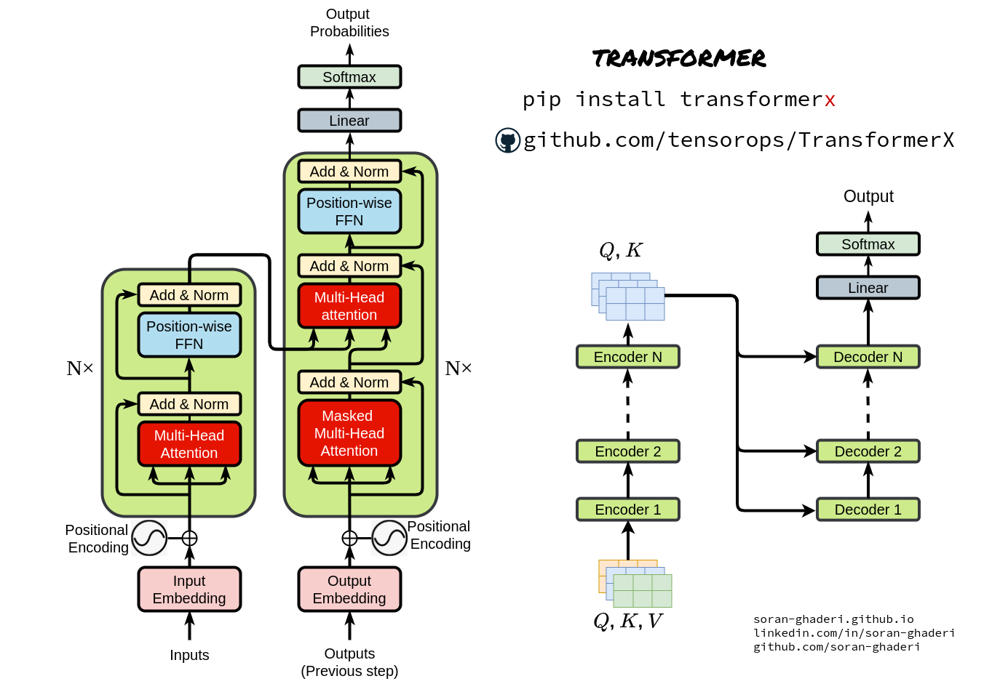

- {:height 541, :width 778}
- The core of the Transformer consists of the **encorder** and **decorder**.
- # Self-Attention
	- The key of the self-attention is the equation $$\text{Attention}(Q, K, V) = \text{softmax}\left(\frac{QK^T}{\sqrt{d_k}}\right)V$$
	- Q is query, a mapping of the word tha
- # Cross-Attention
- # Encorder
	- The **encorder** is a two-layer structure comprising a multi-head attention layer followed by a position-wise feed forward network. This structure is repeated N times with residual connections.
- # Decorder
	- The **decorder** shares a similar architecture but includes two additional layers: a linear projection and a softmax function.
		- In the **decorder**, two attention mechanisms are employed.
		- The first is masked self-attention, which embeds the output tokens and project them into high-dimensional space.
		- The second is cross-attention, which computes the relationship between the encorder's representation and the decorder's self-attention outputs.
- # Output word
	- The final two layers map the high dimensional representation back to the vocabulary space producing a probability distribution for next-token prediction.