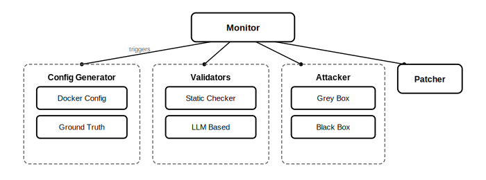
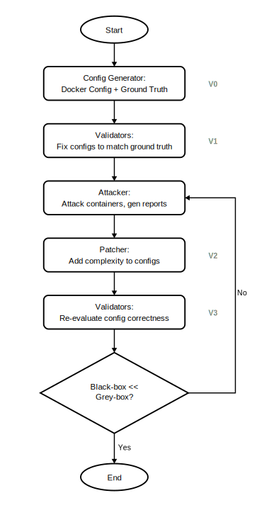
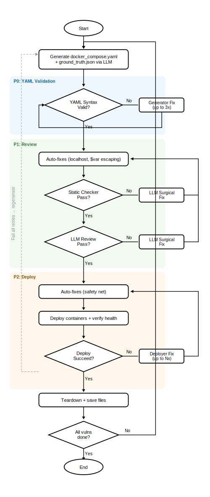
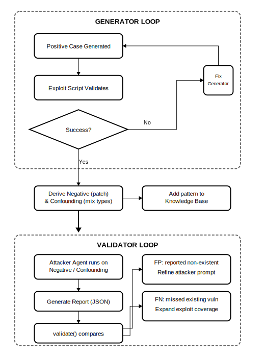

- System architecture for LLM-generated penetration testing benchmarks.
- See also: [[LLM-Assisted Penetration Testing]]
- ## Maybe
	- get a database of error from portswigger.net, HackTheBox and VulnHub
	- benchmark from OWASP benchmark
- ## Main Idea
	- Claude generates docker containers with vulnerabilities and ground truths, and code based scripts validates them.
	- This benchmark only covers OWASP Top 10 for now.
- ## System Architecture
	- 
	- The system consists of five main components:
		- **Monitor**: Central orchestrator that triggers and coordinates all components
		- **Config Generator**: Generates server configurations and ground truth data
			- **Docker Config**: Docker-based target environment for penetration testing
			- **Ground Truth**: Expected vulnerabilities and outcomes for validation
		- **Validators**: Compare attack results against ground truth to produce final reports
			- **Static Checker**: simple port or end point match
			- **LLM based**: complex logic check and fix
		- **Attacker**: attack each config, and generate vuln reports
			- **Grey box**: with config and json information (untrustable)
			- **Black box**: without any information related
		- **Patcher**: patch the configs given the vuln reports to increase the difficulties or complexities in some of the configs to increase the coverage of benchmark
	- ### Flow
		- Config generator, Validator, Attacker and Patcher are all triggered and controlled by Monitor
		- 1. Config Generator to sets up Server Deployment and Ground Truth (V0)
		- 2. Validators to try fixing the config files to match ground truth (V1)
		- 3. Attacker attacks the real docker containers and generate vuln reports
		- 4. Patcher adds more complexities in configs and ground truth given the vuln reports (V2)
		- 5. Validators evaluate fast again in the config and ground truth correctness (V3)
		- 6. iterate from Step 3 again, until Black-box attacker has way lower accuracy than Grey-box attacker
		- 
	- ### Config Generator Flow
		- 
		- The Config Generator produces test cases through a multi-phase process with two-level retry (outer: fresh generations, inner: fix attempts per phase):
		- 1. **Generate** `docker_compose.yaml` and `ground_truth.json` via LLM
		- 2. **YAML Validation** — parse compose syntax, auto-fix up to 3 times
		- 3. **Review** (up to N fix attempts per generation):
			- a. Auto-fixes: deterministic patches (localhost→127.0.0.1, variable escaping)
			- b. Static Checker: regex-based checks (heredocs, ports, healthchecks, port mismatches)
			- c. LLM Review: compose correctness + ground truth endpoint validation
			- d. If issues found → LLM surgical fix → re-review
		- 4. **Deploy** (up to N fix attempts per generation):
			- a. Auto-fixes (safety net — deployer fixes may re-introduce issues)
			- b. Deploy containers, verify health
			- c. If failed → deployer fix attempt → retry from (a)
		- 5. Tear down and proceed to next vulnerability
		- 6. If any phase fails all retries → regenerate from step 1
- ## Research Question
	- ### How to get a good tool?
		- A good pen-test agent should gain high accuracy over the benchmarks.
	- ### How to have a good benchmark?
		- A good benchmark should have accurate ground truth and cover different cases.
	- ### How to get a good ground truth?
		- Ground truth is consisted of three types, positive, negative and confounding.
		- Details check in [[Pentest Ground Truth Methodology]]
	- ### How to cover different cases?
		- Build a OWASP Top 10 knowledge base that has explicit categories of each vulnerability. It contains:
		- Category of each vulnerability
		- Pattern of each category
- ## How to Address the RQs?
	- 
	- Ground Truth Derivation
		- **Positive**: LLM generates vuln config → exploit script succeeds
		- **Negative**: Patch positive (apply exact fix) → same exploit fails
		- **Confounding**: Inject different vuln type → wrong exploit fails, correct succeeds
	- Key Principles
		- **Accuracy > Coverage**: Positive cases may have extra vulns; claimed vuln must exist
		- **Patch-derived negatives**: Verifiable positive/negative pairs
		- **Pure code exploits**: Deterministic validation, no LLM in validation path
		- **Generator improves from exploit failures, Attacker improves from validation mismatches**
