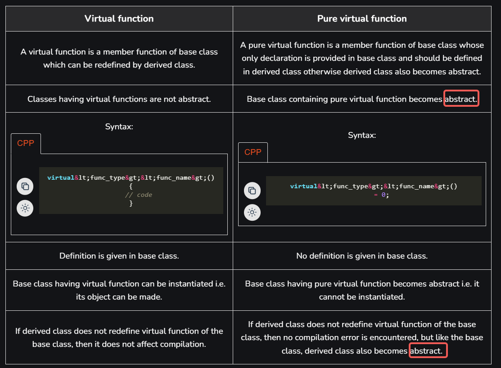

- [cppiceberg](https://fouronnes.github.io/cppiceberg/)
- [abseil / C++ Quickstart With CMake](https://abseil.io/docs/cpp/quickstart-cmake.html)
- [Boost C++ Libraries](https://www.boost.org/)
- ## Constructor
	- [The rule of three/five/zero - cppreference.com](https://en.cppreference.com/w/cpp/language/rule_of_three)
	- delete operator
	- assign operator
- ## Destructor
	- [Destructors, C++ FAQ (isocpp.org)](https://isocpp.org/wiki/faq/dtors)
	- [Destructors - cppreference.com](https://en.cppreference.com/w/cpp/language/destructor)
	- virtual destructor in derived class
	  id:: 66911c62-c3e6-45c2-92b3-b4a9ce4addda
	  collapsed:: true
		- [When to Use Virtual Destructors in C++? - GeeksforGeeks](https://www.geeksforgeeks.org/when-to-use-virtual-destructors-in-cpp/)
		- **Output**
			- ```
			  base constructor
			  derived constructor
			  derived destructor
			  base destructor
			  ```
		- ```C++
		  #include <iostream> 
		  using namespace std; 
		    
		  // Base class 
		  class Base { 
		  public: 
		      // Base class constructor 
		      Base() { cout << "base constructor" << endl; } 
		    
		      // Base class destructor 
		      virtual ~Base() { cout << "base destructor" << endl; }  // must virtual
		  }; 
		    
		  // Derived class which is publicly inheriting the Base class 
		  class Derived : public Base { 
		  public: 
		      int* ptr; 
		      // Derived class constructor 
		      Derived() 
		      { 
		          ptr = new int[10]; 
		          cout << "derived constructor" << endl; 
		      } 
		    
		      // Derived class destructor 
		      ~Derived() 
		      { 
		          delete ptr; 
		          cout << "derived destructor" << endl; 
		      } 
		  }; 
		    
		  int main() 
		  { 
		      // Creating a new Derived object and assigning its 
		      // address to a Base class pointer 
		      Base* ptr = (Base*)new Derived(); 
		    
		      // Deleting the created object through the Base class 
		      // pointer. As the Base class destructor is not virtual, 
		      // it will not call the Derived class destructor. This 
		      // can lead to resource leak if the Derived class was 
		      // holding any resources 
		      delete ptr; 
		    
		      return 0; 
		  }
		  ```
		-
- ## Enum
	- [Enum Classes in C++ and Their Advantage over Enum DataType - GeeksforGeeks](https://www.geeksforgeeks.org/enum-classes-in-c-and-their-advantage-over-enum-datatype/)
	- [Enum vs Enum Class in C++ · Suneet Agrawal (agrawalsuneet.github.io)](https://agrawalsuneet.github.io/blogs/enum-vs-enum-class-in-c++/)
	- Enum just int inside
	  collapsed:: true
		- ```C++
		  #include <iostream>
		  
		  enum Day {
		      Sunday,     // 0
		      Monday,     // 1
		      Tuesday,    // 2
		      Wednesday,  // 3
		      Thursday,   // 4
		      Friday,     // 5
		      Saturday    // 6
		  };
		  
		  int main() {
		      Day today = Monday;
		      int dayValue = today; // Enum value directly used as an integer.
		      
		      std::cout << dayValue << std::endl; // Prints 1
		      return 0;
		  }
		  ```
	- Enum Class is safer
	  collapsed:: true
		- ```C++
		  #include <iostream>
		  
		  enum class Color {
		      Red,
		      Green,
		      Blue
		  };
		  
		  int main() {
		      Color myColor = Color::Red; // Enum value is scoped.
		      int Green = 42;             // No naming conflict.
		      
		      std::cout << static_cast<int>(myColor) << std::endl; // Prints 0 (Red)
		      return 0;
		  }
		  
		  #include <iostream>
		  
		  enum Color {
		      Red,
		      Green,
		      Blue
		  };
		  
		  int main() {
		      Color myColor = Red;
		      int myInt = 1;
		  
		      if (myColor == myInt) {
		          std::cout << "Colors match!" << std::endl; // Compiles, but unexpected behavior.
		      }
		  
		      return 0;
		  }
		  ```
		-
- ## Pointer
	- [Pointer vs Reference Tutorial](https://www.geeksforgeeks.org/different-ways-to-use-const-with-reference-to-a-pointer-in-c/)
	- shared pointer
		- [shared_ptr in C++ - GeeksforGeeks](https://www.geeksforgeeks.org/shared_ptr-in-cpp/)
- ## td library
  collapsed:: true
	- [std::variant](https://en.cppreference.com/w/cpp/utility/variant)
	- [std::visit](https://en.cppreference.com/w/cpp/utility/variant/visit)
- ## Template
  collapsed:: true
	- In class / struct / function
		- ```C++
		  template <typename T>
		  struct Range
		  {
		      T min;
		      T max;
		      Range(T min = 0, T max = 0) :
		          min(min),
		          max(max)
		      {
		      }
		      bool operator==(const Range<T>& range) const
		      {
		          return (this->min == range.min && this->max == range.max);
		      }
		      template <typename T2>
		      bool operator==(const Range<T2>& range) const
		      {
		          return (this->min == range.min && this->max == range.max);
		      }
		  };
		  ```
		-
- ## Polymorphism and Inheritance
	- [Abstract Classes And Pure Virtual Functions](https://www.youtube.com/watch?v=wE0_F4LpGVc)
	- ### Virtuality
		- [Virtuality (gotw.ca)](http://www.gotw.ca/publications/mill18.htm)
		- #### virtual function
		  collapsed:: true
			- More see [virtual function specifier - cppreference.com](https://en.cppreference.com/w/cpp/language/virtual)
			- They are always defined in the base class and overridden in a derived class.
			- They are mainly used to achieve [Runtime polymorphism](https://www.geeksforgeeks.org/polymorphism-in-c/).
			- A class may have a [virtual destructor](https://www.geeksforgeeks.org/virtual-destructor/) but it cannot have a virtual constructor.
			- ```C++
			  struct Base
			  {
			      virtual void f()
			      {
			          std::cout << "base\n";
			      }
			  };
			   
			  struct Derived : Base
			  {
			      void f() override // 'override' is optional
			      {
			          std::cout << "derived\n";
			      }
			  };
			   
			  int main()
			  {
			      Base b;
			      Derived d;
			   
			      // virtual function call through reference
			      Base& br = b; // the type of br is Base&
			      Base& dr = d; // the type of dr is Base& as well
			      br.f(); // prints "base"
			      dr.f(); // prints "derived"
			   
			      // virtual function call through pointer
			      Base* bp = &b; // the type of bp is Base*
			      Base* dp = &d; // the type of dp is Base* as well
			      bp->f(); // prints "base"
			      dp->f(); // prints "derived"
			   
			      // non-virtual function call
			      br.Base::f(); // prints "base"
			      dr.Base::f(); // prints "base"
			  }
			  ```
		- pure virtual function
			- child class
			- {:height 424, :width 567}
		- Abstract class
			- A class that *contains* a pure virtual function is known as an abstract class.
			- child class
		- Override
			- [Abstract class - cppreference.com](https://en.cppreference.com/w/cpp/language/abstract_class)
		- ((66911c62-c3e6-45c2-92b3-b4a9ce4addda))
- ## Explicit
  id:: 668cd6b9-7368-48c8-b610-13c4fe6cd7ab
  collapsed:: true
	- To prevent auto implicit conversion
		- implicit conversion
		  collapsed:: true
			- ```c++
			  int x = 5;
			  double y = x;  // Implicit conversion from int to double
			  
			  int a = 10;
			  double b = 3.14;
			  double result = a + b;  // Implicit conversion of 'a' to double before addition
			  ```
		- explicit conversion
		  collapsed:: true
			- ```c++
			  double x = 3.14;
			  int y = (int)x;  // C-style cast
			  
			  double x = 3.14;
			  int y = static_cast<int>(x);  // Static cast (recommended for most cases)
			  
			  Base* basePtr = new Derived();
			  Derived* derivedPtr = dynamic_cast<Derived*>(basePtr); // Dynamic cast (for polymorphic types):
			  
			  const int x = 5;
			  int* ptr = const_cast<int*>(&x); // Const cast (to add or remove const qualifier)
			  
			  int* ptr = new int(42);
			  long addr = reinterpret_cast<long>(ptr); // Reinterpret cast (for low-level reinterpretation of bit patterns)
			  ```
		- ```c++
		  class MyString {
		  public:
		      explicit MyString(int size) { /* ... */ }
		      MyString(const char* str) { /* ... */ }
		  };
		  
		  void printString(const MyString& s) { /* ... */ }
		  
		  int main() {
		      printString(10);  // Compile error: no implicit conversion allowed
		      printString("Hello");  // Still OK
		      printString(MyString(10));  // OK, explicit conversion
		  }
		  ```
	- Inheritance explicit
		- ```c++
		       B
		      / \
		     A   C
		      \ /
		       D
		       
		  class C : public B {
		  public:
		      explicit C(/* some parameters */) {
		          // Constructor implementation
		      }
		      // ...
		  };
		  
		  class D : public C {
		  public:
		      D(const A& a) : C(/* necessary arguments */) {
		          // Constructor implementation
		      }
		      // ...
		  };
		  ```
- ## Lambda
	- [Lambda expressions (since C++11) - cppreference.com](https://en.cppreference.com/w/cpp/language/lambda)
	- ```C++
	  auto glambda = [](auto a, auto&& b) { return a < b; };
	  ```
- ## Friend Class
- ## [[Singleton]]
- ## Covariance
	- [Covariance and contravariance in C++ – Arthur O'Dwyer – Stuff mostly about C++ (quuxplusone.github.io)](https://quuxplusone.github.io/blog/2019/01/20/covariance-and-contravariance/)
	- ```C++
	  struct Animal {
	      virtual void make_noise() = 0;
	      virtual ~Animal() = default;
	  };
	  
	  struct Cat : Animal {
	      void make_noise() override { puts("meow"); }
	  };
	  
	  struct Horse : Animal {
	      void make_noise() override { puts("neigh"); }
	      virtual void ride() { puts("okay sure"); }
	  };
	  
	  struct AnimalBreeder {
	      virtual Animal *produce() = 0;
	  };
	  
	  struct CatBreeder : AnimalBreeder {
	      Cat *produce() override { return new Cat; } // covariant return types.
	  };
	  
	  struct HorseBreeder : AnimalBreeder {
	      Horse *produce() override { return new Horse; } // covariant return types.
	  };
	  ```
- ## inline
	- [Inline Functions in C++ - GeeksforGeeks](https://www.geeksforgeeks.org/inline-functions-cpp/)
	- inline only a request to the compiler, not a command.
	- The compiler can ignore the request for inline.
	- **The compiler may not perform inlining in such circumstances as: **
		- If a function contains a loop. (*for, while and do-while*)
		- If a function contains static variables.
		- If a function is recursive.
		- If a function return type is other than void, and the return statement doesn’t exist in a function body.
		- If a function contains a switch or goto statement.
- [Liskov substitution principle - Wikipedia](https://en.wikipedia.org/wiki/Liskov_substitution_principle)