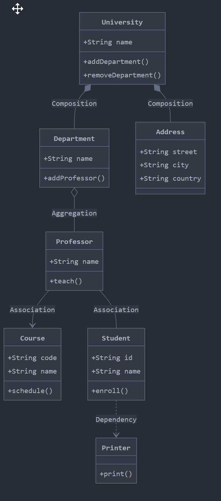

## [[Environment Set Up in Windows]]
- Code Review
	- Code Review in Short
	  id:: 65c2e6e1-32bc-4221-a821-aa644802806d
		- The code is well-designed.
		- The functionality is good for the users of the code.
		- Any UI changes are sensible and look good.
		- Any parallel programming is done safely.
		- The code isn’t more complex than it needs to be.
		- The developer isn’t implementing things they *might* need in the future but don’t know they need now.
		- Code has appropriate unit tests.
		- Tests are well-designed.
		- The developer used clear names for everything.
		- Comments are clear and useful, and mostly explain *why* instead of *what*.
		- Code is appropriately documented (generally in g3doc).
		- The code conforms to our style guides.
	- Comment guide
		- Be kind.
		- Explain your reasoning.
		- Balance giving explicit directions with just pointing out problems and letting the developer decide.
		- Encourage developers to simplify code or add code comments instead of just explaining the complexity to you.
	- Reference
		- [The Standard of Code Review | eng-practices (google.github.io)](https://google.github.io/eng-practices/review/reviewer/standard.html)
- # [[C++ Grammar]]
- C++ Guidelines
	- [C++ Core Guidelines (isocpp.github.io)](https://isocpp.github.io/CppCoreGuidelines/CppCoreGuidelines) #🙋🏻PICKME
		- [In: Introduction](https://isocpp.github.io/CppCoreGuidelines/CppCoreGuidelines#S-introduction) ✔️
		- [P: Philosophy](https://isocpp.github.io/CppCoreGuidelines/CppCoreGuidelines#S-philosophy)
		- [I: Interfaces](https://isocpp.github.io/CppCoreGuidelines/CppCoreGuidelines#S-interfaces)
		- [F: Functions](https://isocpp.github.io/CppCoreGuidelines/CppCoreGuidelines#S-functions)
		- [C: Classes and class hierarchies](https://isocpp.github.io/CppCoreGuidelines/CppCoreGuidelines#S-class)
		- [Enum: Enumerations](https://isocpp.github.io/CppCoreGuidelines/CppCoreGuidelines#S-enum)
		- [R: Resource management](https://isocpp.github.io/CppCoreGuidelines/CppCoreGuidelines#S-resource)
		- [ES: Expressions and statements](https://isocpp.github.io/CppCoreGuidelines/CppCoreGuidelines#S-expr)
		- [Per: Performance](https://isocpp.github.io/CppCoreGuidelines/CppCoreGuidelines#S-performance)
		- [CP: Concurrency and parallelism](https://isocpp.github.io/CppCoreGuidelines/CppCoreGuidelines#S-concurrency)
		- [E: Error handling](https://isocpp.github.io/CppCoreGuidelines/CppCoreGuidelines#S-errors)
		- [Con: Constants and immutability](https://isocpp.github.io/CppCoreGuidelines/CppCoreGuidelines#S-const)
		- [T: Templates and generic programming](https://isocpp.github.io/CppCoreGuidelines/CppCoreGuidelines#S-templates)
		- [CPL: C-style programming](https://isocpp.github.io/CppCoreGuidelines/CppCoreGuidelines#S-cpl)
		- [SF: Source files](https://isocpp.github.io/CppCoreGuidelines/CppCoreGuidelines#S-source)
		- [SL: The Standard Library](https://isocpp.github.io/CppCoreGuidelines/CppCoreGuidelines#sl-the-standard-library)
- ## Class UML
	- Association vs Composition vs Aggregation
		- {:height 676, :width 301}
		- **Composition** (strongest relationship) - When parent is destroyed, child also
			- ```
			  public class Foo {
			    private Bar bar = new Bar(); 
			  }
			  ```
		- **Aggregation** (has a relationship) - child exists indepently
			- ```
			  public class Foo { 
			    private Bar bar; 
			    Foo(Bar bar) { 
			       this.bar = bar; 
			    }
			  }
			  ```
		- **Association** (basic relationship) -  know each other but don't own each other. `Foo` uses `Bar`
			- ```
			  public class Foo {         
			    private Bar bar;
			  };
			  ```
			  NB: See [Fowler's definition](https://martinfowler.com/bliki/DependencyAndAssociation.html) - the key is that `Bar` is semantically related to `Foo` rather than just a dependency (like an `int` or `string`).
		- **Dependency** (weakest relationship) - uses another class temporarily
- # Threading
	-
- # C++ Unit Test
	- What is an unit test
		- Maintainable
		- Readable
		- Trustworthy
	- [[GoogleTest]]
	- [[Qt UnitTest]]
- # C++ code analysis
	- [Cppcheck - A tool for static C/C++ code analysis](https://cppcheck.sourceforge.io/)
	- [C/C++ Sanitizers | Microsoft Learn](https://learn.microsoft.com/en-us/cpp/sanitizers/?view=msvc-170)
- Reference
	- [c++ faq - The Definitive C++ Book Guide and List - Stack Overflow](https://stackoverflow.com/questions/388242/the-definitive-c-book-guide-and-list)