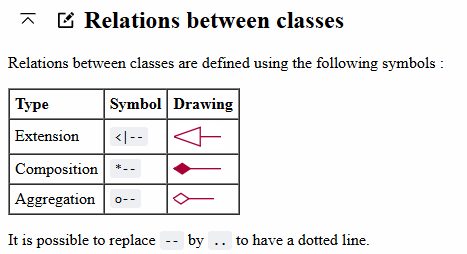

## [[Environment Set Up in Windows]]
- ## [[Code Review]]
- # [[C++ Grammar]]
  :LOGBOOK:
  CLOCK: [2024-07-15 Mon 14:06:52]--[2024-07-15 Mon 14:06:52] =>  00:00:00
  :END:
- ## Class UML
	- Association vs Composition vs Aggregation
		- 
		- **Association** - I have a relationship with an object. `Foo` uses `Bar`
			- ```
			  public class Foo {         
			    private Bar bar;
			  };
			  ```
			  NB: See [Fowler's definition](https://martinfowler.com/bliki/DependencyAndAssociation.html) - the key is that `Bar` is semantically related to `Foo` rather than just a dependency (like an `int` or `string`).
		- **Composition** - I own an object and I am responsible for its lifetime. When `Foo` dies, so does `Bar`
			- ```
			  public class Foo {
			    private Bar bar = new Bar(); 
			  }
			  ```
		- **Aggregation** - I have an object which I've borrowed from someone else. When `Foo` dies, `Bar` may live on.
			- ```
			  public class Foo { 
			    private Bar bar; 
			    Foo(Bar bar) { 
			       this.bar = bar; 
			    }
			  }
			  ```
- # Threading
	-
- # C++ Unit Test
	- What is an unit test
		- Maintainable
		- Readable
		- Trustworthy
	- [[GoogleTest]]
	- [[Qt UnitTest]]
- # C++ code analysis
	- [Cppcheck - A tool for static C/C++ code analysis](https://cppcheck.sourceforge.io/)
	- [C/C++ Sanitizers | Microsoft Learn](https://learn.microsoft.com/en-us/cpp/sanitizers/?view=msvc-170)
	-
- Reference
	- [c++ faq - The Definitive C++ Book Guide and List - Stack Overflow](https://stackoverflow.com/questions/388242/the-definitive-c-book-guide-and-list)