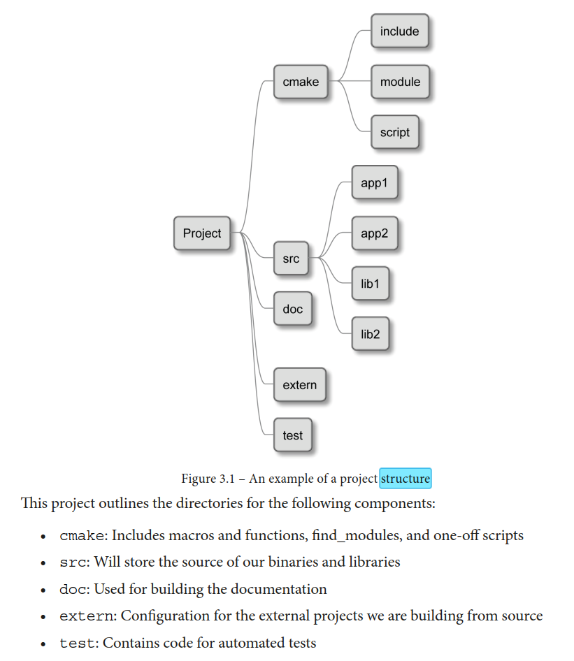

- References
	- * [An Introduction to Modern CMake · Modern CMake (cliutils.gitlab.io)](https://cliutils.gitlab.io/modern-cmake/)
	- ** [Effective Modern CMake (github.com)](https://gist.github.com/mbinna/c61dbb39bca0e4fb7d1f73b0d66a4fd1)
	- ** https://github.com/ttroy50/cmake-examples/tree/master/01-basic
	- *** https://codevion.github.io/#!cpp/cmake.md
- CMake Project Structure
	- {:height 559, :width 478}
- [[How to set up a library - CMake]]
- Move `*.dll` to build exe directory
	- ```CMake
	  # project EMTrackerDemo, library emtrackerlib
	  add_custom_command(TARGET EMTrackerDemo POST_BUILD
	          COMMAND ${CMAKE_COMMAND} -E copy_if_different
	          $<TARGET_FILE:emtrackerlib> $<TARGET_FILE_DIR:EMTrackerDemo>)
	  
	  # emtrackerlib CMakeLists.txt
	  cmake_minimum_required(VERSION 3.10)
	  
	  add_library(emtrackerlib SHARED IMPORTED GLOBAL)
	  
	  target_include_directories(emtrackerlib INTERFACE ${CMAKE_CURRENT_SOURCE_DIR}/include)
	  
	  if(CMAKE_SIZEOF_VOID_P EQUAL 8)
	      set_property(TARGET emtrackerlib PROPERTY IMPORTED_LOCATION ${CMAKE_CURRENT_SOURCE_DIR}/lib/ATC3DG64.dll)
	      set_property(TARGET emtrackerlib PROPERTY IMPORTED_IMPLIB ${CMAKE_CURRENT_SOURCE_DIR}/lib/ATC3DG64.lib)
	  else()
	      set_property(TARGET emtrackerlib PROPERTY IMPORTED_LOCATION ${CMAKE_CURRENT_SOURCE_DIR}/lib/ATC3DG.dll)
	      set_property(TARGET emtrackerlib PROPERTY IMPORTED_IMPLIB ${CMAKE_CURRENT_SOURCE_DIR}/lib/ATC3DG.lib)
	  endif()
	  ```
- How to set up #Qt
	- ```CMake
	  cmake_minimum_required(VERSION 3.12)
	  
	  set(CMAKE_CXX_STANDARD 17)
	  
	  set(LIBRARY_TARGET_NAME visualization)
	  
	  set(CMAKE_AUTOUIC ON)
	  set(CMAKE_AUTOMOC ON)
	  set(CMAKE_AUTORCC ON)
	  
	  find_package(Qt5 REQUIRED COMPONENTS Core Widgets Gui)
	  
	  set(${LIBRARY_TARGET_NAME}_HDR
	  )
	  set(${LIBRARY_TARGET_NAME}_SRC
	  )
	  
	  add_library(${LIBRARY_TARGET_NAME} STATIC ${${LIBRARY_TARGET_NAME}_HDR} ${${LIBRARY_TARGET_NAME}_SRC})
	  
	  set_target_properties(${LIBRARY_TARGET_NAME} PROPERTIES
	      PUBLIC_HEADER "${${LIBRARY_TARGET_NAME}_HDR}"
	  )
	  target_include_directories(${LIBRARY_TARGET_NAME} PUBLIC 
	  "$<BUILD_INTERFACE:${CMAKE_CURRENT_SOURCE_DIR}/include>"
	  )
	  
	  target_link_libraries(${LIBRARY_TARGET_NAME} 
	      Qt5::Core
	      Qt5::Widgets
	      Qt5::Gui
	  )
	  ```
- How to set up #VTK
	- ```CMake
	  cmake_minimum_required(VERSION 3.12)
	  
	  set(CMAKE_CXX_STANDARD 17)
	  
	  set(LIBRARY_TARGET_NAME visualization)
	  
	  find_package(VTK COMPONENTS 
	    vtkCommonColor
	    vtkCommonCore
	    vtkCommonDataModel
	    vtkFiltersCore
	    vtkFiltersGeometry
	    vtkFiltersModeling
	    vtkIOImage
	    vtkIOGeometry
	    vtkImagingCore
	    vtkInteractionImage
	    vtkInteractionStyle
	    vtkInteractionWidgets
	    vtkRenderingContextOpenGL2
	    vtkRenderingCore
	    vtkRenderingFreeType
	    vtkRenderingGL2PSOpenGL2
	    vtkRenderingOpenGL2
	  )
	  
	  set(${LIBRARY_TARGET_NAME}_HDR
	  )
	  set(${LIBRARY_TARGET_NAME}_SRC
	  )
	  
	  add_library(${LIBRARY_TARGET_NAME} STATIC ${${LIBRARY_TARGET_NAME}_HDR} ${${LIBRARY_TARGET_NAME}_SRC})
	  
	  set_target_properties(${LIBRARY_TARGET_NAME} PROPERTIES
	      PUBLIC_HEADER "${${LIBRARY_TARGET_NAME}_HDR}"
	  )
	  target_include_directories(${LIBRARY_TARGET_NAME} PUBLIC 
	  "$<BUILD_INTERFACE:${CMAKE_CURRENT_SOURCE_DIR}/include>"
	  )
	  
	  target_link_libraries(${LIBRARY_TARGET_NAME} 
	      ${VTK_LIBRARIES}
	  )
	  ```