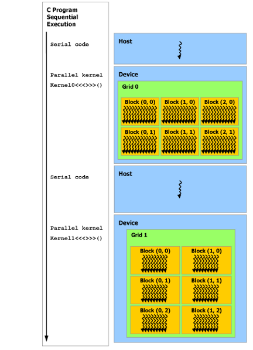

- [Official Guide](https://docs.nvidia.com/cuda/cuda-c-programming-guide/index.html)
- GPU Physical Structure
	- 
	- 
	- Kernels: CUDA C++ extends C++ by allowing the programmer to define C++ functions, called *kernels*
	- Thread:
	  
	- From program to GPU
	  
	- Compute Capability:
		- The *compute capability* of a device is represented by a version number, also sometimes called its “SM version”.
		- The compute capability comprises a major revision number *X* and a minor revision number *Y* and is denoted by *X.Y*.
		- Devices with the same major revision number are of the same core architecture. The major revision number is 9 for devices based on the *NVIDIA Hopper GPU* architecture, 8 for devices based on the *NVIDIA Ampere GPU* architecture, 7 for devices based on the *Volta* architecture, 6 for devices based on the *Pascal* architecture, 5 for devices based on the *Maxwell* architecture, and 3 for devices based on the *Kepler* architecture.
		- *Turing* is the architecture for devices of compute capability 7.5, and is an incremental update based on the *Volta* architecture.
	- Programming
		- The core language extensions have been introduced in [Programming Model](https://docs.nvidia.com/cuda/cuda-c-programming-guide/index.html#programming-model). They allow programmers to define a kernel as a C++ function and use some new syntax to specify the grid and block dimension each time the function is called. A complete description of all extensions can be found in [C++ Language Extensions](https://docs.nvidia.com/cuda/cuda-c-programming-guide/index.html#c-language-extensions). Any source file that contains some of these extensions must be compiled with nvcc as outlined in [Compilation with NVCC](https://docs.nvidia.com/cuda/cuda-c-programming-guide/index.html#compilation-with-nvcc).
	- Error
		- All runtime functions return an error code, but for an asynchronous function (see [Asynchronous Concurrent Execution](https://docs.nvidia.com/cuda/cuda-c-programming-guide/index.html#asynchronous-concurrent-execution)), this error code cannot possibly report any of the asynchronous errors that could occur on the device since the function returns before the device has completed the task; the error code only reports errors that occur on the host prior to executing the task, typically related to parameter validation; if an asynchronous error occurs, it will be reported by some subsequent unrelated runtime function call.
	- Performance Guidelines https://docs.nvidia.com/cuda/cuda-c-programming-guide/index.html#performance-guidelines