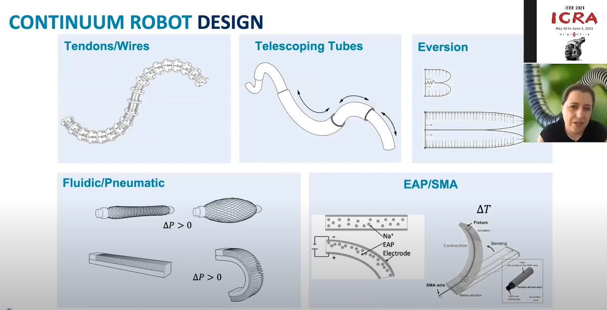
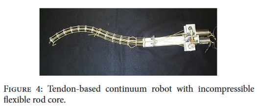

# Type [2](((6466b60f-985d-4768-b8b6-b90f8157b931)))
collapsed:: true
	- 
	- Tendon-Based
		- {:height 225, :width 525}
		- 
		- 
		- Parallel Tendon-driven Continuum Robot
			- 
	- Concentric Tube
		- 
	- Locally Actuated Backbone (closest to the biological continuum structures)
		- {:height 284, :width 331}
	- Long and thin continuum robot
		- 
		- 
		- 
- ## Tendon-based Continuum Robot Mechanism
  collapsed:: true
	- Differential mechanisms usually possess several typical structures, including the following
	  collapsed:: true
		- pulley-based forms
		- linkage-based forms
		- gear-based forms
		- fluidic T-pipe-based forms.
	- 
		- 
		  collapsed:: true
			- ((644b3087-59b3-4f05-92a4-be675781cd5f))
		- 
		  collapsed:: true
			- |Planar|Spatial|
			  |--|--|
			  |((64657079-2283-4330-a571-53e55b150a97))|((64656f6e-9f29-453d-b57d-e424244257d0))|
			  |((646570e9-5f66-4583-bea2-725734d351e2))|((64657004-a7b1-4723-9c05-e3316027c14d))|
- # Kinematics and Control
	- 
	- 
	- 
	- 
- # Application in Surgery [6](((646c2e44-a4f2-45b3-a585-0f458a7d491a)))
  collapsed:: true
	- Transnasal Surgery
	  
	- Keyhole neurosurgery
	  
	- Medusa endoport
	  
	- Continuum Robot in Medical Industry
		- 
		- 
		- 
		- 
- # Continuum Robot Actuators
  collapsed:: true
	- Series Elastic Actuators
		- {{video https://www.youtube.com/watch?v=gZLO2Am0Zk8}}
- # Continuum Robot Simulator
  collapsed:: true
	- #simulator
	- ANSYS
	- COMSOL Multiphysics
	- Abaqus
	- [[SOFA]]
	- Matlab
		- [Open CR Project](https://www.cs.toronto.edu/~jbk/opencontinuumrobotics/)
			- https://github.com/ContinuumRoboticsLab/CRVisToolkit
	- Gazebo
		- Useful links
			- https://github.com/aGotelli/A_Gazebo_Simulator_For_Continuum_Parallel_Robots
			- [A Gazebo Simulator For Continuum Parallel Robots: walk through and demonstration of the simulator](https://www.youtube.com/watch?v=6k5aZPOQjQ8)
			- https://www.frontiersin.org/articles/10.3389/frobt.2021.713083/full
		- [[ROS2 Foxy + Raspberry Pi + Macbook]]
- # Reference
	- [[@Continuum Differential Mechanisms and Their Applications in Gripper Designs]]
	- [Continuous Backbone “Continuum” Robot Manipulators](https://www.hindawi.com/journals/isrn/2013/726506/)
	  id:: 6466b60f-985d-4768-b8b6-b90f8157b931
	- [Snake Arm / Elephant’s Trunk experiment - YouTube](https://www.youtube.com/watch?v=EUEp-AfvvzE)
	- [Continuum robot arm progress. Yamamoto laboratory 2018 - YouTube](https://www.youtube.com/watch?v=iNtAn3t79fs)
	- [Frontiers | How to Model Tendon-Driven Continuum Robots and Benchmark Modelling Performance (frontiersin.org)](https://www.frontiersin.org/articles/10.3389/frobt.2020.630245/full)
	- ** [ICRA 2021 Keynote Talk -- Jessica Burgner-Kahrs: I, Continuum Robot - YouTube](https://www.youtube.com/watch?v=ayf9xWxGcBA&list=WL&index=5&t=134s)
	  id:: 646c2e44-a4f2-45b3-a585-0f458a7d491a
		- 