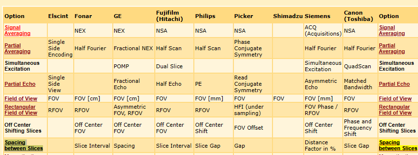
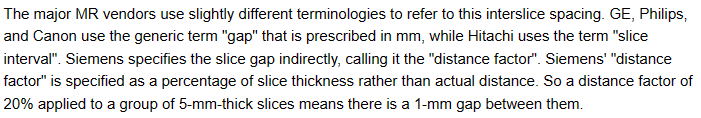
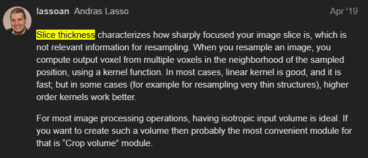
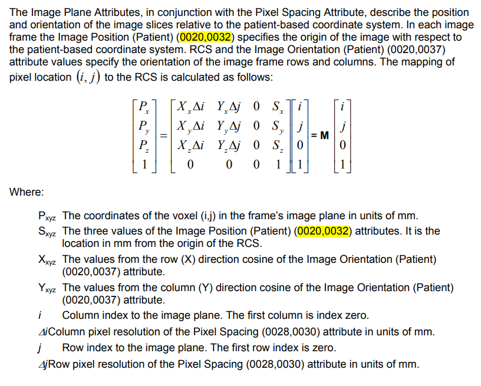
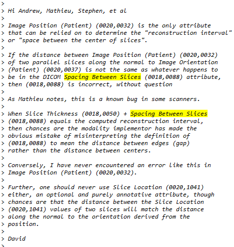

- The DICOM Homepage: [https://dicom.nema.org/](https://dicom.nema.org/)
- DICOM on wikipedia: [https://en.wikipedia.org/wiki/DICOM](https://en.wikipedia.org/wiki/DICOM)
- Clean and simple DICOM tag browser: [https://dicom.innolitics.com](https://dicom.innolitics.com/)
- A useful tag lookup site: [http://dicomlookup.com/](http://dicomlookup.com/)
- A hyperlinked version of the standard: [https://web.archive.org/web/20180624030937/http://dabsoft.ch/dicom/](https://web.archive.org/web/20180624030937/http://dabsoft.ch/dicom/)
- Tags
	- different vendors use the **same** dicom tags for addressing different things. For instance, the attribute Spacing Between Slices (0018, 0088) means two **different** things depending on the vendor
	  [MRI Acronyms - Options - MR-TIP.com](https://www.mr-tip.com/serv1.php?type=cam&sub=1)
	  
	- [Slice cross-talk - Questions and Answers ​in MRI (mriquestions.com)](https://mriquestions.com/cross-talk.html)
	  
	- Slice thickness
	  [Slice position and accuracy - Questions and Answers ​in MRI (mriquestions.com)](https://mriquestions.com/slice-parameters.html)
	  [CT Slice Thickness - Support - 3D Slicer Community](https://discourse.slicer.org/t/ct-slice-thickness/6460/2)
	  
	- Slice distance calculation [How to calculate space between dicom slices for MPR? - Stack Overflow](https://stackoverflow.com/questions/14930222/how-to-calculate-space-between-dicom-slices-for-mpr)
	  
	- should not use spacing between slices (0018,0088) and slice location (0020,1041)
	  [[Insight-users] Slice spacing of DICOM series (itk.org)](https://itk.org/pipermail/insight-users/2008-November/027903.html)
	  
- 
  
  
- 3D Reconstruction