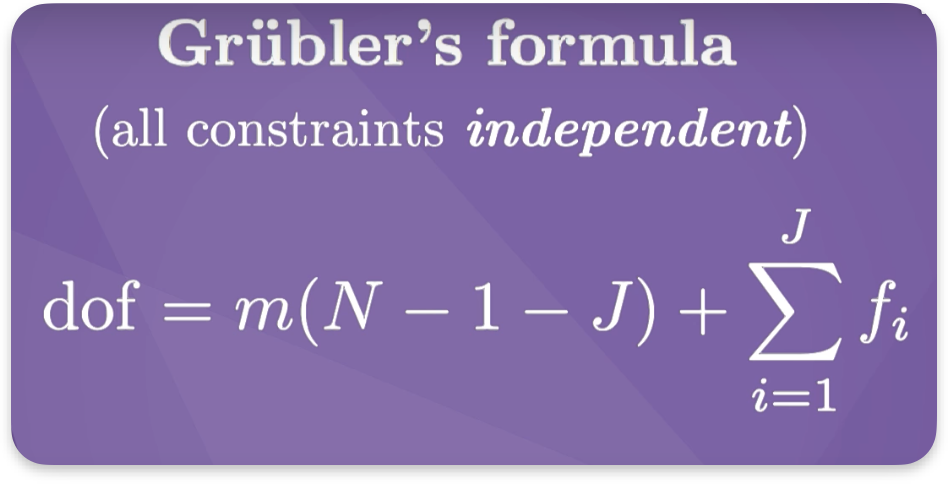
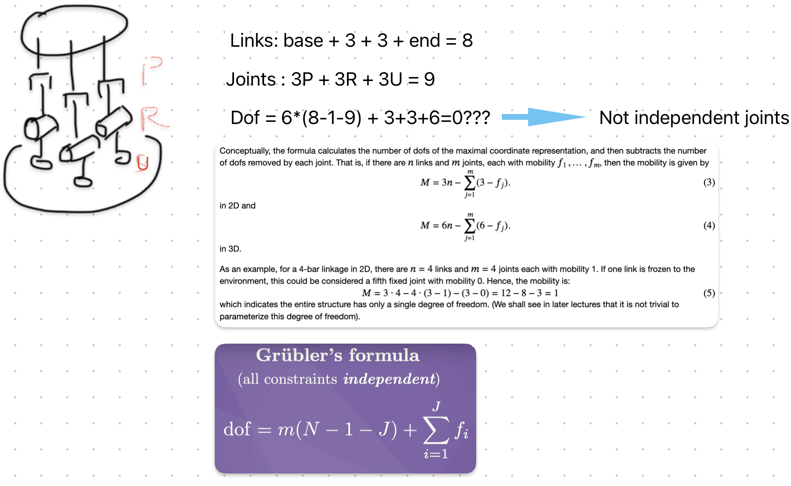
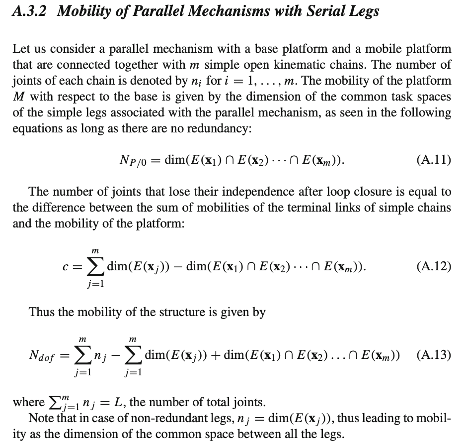

- [2.2. Degrees of Freedom of a Robot](https://modernrobotics.northwestern.edu/nu-gm-book-resource/2-2-degrees-of-freedom-of-a-robot/#:~:text=Grubler's%20formula%20tells%20us%2C%203,because%20there's%20a%20closed%20loop.)
- {:height 186, :width 355}
	- m = 3 for 2D, m=6 for 3D
	- N: no of links
	- J: no of joints
	- IMPORTANT: independent joints
- Example
	- {:height 297, :width 363}
	  id:: 64b23f3a-e979-4877-9518-a7db8c8c7e11
		- DoFs = 3*(3-1-2)+2 = 2
	- 
- Solution of complex robot system
	- 
	- For the robot above, this applies
		- {:height 417, :width 429}
	- DoFs = 9 - 3*3+3 = 3 -> 3 motors can control it
	  collapsed:: true
		- Leg 1: Tz, Rx, Ry
		- Leg 2: Tz, Rx, Ry
		- Leg 3: Tz, Ry, Rx