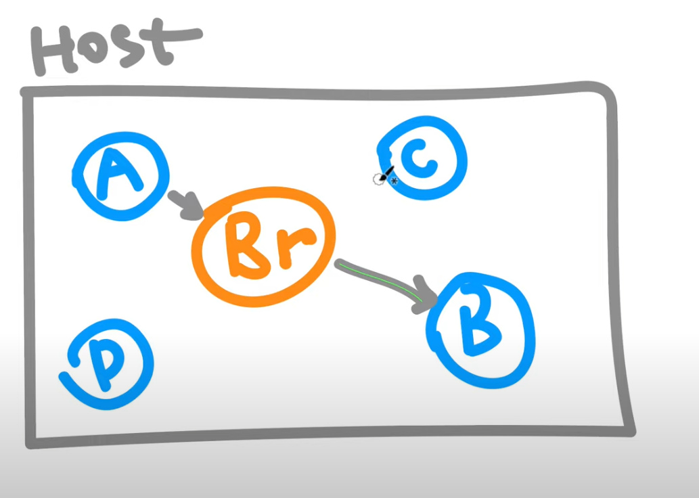
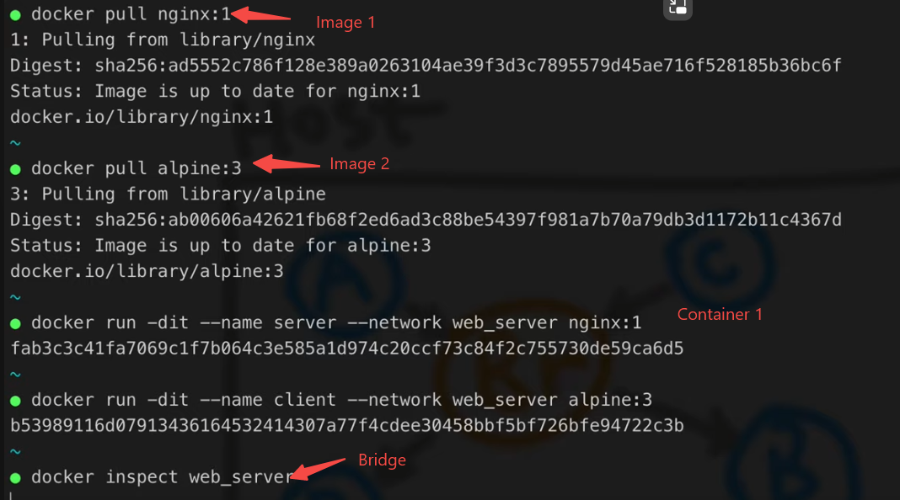
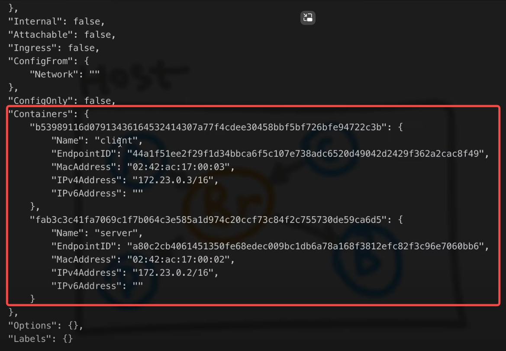

- Docker Images and Docker Containers
	- 
- Bridge ( or Network ) connects containers
	- 
	- Connect images to network
		- {:height 235, :width 462}
		- 
	- Bind specific container to another
		- ```bash
		  docker attach client
		  curl http://server:80
		  ```