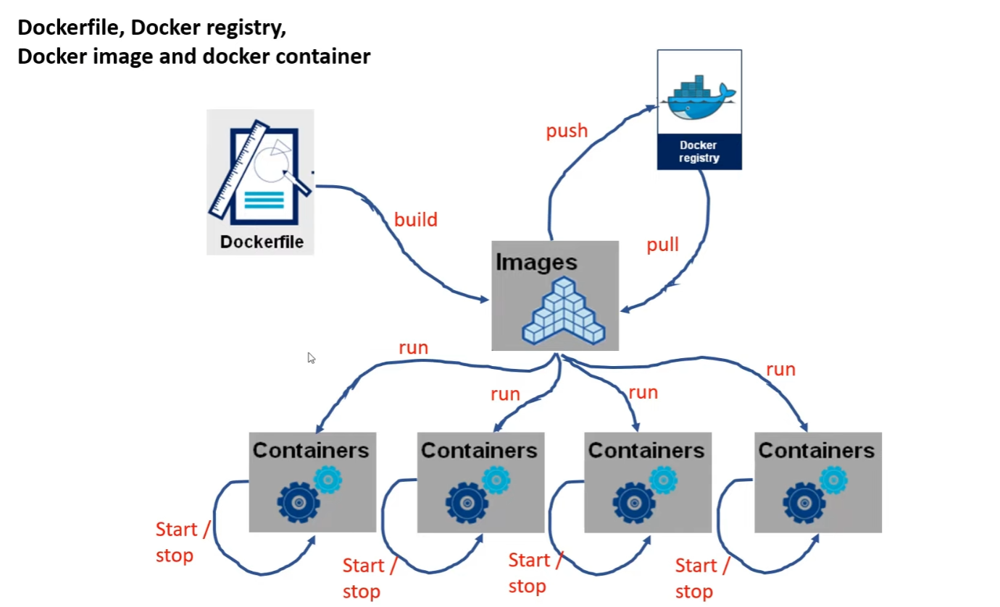
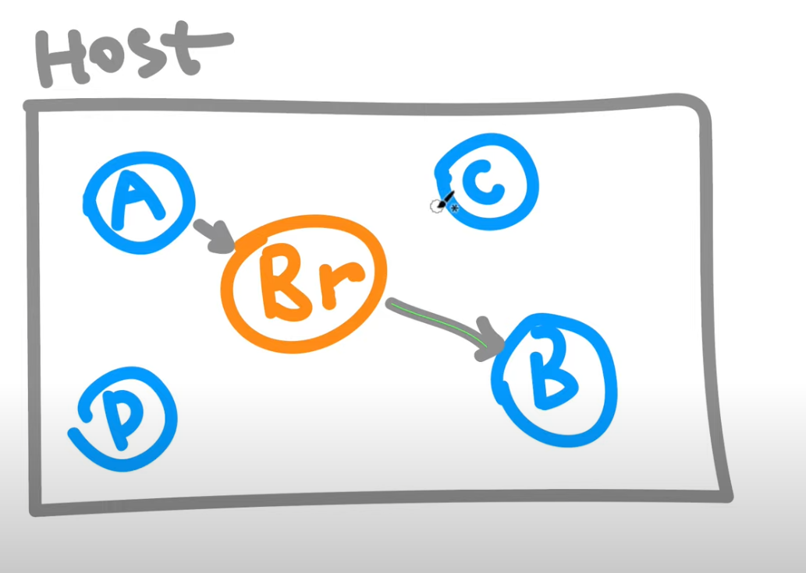
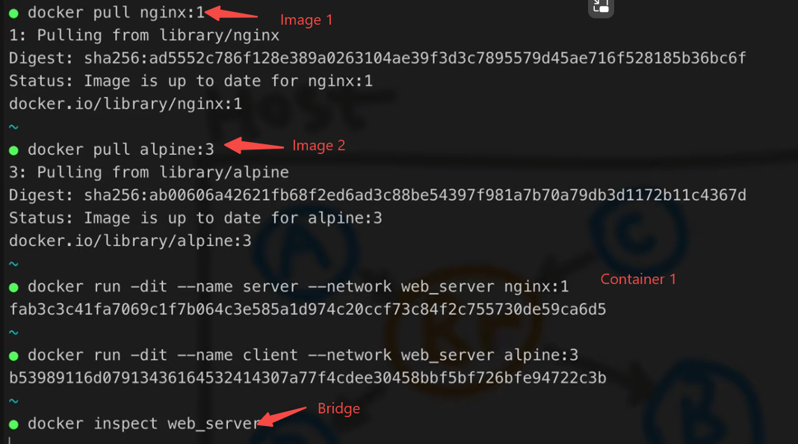
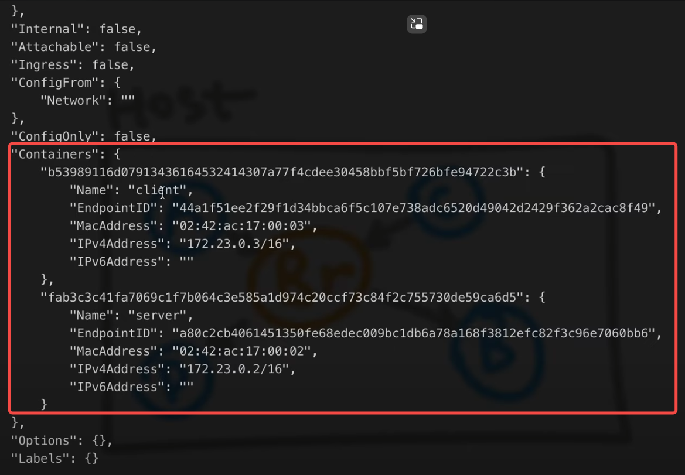
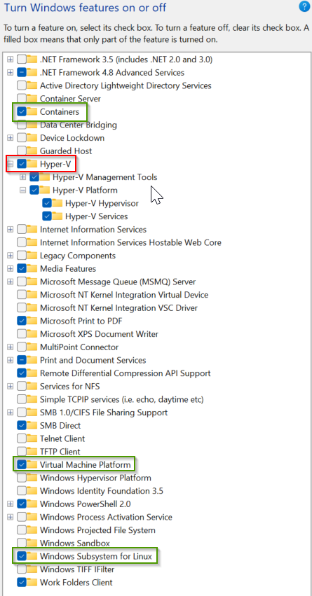

- #Concepts
	- Docker Images and Docker Containers
		- 
	- Bridge ( or Network ) connects containers
	  collapsed:: true
		- 
		- Connect images to network
		  collapsed:: true
			- {:height 235, :width 462}
			- 
		- Bind specific container to another
			- ```bash
			  docker attach client
			  curl http://server:80
			  ```
- # Docker in Windows 11 Pro
	- ## Enable Windows feature
	  collapsed:: true
		- red for windows container
		- green for linux container
		- 
	-
- # Docker in VS Code
	- [Tutorial: Get started with Docker apps in Visual Studio Code | Microsoft Learn](https://learn.microsoft.com/en-us/visualstudio/docker/tutorials/docker-tutorial?WT.mc_id=vscode_docker_aka_helppanel)
	- [VS Code Docker Extension - YouTube](https://www.youtube.com/playlist?list=PLReL099Y5nRf3XEK2f8G8FpMi3XSGPcSZ)
	- [Docker extension for Visual Studio Code](https://code.visualstudio.com/docs/containers/overview)
- # Docker examples
	- ((641be390-ce93-48f0-80fc-ccc2546e712b))