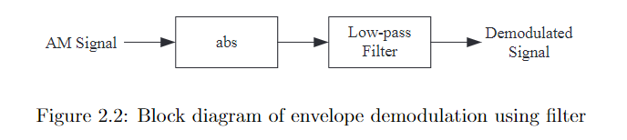
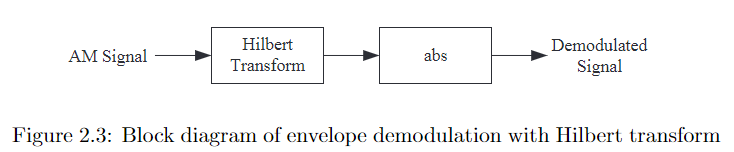

- > AM contains two types of signal: message signal and the carrier signal, not fully applicable for ultrasound wave
- 
- Envelope demodulation using filter ((635b47ea-d1e6-4114-9c11-c754328b2e31))
	- {:height 117, :width 505}
- Envelope demodulation with Hilbert transform
	- {:height 117, :width 505}
- Coherent demodulation
- Square-law demodulation
- Quadrature demodulation