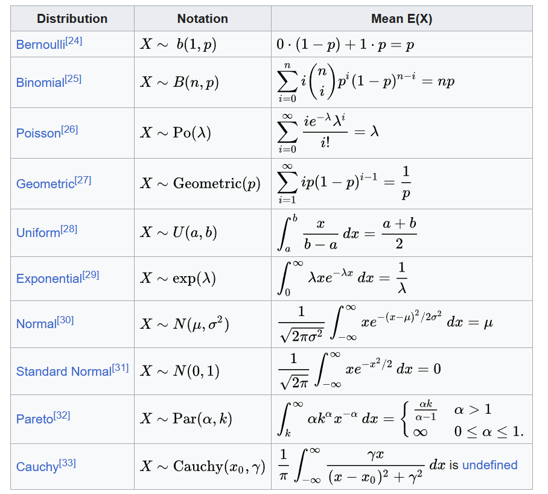

- [Expected value - Wikipedia](https://en.wikipedia.org/wiki/Expected_value)
- a generalization of the weighted average.
- The expected value of a random variable *X* is often denoted by E(*X*), E[*X*],
- ​$\mathrm{E}[X]=\sum_{i=1}^{\infty} x_i p_i$
	- $E(X)=1 \dfrac{ 1  }{ 6  }  +2 \dfrac{ 1  }{ 6  }  +3 \dfrac{ 1  }{ 6  }  +4 \dfrac{ 1  }{ 6  }  +5 \dfrac{ 1  }{ 6  }  +6 \dfrac{ 1  }{ 6  }=3.5$
- $\mathrm{E}[X]=\int_{-\infty}^{\infty} x f(x) d x$
  id:: 64267f79-2af6-42ca-968c-9245cb8a7523
- $\mathrm{E}[X^2]=\int_{-\infty}^{\infty} x^2 f(x) d x$
- Probability Distribution
  collapsed:: true
	- 
- $\operatorname{Var}(X)=\mathrm{E}\left[X^2\right]-(\mathrm{E}[X])^2$
	- [[Variance]]