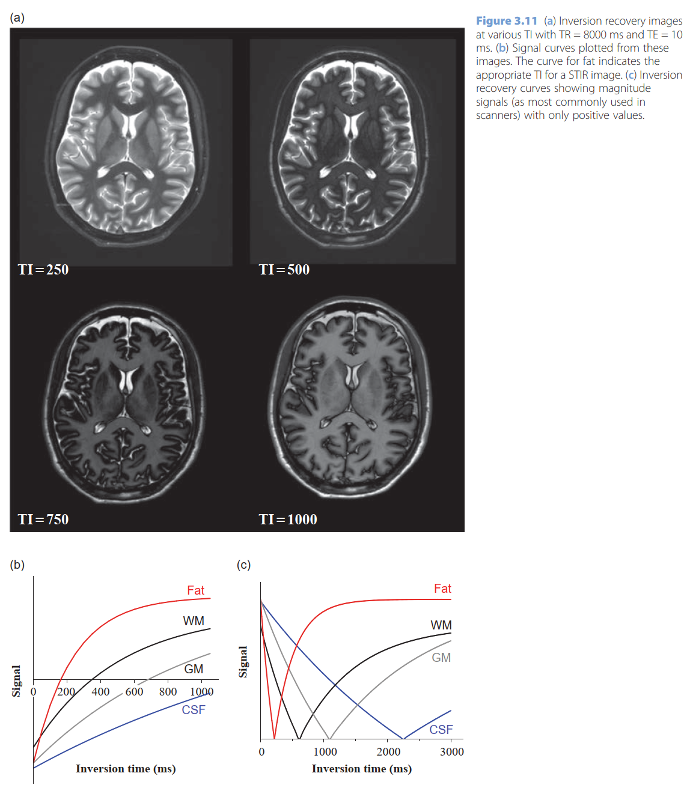

- remove the CSF signal, known as ‘nulling the signal’, by choosing an Inversion Recovery (IR) sequence instead of spin echo, and carefully setting the inversion time (TI).
- {:height 586, :width 506}