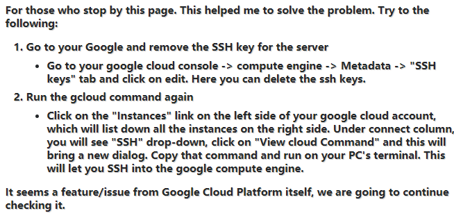

## [Fastai](https://course.fast.ai/)
- use Colab: fast set up, free | ahah, too slow, 👋🏻
- use GCP again
- use WSL in windows
- 3 tips
	- can't get app-key, find [solution](https://stackoverflow.com/questions/46673717/gpg-cant-connect-to-the-agent-ipc-connect-call-failed)
	    
	    ```bash
	    sudo apt remove gpg
	    sudo apt-get update -y
	    sudo apt-get install -y gnupg1
	    ```
	- fresh hand following the tutorial, get cricked out because of ssh update after the buildung the instance. find solution [here](https://stackoverflow.com/questions/26193535/error-gcloud-compute-ssh-usr-bin-ssh-exited-with-return-code-255#:~:text=If%20you%20have%20installed%20gcloud%20without%20sudo%2C%20you%20can%20omit%20sudo%20.&text=255%20is%20the%20interactive%20ssh,executed%20in%20the%20ssh%20session.&text=Go%20to%20your%20google%20cloud,tab%20and%20click%20on%20edit.). MAKE SURE THE INSTANCE IS RUNNING!!!
	    
	    `gcloud compute config -ssh`
	- get error like:
	    
	    ```bash
	    # error type 1
	    External IP address was not found; defaulting to using IAP tunneling.
	    ERROR: (gcloud.compute.start-iap-tunnel) Error while connecting [4033: u'not authorized'].
	    kex_exchange_identification: Connection closed by remote host
	    ERROR: (gcloud.compute.ssh) [/usr/bin/ssh] exited with return code [255].
	    
	    # error type 2
	    ssh: connect to host 34.**.**.167 port 22: Resource temporarily unavailable
	    ERROR: (gcloud.compute.ssh) [/usr/bin/ssh] exited with return code [255].
	    ```
	    
	    try this :([quelle](https://stackoverflow.com/questions/26193535/error-gcloud-compute-ssh-usr-bin-ssh-exited-with-return-code-255#:~:text=If%20you%20have%20installed%20gcloud%20without%20sudo%2C%20you%20can%20omit%20sudo%20.&text=255%20is%20the%20interactive%20ssh,executed%20in%20the%20ssh%20session.&text=Go%20to%20your%20google%20cloud,tab%20and%20click%20on%20edit.))
	- 