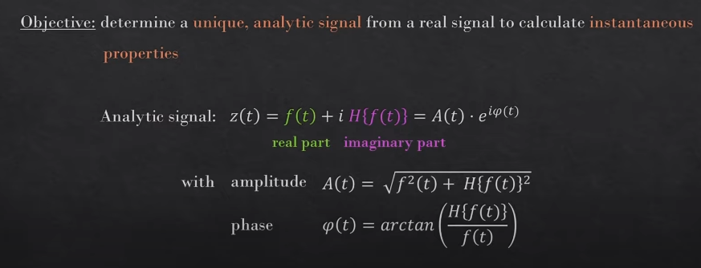

- [Hilbert Transform & Hilbert Spectrum | understanding negative frequencies in the Fourier Transform - YouTube](https://www.youtube.com/watch?v=dy4OeAYqSqM)
- [Discrete-time analytic signal using Hilbert transform - MATLAB hilbert (mathworks.com)](https://www.mathworks.com/help/signal/ref/hilbert.html#d124e88605)
- ## Theory
	- The Hilbert transform of $u$ can be thought of as the convolution of $u(t)$ with the function $h(t) = \frac{1}{πt}$, known as the [Cauchy kernel](https://en.wikipedia.org/wiki/Cauchy_kernel). ((635b4af3-ad8e-4802-83d7-7aa9210115c4))
	- `hilbert`  returns a complex helical sequence, sometimes called the *analytic signal*, from a real data sequence.
	  The analytic signal $x = x_r + jx_i$ has a real part, $x_r$, which is the original data, and an imaginary part, $x_i$, which contains the Hilbert transform. The imaginary part is a version of the original real sequence with a 90° phase shift. Sines are therefore transformed to cosines, and conversely, cosines are transformed to sines. The Hilbert-transformed series has the same amplitude and frequency content as the original sequence. The transform includes phase information that depends on the phase of the original. ((635b4c3f-4e94-47f5-95d3-634a7c92ffa8))
	- the Hilbert transform is a specific singular integral that takes a function, u(t) of a real variable and produces another function of a real variable H(u)(t)
	- 
	-
- # Steps
	- FFT of real-valued signal
	- Set Fourier coefficients of negative frequencies to 0
	- Double the amplitude
	- iFFT to obtain the analytic signal
- # Application
	- The primary motivation for using the Hilbert transform is to obtain a unique representation of a real-valued signal in the complex plane, which is helpful for analyzing certain properties of the signal. In particular, the Hilbert transform can be used to:
	- **Extract instantaneous amplitude and phase information** from a signal. The analytic signal representation allows for the computation of the instantaneous amplitude (the magnitude of the complex-valued analytic signal) and the instantaneous phase (the angle of the complex-valued analytic signal).
	- **Separate positive and negative frequency components** of a signal. The Hilbert transform can be used to separate the positive and negative frequency components of a signal, which can be useful for various signal processing tasks, such as modulation and demodulation in communications.
	- Design filters with linear phase response. In signal processing, the Hilbert transform can be used to design filters that have a linear phase response. These filters are useful for applications where preserving the phase information of a signal is important, such as in audio and image processing.
	- Solve certain types of differential and integral equations. The Hilbert transform is used in mathematical analysis to solve some types of differential and integral equations, particularly those that involve singular integrals.
	- The Hilbert transform can be defined mathematically as a convolution operation between the input signal and the Cauchy principal value of the function 1/πt, where t is the time variable. In the frequency domain, the Hilbert transform corresponds to a phase shift of -90 degrees for positive frequencies and +90 degrees for negative frequencies.
- # Why Hilbert Transform
	- Analytic signal representation: The Hilbert transform is used to create the analytic signal, which is a complex-valued function that represents the original real-valued signal in the complex plane. The analytic signal is formed by adding the original signal and the Hilbert-transformed signal, multiplied by the imaginary unit (j), as follows:
	  
	  Analytic signal: x_a(t) = x(t) + j * H[x(t)]
	  
	  where x(t) is the original real-valued signal, H[x(t)] is the Hilbert-transformed signal, and x_a(t) is the analytic signal.
	  
	  The analytic signal provides a unique representation of the original real-valued signal in the complex plane, which enables the extraction of the instantaneous amplitude and phase information of the signal.
	- Quadrature relationship: The Hilbert transform is related to the original signal through a quadrature relationship, which means that the original signal and the Hilbert-transformed signal are orthogonal (or 90 degrees out of phase) with each other. This property is useful in separating the positive and negative frequency components of the signal.
	- Phase shift in the frequency domain: In the frequency domain, the Hilbert transform corresponds to a phase shift of -90 degrees for positive frequencies and +90 degrees for negative frequencies. This phase-shifting property is useful for designing filters with a linear phase response and for various signal processing tasks, such as modulation and demodulation in communications.
	- Solving mathematical problems: The Hilbert transform is used in mathematical analysis to solve certain types of differential and integral equations, particularly those involving singular integrals. Its relationship with the Cauchy principal value helps address singularities in these equations, making it possible to find solutions that may not be easily accessible through other methods.
- Reference
	- [1]
	  id:: 635b47ea-d1e6-4114-9c11-c754328b2e31
	  
	- [5]
	  id:: 635b4af3-ad8e-4802-83d7-7aa9210115c4
	  [Hilbert transform - Wikipedia](https://en.wikipedia.org/wiki/Hilbert_transform)
	- [6]
	  id:: 635b4c3f-4e94-47f5-95d3-634a7c92ffa8
	  [Discrete-time analytic signal using Hilbert transform - MATLAB hilbert (mathworks.com)](https://www.mathworks.com/help/signal/ref/hilbert.html#d124e82062)
	-