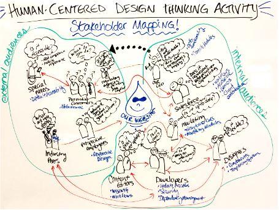

## Four components in life science startup
	- Unmet need
	- IP
	- Money
	- People
- ## Timeline of Startup
  IP -> People + Cash -> Product ( prototype + data (clinical trial) ) -> regulatory, manufacturing scale up-> Product launch ---> money back to investor (Exit)
- ## Funding
	- grant
	- university funding
	- network
- Unmet need -> who has the problem -> who will pay -> money
	- 
- ## ROI
	- Return On Investment
	- Multiples
	- IRR: Internal Rate of Return
- ## Pre-Money & Post-Money
  pre = post - just_invested
- ## Institutions
	- Pension fund
	- Insurance companies
	- Hedge funds
	- Sovereign wealth fund
	- Family offices
	- Private equity ( venture capital )
- ## Convince
	- understand risk and minimize it
	- amount of money
	- return
- ## How to start company
	- Gantt chart
	- Organization chart
	- Budget