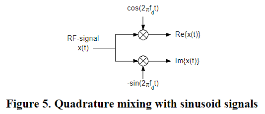

- ((633a92f6-6db0-404c-a37c-d3ea72697163))
- Down-mxing -> Low-pass Filtering -> Decimation
	- 
	- Down-mixing
	  $x_{IQ}(t) = x_{RF}(t) \cdot e^{-i 2\pi f_{demod} t}$ : a complex signal
	  {:height 179, :width 401}
	- Low-pass Filtering: The low-pass filter on the complex signal can be thought of as a filter applied to the real and imaginary part **separately**
	- Decimation
	  ((635b5109-cf45-41f6-9f37-84fc2169bc82))
- {{youtube h_7d-m1ehoY}}
- The operation of an IQ-demodulator can be explained by representing its RF input signal $s_{RF}(t)$ as a combination of two double sideband modulated quadrature carriers
  $$s_{RF}(t)=s_I(t)+s_Q(t)=I(t)\cos w_{RF}t-Q(t)\sin_{RF}(t)$$
- Quadrature Signals
  two signals are said to be Quadrature, when they are 90 degree apart in phase
	- I = in phase signal = $I*\cos(2\pi ft)$
	- Q = 90 degree shifted signal$ = Q*\sin(2\pi ft)$
- Adding Quadrature Signal
  $I*\cos(2\pi ft) + Q*\sin(2\pi ft)$
  If  $I(t)$, $Q(t)$ vary well, can get amplitude and phase modulation
  {:height 278, :width 467}
  {:height 254, :width 547}
- Digital Modulation
   $I(t)$, $Q(t)$ can be generated to result in any modulation, AM, FM, PM, SSB, BPSK, QPSK, 16QAM...
	- Binary Phase Shift Keying
	  $I(t) = 1/ -1$
	  $Q(t) = 0$
	  {:height 254, :width 456}
	- Demodulation
	  Any modulated RF signal can be converted into  $I(t)$, $Q(t)$
		- Down-mixing
		- Low-pass filtering
			- the complex signal is low-pass filtered to remove the negative frequency spectrum and noise outside the desired bandwidth
		- Decimation