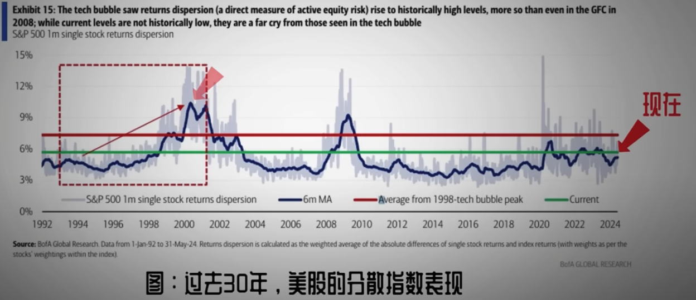
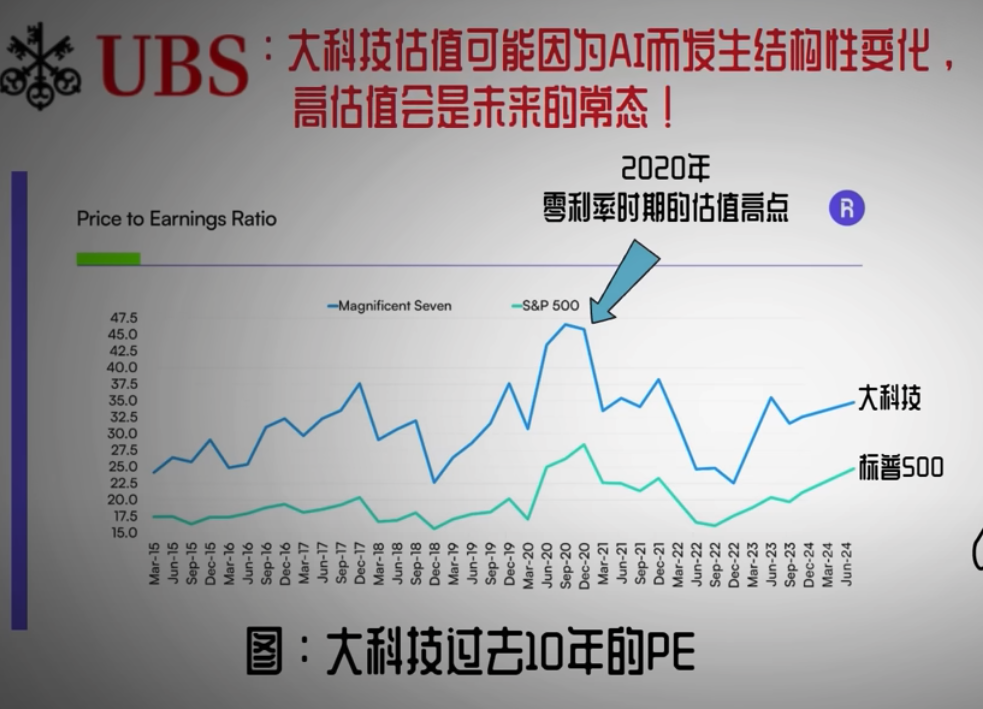
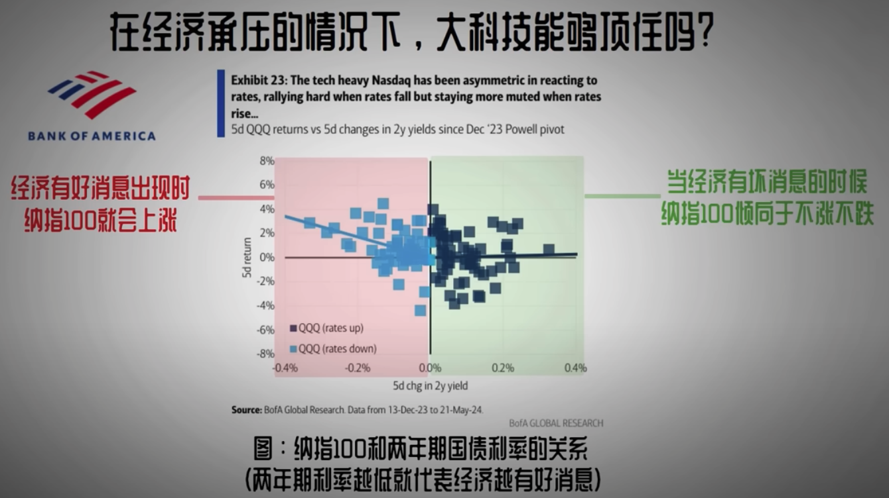
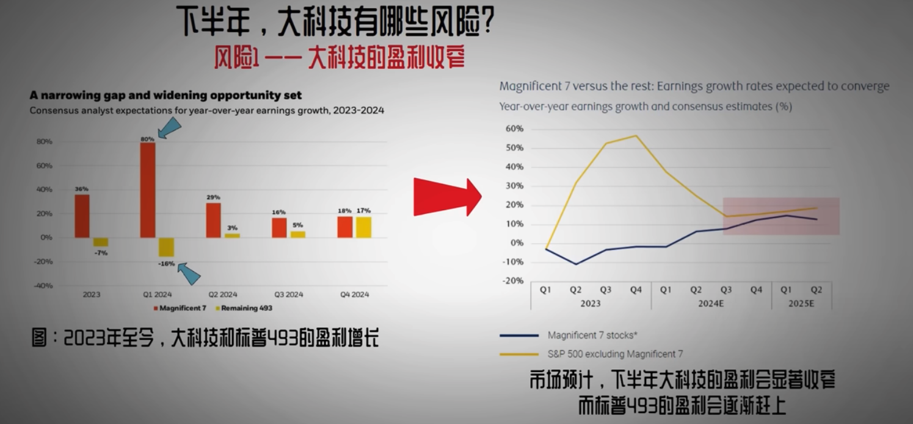

- How to Invest
	- 110 - your age = stock, rest in bonds
	- Stock: half local, half overseas
- Find a Good Stock
	- 3+1 Profit Index
		- Profitability
			- $\text{Net Profit Margin}=\text{Net Profit} / \text{Revenue}$
			- higher better
		- Finance Health
			- $\text{Current Ratio} = \text{Current Assets} / \text{Current Liabilities}$
			- better >1.5, at least > 1
		- Price Level
			- $\text{Price to Earn Ratio}=\text{Share Price}/\text{Earnings per Share}$
		- Advantages
		  id:: 66934923-88fa-41dc-9a56-a45621513e19
			- Brand reputation: apple or hermes
			- User stickiness: whatsapp
			- Parent or irreplaceable
- Identify a bubble
	- Stock prices rise, volatility rises --> VIX > 30%~500%
	- The market's stock returns will become extremely dispersed
		- 
- Tech company
	- AI --> ((66934923-88fa-41dc-9a56-a45621513e19))
		- {:height 258, :width 346}
	- QQQ relates to tech
		- {:height 274, :width 469}
	- Profit shrink
		- {:height 226, :width 468}
- Investment Type
	- [Simple but helpful explanations](https://smartasset.com/investing/types-of-investment)
	- [[ETF(Exchange-Traded Fund)]]