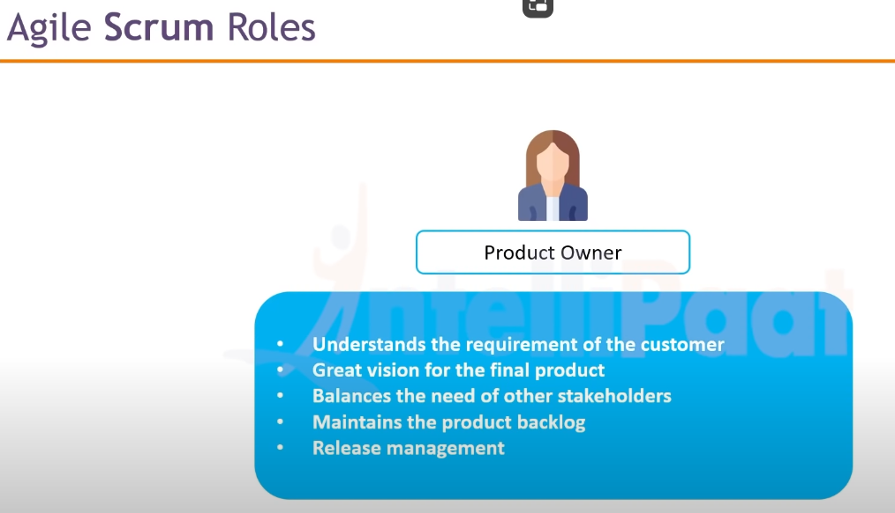
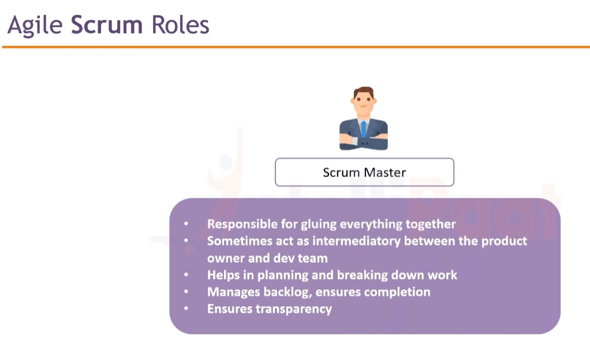
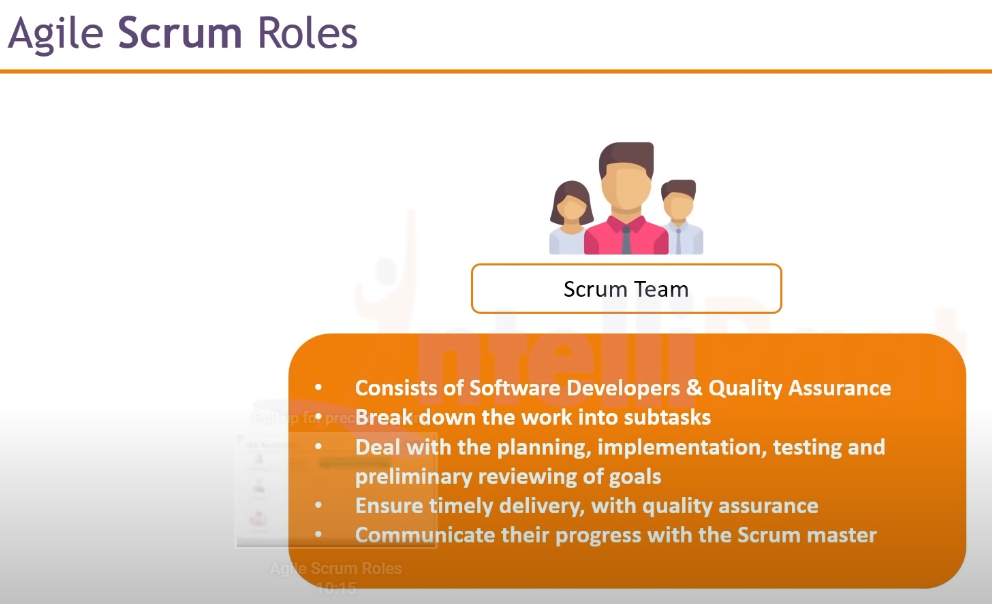
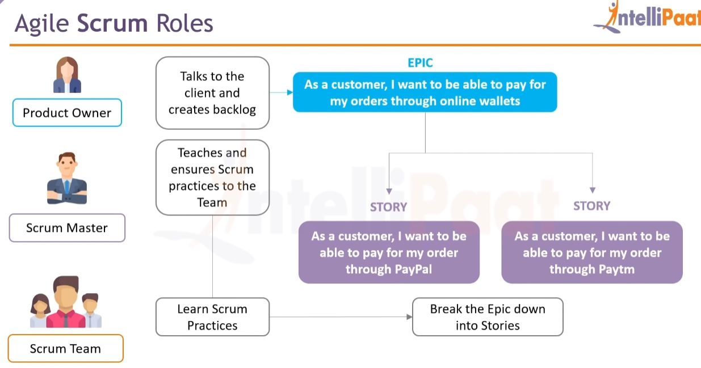
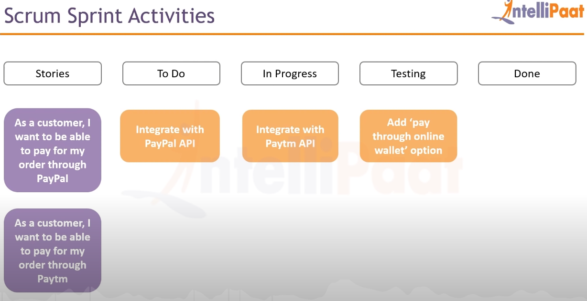

- = Bug Tracking + Agile Terminologies
	- Agile is a methodology for software development that emphasizes flexibility, collaboration, and customer satisfaction. It is based on the Agile Manifesto, which outlines a set of values and principles for Agile software development. Agile processes are iterative and incremental, and they focus on delivering value to the customer in small increments. Agile processes are designed to be flexible and adaptable, and they encourage collaboration and communication between team members. Some of the key Agile processes include Scrum, Kanban, and Extreme Programming (XP).
- Terms in Jira
	- 
	- A **backlog** is a prioritized list of features or requirements for a software project. The backlog is used to manage the work that needs to be done in order to deliver a product or service. The backlog is typically managed by the Product Owner, who is responsible for prioritizing the items in the backlog based on their value to the customer. The backlog is an important tool for Agile software development, as it helps to ensure that the team is working on the most important features or requirements first.
	- **Story points** are a unit of measure used in Agile software development to estimate the difficulty of implementing a given feature or requirement. Story points are used to help the team to estimate the amount of work that needs to be done in order to deliver a product or service. Story points are typically assigned to items in the backlog, and they are used to help the team to plan their work for the upcoming sprint. Story points are a relative measure of effort, and they are not directly tied to time or any other specific unit of measure.
	- **Components** are typically used to group issues that are related to a specific feature or requirement. Components can be used to help the team to organize their work and to track progress on specific features or requirements. Components can be assigned to issues in the backlog, and they can be used to help the team to plan their work for the upcoming sprint.
	  
	  Components in Jira can be used to group issues into smaller sub-sections, like UI, API, Hardware, etc. You could also use it to organize your issues based on customers, areas, functionality, etc. For example, you can use components to organize tasks based on the tool, which is a quick way of seeing all the tasks that you have related to Bitbucket or Jira1. Components are basically the building **blocks** of your project, and they come in handy when you want to generate good reports, i.e., collect useful statistics and be able to group data contextually2.
- Scrum
  collapsed:: true
	- Scrum is based on a set of roles, events, artifacts, and rules that help teams to manage their work more efficiently. Some of the key roles in Scrum include the Scrum Master, the Product Owner, and the Development Team. Scrum events include Sprint Planning, Daily Scrum, Sprint Review, and Sprint Retrospective. Scrum artifacts include the Product Backlog, the Sprint Backlog, and the Increment.
	- Roles
	  collapsed:: true
		- 
		- 
		- 
	- Interaction
	  collapsed:: true
		- 
		- 
		- 