# Materials:
	- [5 Day Curriculum](https://docs.google.com/document/d/e/2PACX-1vS2Y4T1AlbEZg48HL8i1ODzNn0-zTQQt8DwzOuUj8gHnjwFq3G7Fdww6xJdh_4Yi8Il1bTuDHKIlWim/pub)
	- [5 Day checklist](https://docs.google.com/document/d/e/2PACX-1vTkajey208fMutPynoKg7AE-RJsSpWgCQCFKgdzxGfPF0qjZwLXLARJCGpEqovqtly1xrWLKzAoG7qF/pub)
	- [Daily submission form](https://docs.google.com/forms/d/e/1FAIpQLSfOP3QRWvTnuYJ--PqnxyCFvcOn8D_oEYZq3LYHCH6aRyZQsQ/viewform)
	- [Presentation](https://docs.google.com/presentation/d/e/2PACX-1vQ2SVHmzSxgVv31-TUs4Zqrvd-vnP00MjZUvWkhqC5WS9xc_hhI1aEYO1VHfbbXESXymWlCsN9XP0tT/pub?start=false&loop=false&delayms=3000#slide=id.g32272e011e2_0_10)
- [My Idx Google Codespace](https://idx.google.com/u/0/aisg-5-day-ai-agent-6251115)
- # Day 0
  collapsed:: true
	- [Record](https://us02web.zoom.us/rec/share/CnrPxgdVv0O69geR_q85gSxFFMrxm3hYw8BssnLDOKnR9LJz3zh7AlcmyDHe80bH.d7fq7K4NAosfm_WY) Passcode: at=.%TT5
	- Handout notes
		- Session 0 : Foundations of AI Agents
		- What is an AI Agent?
			- Objective: Understand the basics of ai agents 
			  
			  *autonomous: designed to perform independently 
			  
			  An AI agent is an autonomous  system that interacts with its environment to achieve specific goals.
		- Good article from  [https://www.salesforce.com/agentforce/what-are-ai-agents/](https://www.salesforce.com/agentforce/what-are-ai-agents/)
		- Video [Link](https://www.youtube.com/watch?v=hLJTcVHW8_I&t=219s)
		- Research on our own and share any unique links
		- Recommended reading [Paper](https://arxiv.org/pdf/2407.01502)
		- Cool repo -[repo](https://github.com/aishwaryanr/awesome-generative-ai-guide/blob/main/resources/agents_101_guide.md)
		- Good resource: [https://github.com/kaushikb11/awesome-llm-agents](https://github.com/kaushikb11/awesome-llm-agents)
		- LLM agents: [https://www.superannotate.com/blog/llm-agents](https://www.superannotate.com/blog/llm-agents)
		  
		  Examples:
		- [Video](https://www.youtube.com/watch?v=k9aur17dCzE)
		- Understand the terms: agent, environment, state, action, and reward.
		- Complete this course as we progress through the module [Coursera Link](https://www.coursera.org/learn/learn-ai-agents#modules)
		- Recommended Course No.1 :[https://www.deeplearning.ai/short-courses/ai-agents-in-langgraph/](https://www.deeplearning.ai/short-courses/ai-agents-in-langgraph/)
		- Recommended Course No.2 : [https://www.deeplearning.ai/short-courses/multi-ai-agent-systems-with-crewai/](https://www.deeplearning.ai/short-courses/multi-ai-agent-systems-with-crewai/)
	- [The best post](https://github.com/aishwaryanr/awesome-generative-ai-guide/blob/main/resources/agents_101_guide.md)
	- ## AI Agent vs Agentic AI
		- 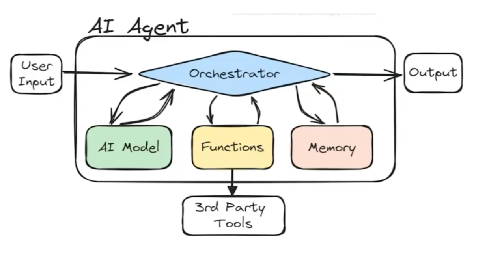{:height 242, :width 456}
		- 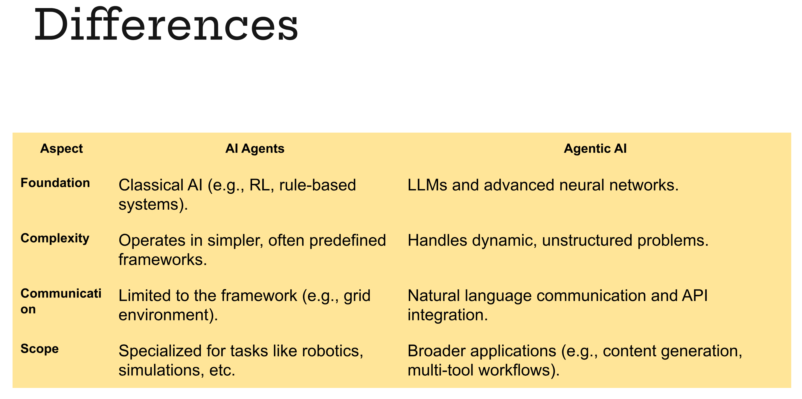{:height 235, :width 458}
		- **Agentic AI** refers to advanced AI systems that demonstrate a higher degree of independence, initiative, and adaptability. While traditional AI agents operate within ==predefined frameworks==, agentic AI pushes the boundaries by showcasing characteristics that make them appear more "agent-like," often capable of pursuing open-ended goals.
		- 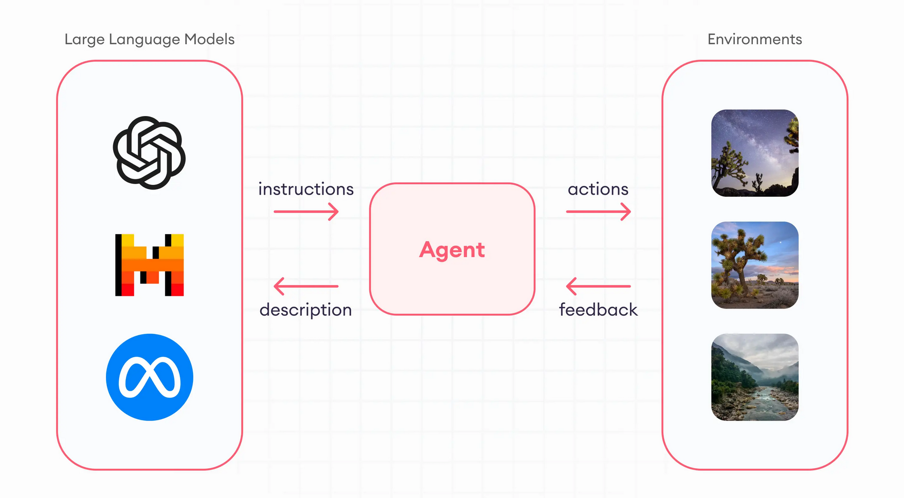{:height 269, :width 463}
		- A basic LLM with a [retrieval augmented generation (RAG)](https://www.superannotate.com/blog/rag-explained) system can easily fetch the needed information from legal databases.
	- ## LLM agent components
		- 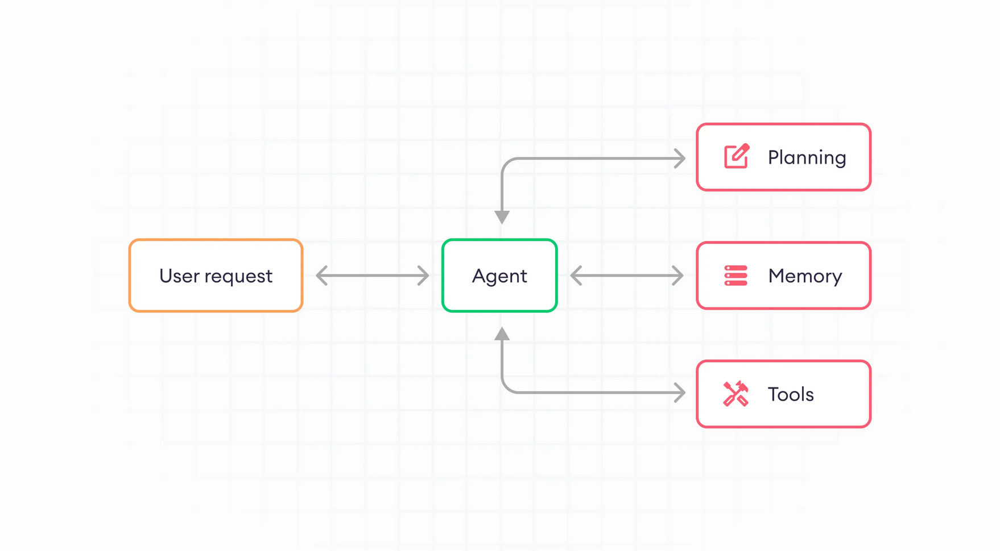{:height 221, :width 438}
		- Brain (Agent): LLM / action model
		- Memory: short-term memory and long term memory
		- Planning: plan formulation + plan reflection
			- Plant formulation: break down large task using [chain of thought method](https://www.superannotate.com/blog/chain-of-thought-cot-prompting) or [tree of thought method](https://github.com/princeton-nlp/tree-of-thought-llm), or decision tree
			  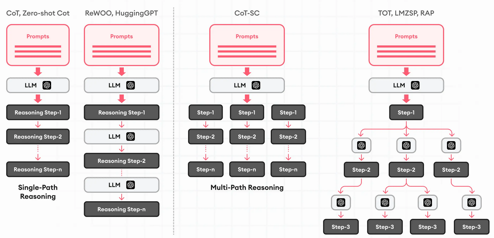
			- Plan reflection: review and feedback, methods: [ReAct](https://arxiv.org/abs/2210.03629) and [Reflexion](https://arxiv.org/abs/2303.11366)
		- Tool: databases, querying, coding
	- ## Multi agent
		- 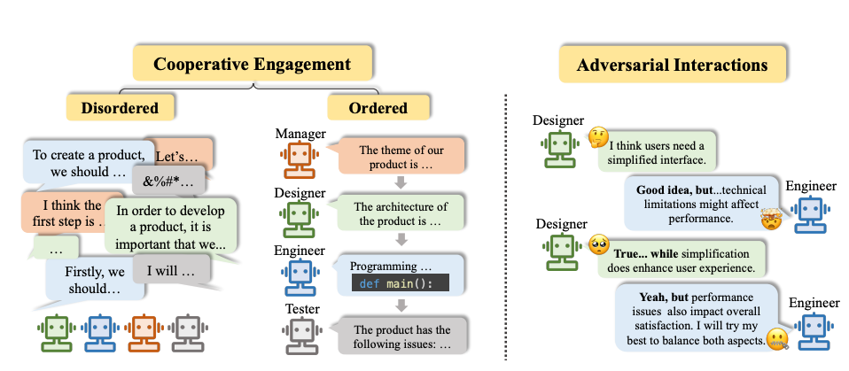
	- ## Examples
		- ### Single Agent
			- 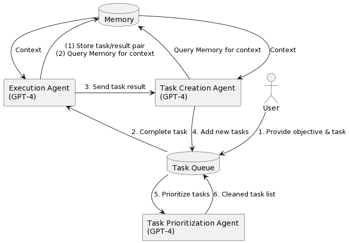{:height 344, :width 482}
			- [BabyAGI](https://github.com/yoheinakajima/babyagi)
			  collapsed:: true
				- GPT-4 (Agent Core):
					- OpenAI's GPT-4 serves as the core of the system, enabling it to 
					  complete tasks, generate new tasks based on completed results, and 
					  prioritize tasks in real-time. It leverages the powerful text-based 
					  language model capabilities of GPT-4.
				- Pinecone(Memory Module):
					- Pinecone is utilized for efficient storage and retrieval of 
					  task-related data, including task descriptions, constraints, and 
					  results. It provides robust search and storage capabilities for 
					  high-dimensional vector data, enhancing the system's efficiency.
				- LangChain Framework (Tooling Module):
					- The LangChain framework enhances the system's capabilities, 
					  particularly in task completion and decision-making processes. It allows
					  the AI agent to be data-aware and interact with its environment, 
					  contributing to a more powerful and differentiated system.
				- Task Management (Planning Module):
					- The system maintains a task list using a deque data structure, 
					  enabling it to manage and prioritize tasks autonomously. It dynamically 
					  generates new tasks based on completed results and adjusts task 
					  priorities accordingly.
			- [Other agents](https://www.promptingguide.ai/research/llm-agents#notable-llm-based-agents)
			- [And some other agents](https://github.com/kaushikb11/awesome-llm-agents)
		- ### Multi agent
			- Sequential
				- 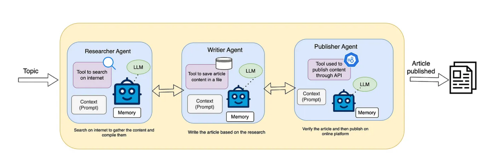{:height 158, :width 455}
				- Feedback mechanism
					- If the second agent finds that the research done on the topic is not sufficient to write, it will again ask the first agent to provide more information. Similarly, if the third agent finds that the article written is not good to publish it will go back to the second agent and give its feedback on the article and ask it to write again. This way, we have a more reliable and efficient system.
			- Hierarchical
				- 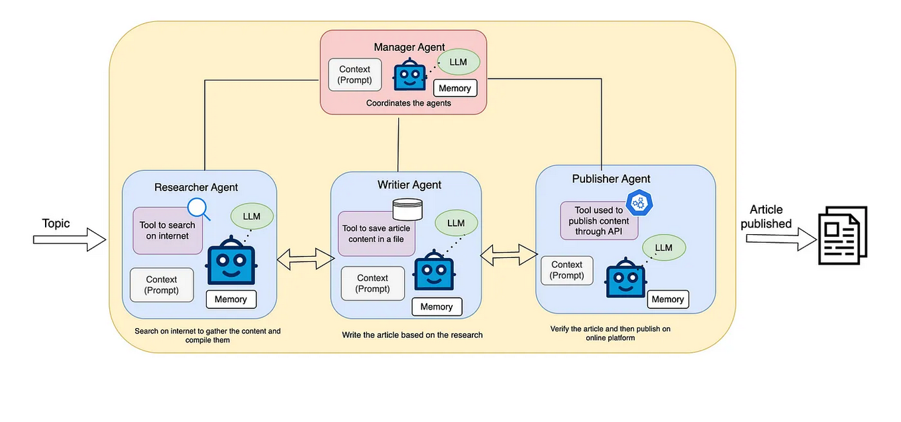{:height 189, :width 388}
			- Human role
				- 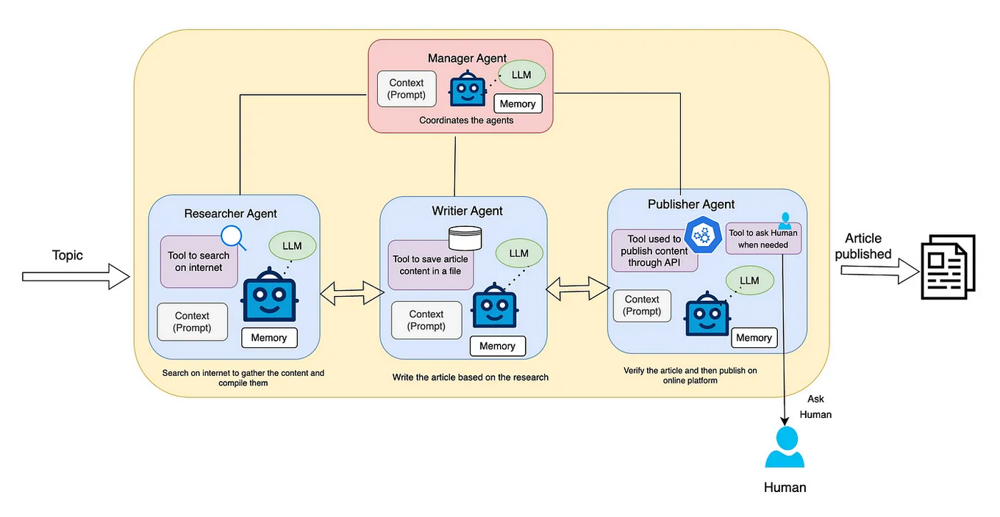{:height 214, :width 398}
				- So, we can give the publisher agent the ability to ask for human intervention if it is not sure about the article by giving it a tool. In the prompt, we can mention clearly that when we want human intervention, the agent can ask for human intervention only when needed.
- # Day 1
  collapsed:: true
	- Article:[https://medium.com/@pallavisinha12/understanding-llm-based-agents-and-their-multi-agent-architecture-299cf54ebae4](https://www.google.com/url?q=https://medium.com/@pallavisinha12/understanding-llm-based-agents-and-their-multi-agent-architecture-299cf54ebae4&sa=D&source=editors&ust=1736048889331840&usg=AOvVaw3tBoU6AQjWKwGTcqJiNiK_)
	- built an AI with short term memory, stored as a variable and added to prompt as background knowledge
- # Day 2
  collapsed:: true
	- [ReAct Implementation](https://langchain-ai.github.io/langgraph/concepts/agentic_concepts/#react-implementation)
	- [Agentic AI](https://markovate.com/blog/agentic-ai-architecture/)
	- [Prompt enginnering](https://cloud.google.com/discover/what-is-prompt-engineering)
	- [ReAct implementation ](https://langchain-ai.github.io/langgraph/concepts/agentic_concepts/#react-implementation)
		- There are several differences between [this](https://arxiv.org/abs/2210.03629) paper and the pre-built [`create_react_agent`](https://langchain-ai.github.io/langgraph/reference/prebuilt/#langgraph.prebuilt.chat_agent_executor.create_react_agent) implementation:
		- First, we use [tool-calling](https://langchain-ai.github.io/langgraph/concepts/agentic_concepts/#tool-calling) to have LLMs call tools, whereas the paper used prompting + parsing of raw output. This is because tool calling did not exist when the paper was written, but is generally better and more reliable.
		- Second, we use messages to prompt the LLM, whereas the paper used string formatting. This is because at the time of writing, LLMs didn't even expose a message-based interface, whereas now that's the only interface they expose.
		- Third, the paper required all inputs to the tools to be a single string. This was largely due to LLMs not being super capable at the time, and only really being able to generate a single input. Our implementation allows for using tools that require multiple inputs.
		- Fourth, the paper only looks at calling a single tool at the time, largely due to limitations in LLMs performance at the time. Our implementation allows for calling multiple tools at a time.
		- Finally, the paper asked the LLM to explicitly generate a "Thought" step before deciding which tools to call. This is the "Reasoning" part of "ReAct". Our implementation does not do this by default, largely because LLMs have gotten much better and that is not as necessary. Of course, if you wish to prompt it do so, you certainly can.
	- 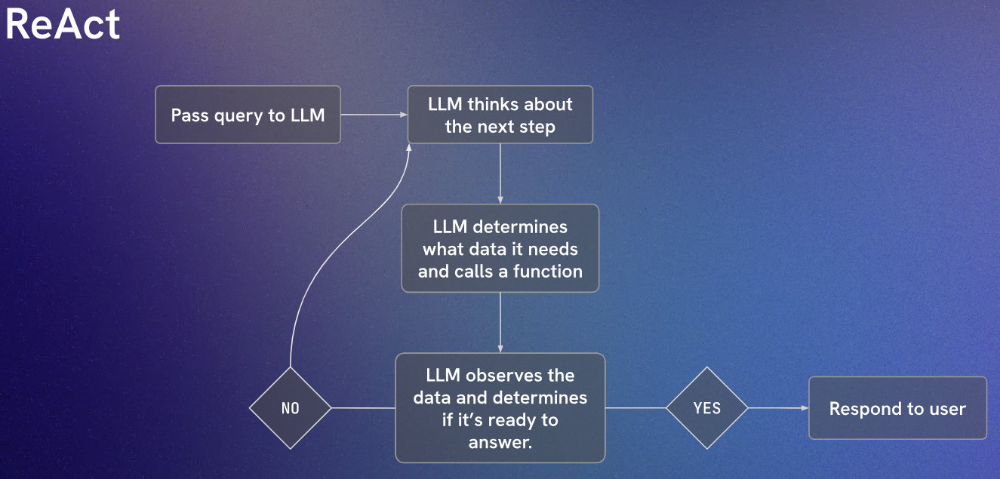
	-
- # Notes for Blog
	- Agentic AI is a plus version of AI Agent, which focuses more in RL area
	- Multi Agent is another human brain that available anytime. You may consider it as a personal assistant.
	- What service it provides out of LLM features? decision making, planning, coding
	- Temperature: 0-1, how creative the ai responses, 0 = deterministic, 1 = creative
	- How it manages to do that
		- break down task
		- use tool or contact other agent
		- store query or persona
	- Prompt template is very important in ReAct
		- This limits the agent creativity ( and dont forget to set temperature low)