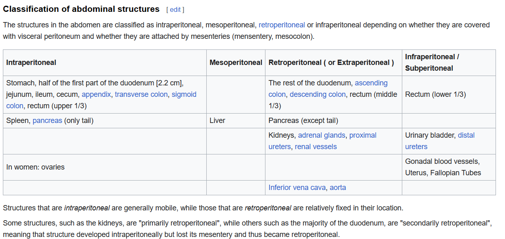

- Abdominal Cavity
	- 
- Open Abdomen Surgery
- Traditional Laparoscopic Surgery
	- 3 - 5 port, minimal invasive
	- 1 - telescopic rod lens
	- 1 - surgical instrument
	- 1 - tissue removal hole (carrying in a bag)
	- {:height 554, :width 573}
- Single Incision Laparoscopic Surgery
	- [Single Port | Da Vinci SP | System | Intuitive](https://www.intuitive.com/en-us/products-and-services/da-vinci/systems/sp)
	- 