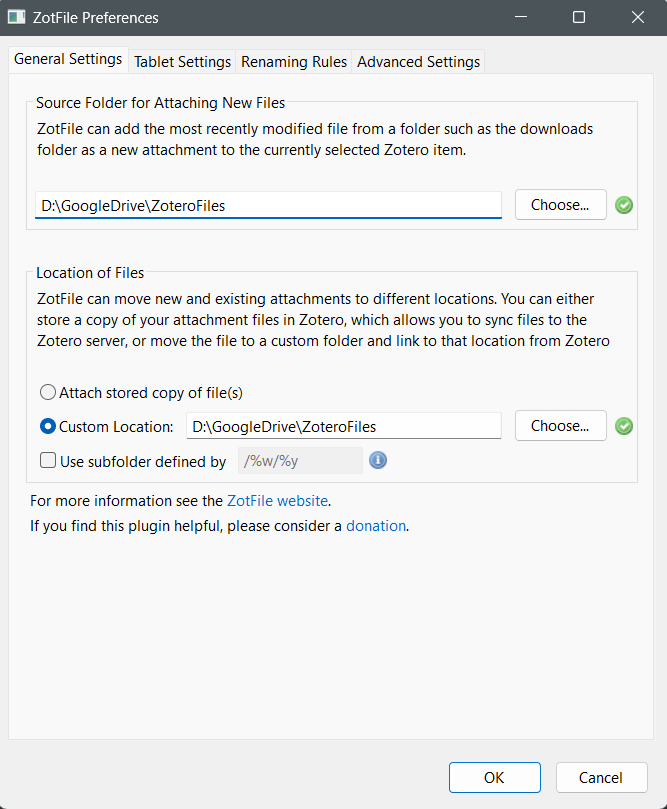
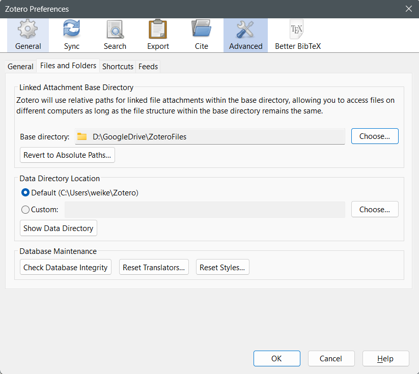

- Zotero + ZotFile: Save all pdfs in cloud drive in spite of Zotero Cloud
	- [ZotFile - Advanced PDF management for Zotero](http://zotfile.com/)
	- Change the pdf location: Tools -> ZotFile Preferences -> General Settings
		- {:height 231, :width 268}
- Zotero + Logseq
	- Change Attachment Base Directory: Perference->Advanced->Files and Folders->Base Directory
		- {:height 231, :width 333}