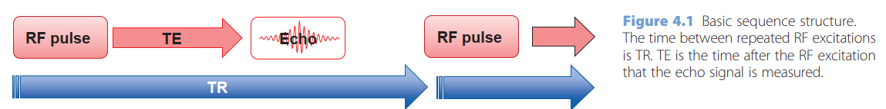

- Introduction
	- MR images are produced using a repeating series of RF and gradient pulses, known as a pulse sequence or simply sequence.
	- All sequences have a repetition time TR, and an echo time TE, which control the sequence timing.
		- 
	- All sequences have an excitation RF pulse which disturbs the body’s protons and creates a signal in the RF coils.
	- The signal can be detected by forming either a spin echo (SE) or a gradient echo (GE). SE sequences have a second RF pulse for refocusing the signal echo, and this extra pulse corrects the signal for B0 inhomogeneities. GE sequences use gradient pulses to create the echo, which can be much faster than SE, but has sensitivity to B0 inhomogeneity.
	- A useful variant of SE is the inversion recovery (IR) sequence, which starts with a 180° pulse to invert the protons’ magnetization. The delay between the inversion pulse and the excitation pulse is called the inversion time (TI). By setting TI to a particular fraction of the T1 of a tissue it is possible to null the signals from that tissue.