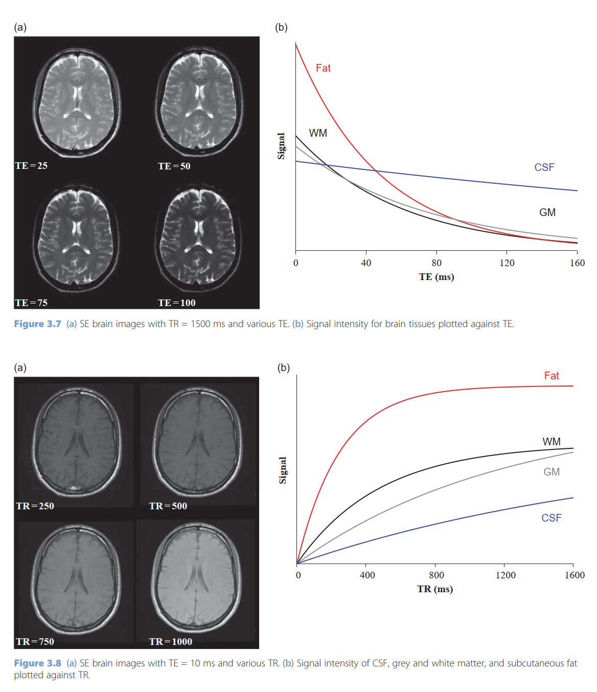
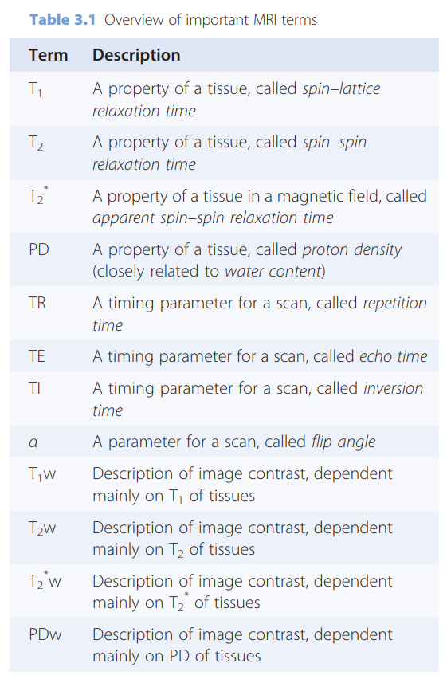
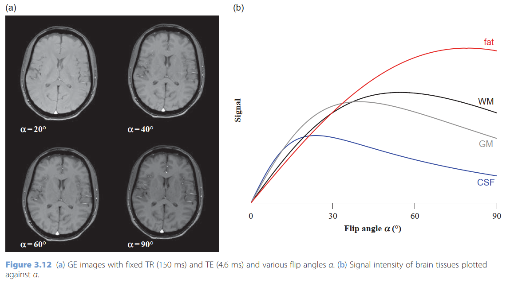
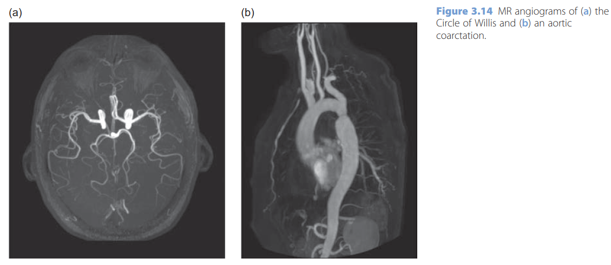
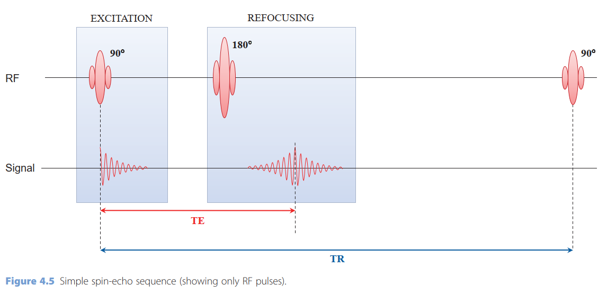
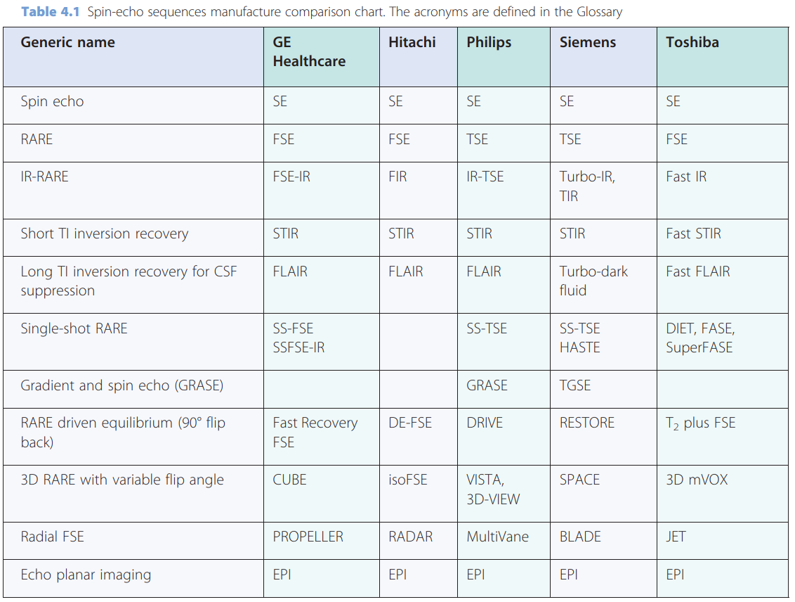
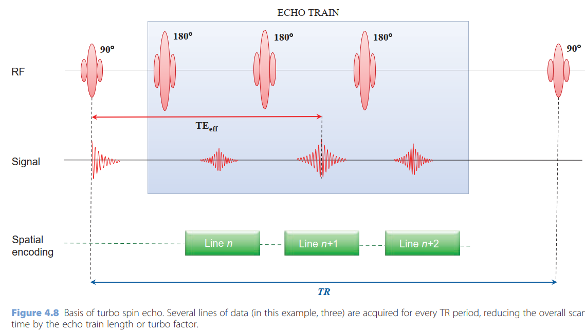
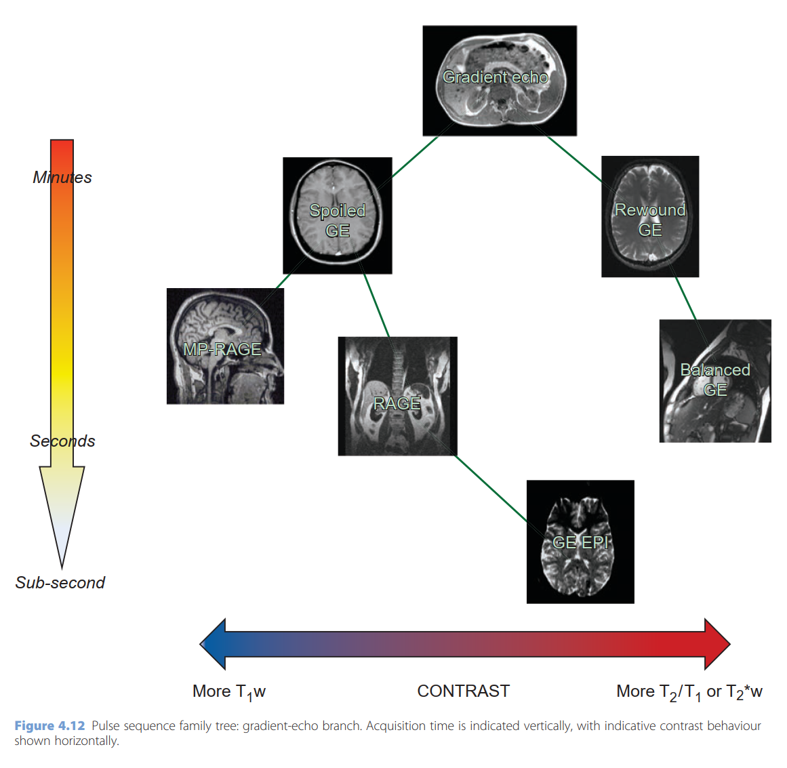
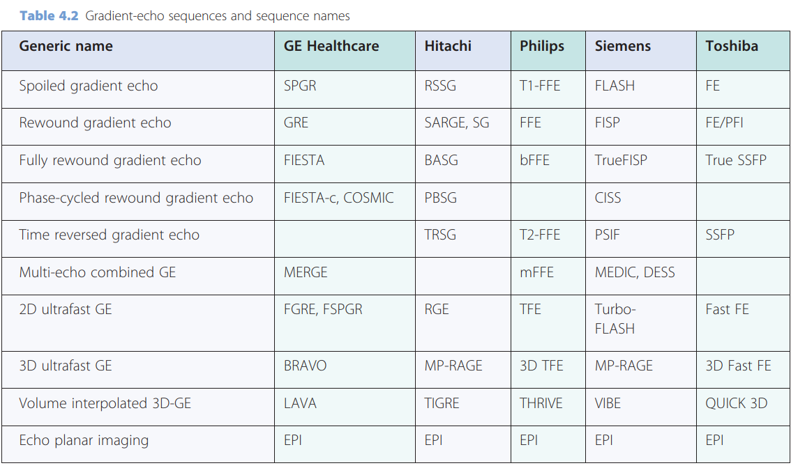

- Introduction
	- MR images are produced using a repeating series of RF and gradient pulses, known as a pulse sequence or simply sequence.
	- All sequences have a repetition time TR, and an echo time TE, which control the sequence timing.
		- 
		- {:height 521, :width 446}
	- All sequences have an excitation RF pulse which disturbs the body’s protons and creates a signal in the RF coils.
	- The signal can be detected by forming either a spin echo (SE) or a gradient echo (GE). SE sequences have a second RF pulse for refocusing the signal echo, and this extra pulse corrects the signal for B0 inhomogeneities. GE sequences use gradient pulses to create the echo, which can be much faster than SE, but has sensitivity to B0 inhomogeneity.
	- A useful variant of SE is the inversion recovery (IR) sequence, which starts with a 180° pulse to invert the protons’ magnetization. The delay between the inversion pulse and the excitation pulse is called the inversion time (TI). By setting TI to a particular fraction of the T1 of a tissue it is possible to null the signals from that tissue.
- [[MRI Mechanism]]
- MRI Sequences
  id:: 6433a570-426e-4873-a4ed-96def66974dd
	- .pdf)
	- 
	- [T1 vs T2](https://www.radiologymasterclass.co.uk/tutorials/mri/t1_and_t2_images)
		- T1-weighted and T2-weighted images, often referred to as T1 and T2 images.
		- T1 and T2 are fundamental properties of all tissues. They describe the two kinds of relaxation
		  which allow the protons to get back to their equilibrium condition.
		- T1 is known as spin–lattice or longitudinal relaxation time and is always longer than T2.
		- T2 is known as spin–spin or transverse relaxation time.
		- T1 : bright is fat
			- T1 images can be thought of as a map of proton energy within fatty tissues of the body
			- Fatty tissues include subcutaneous fat (**SC fat**) and bone marrow of the vertebral bodies
			- Cerebrospinal fluid (**CSF**) contains no fat – so it appears black on T1-weighted images
		- T2 :  bright is fat and water
			- T2 images are a map of proton energy within fatty **AND** water-based tissues of the body
			- Fatty tissue is distinguished from water-based tissue by comparing with the T1 images – anything that is bright on the T2 images but dark on the T1 images is fluid-based tissue
			- For example, the **CSF** is white on this T2 image and dark on the T1 image above because it is free fluid and contains no fat
			- Note that the bone cortex is black – it gives off no signal on either T1 or T2 images because it contains no free protons
	- STIR and FLAIR sequences are available for suppressing fat or CSF respectively, leaving a ‘T2-weighted’ appearance in the remaining tissues
	- A very simple brain exam might contain a T2w image and a FLAIR, with T1w images pre- and post-Gd.
	- 
	- T2W T2-Weighted Image
		- {{video https://youtu.be/ALRcr-AjRK4}}
		- T2w contrast can be produced by either Spin-Echo (SE) or some Gradient-Echo (GE) sequences. (GE sequences actually produce T2*-weighting, not T2-weighting: the image appearance is similar, but there are important differences which we will explain later.)
		- SE T2 images require long TR and long TE, so they have a long scan time (this is because the scan time depends directly on the TR).
	- T1W T1 Weighted Image
		- {{video https://youtu.be/j5u9349PWIw}}
		- T1-weighted (T1w) images can be produced using either SE or GE sequences.
		- T1w Images Post-Gd
			- The most commonly used contrast agents are based on gadolinium (Gd)
	- FLAIR Fluid Attenuated Inversion Recovery
		- remove the CSF signal, known as ‘nulling the signal’, by choosing an Inversion Recovery (IR) sequence instead of spin echo, and carefully setting the inversion time (TI).
		- {:height 586, :width 506}
	- STIR Short TI Inversion Recovery
		- another IR sequence like FLAIR
		- TI is chosen to null fat signals, which have much shorter T1s than CSF.
		- Using short TI, fluids with long T1s give a high signal, so the STIR appearance is approximately ‘T2w with fat suppression’.
	- PD-Weighted Images
		- PDw images can be produced either with SE or GE sequences; however, for musculoskeletal imaging it is usual to stick to SE
	- Gradient-Echo Images
		- Although the sequence choice is important, the choice of excitation flip angle, α, is much more important to determine the contrast in the images.
		- 
	- Angiographic Images
	  collapsed:: true
		- We can exploit the high signal of flowing blood in MR Angiography (MRA) using a variety of techniques to suppress almost all the signal in static tissues. The three most important sequences are ‘time-of-flight MRA’ (also known as ‘in-flow MRA’), ‘phase-contrast MRA’, and ‘contrast-enhanced MRA’, which uses a very rapid imaging sequence during the injection of gadolinium.
		- 
	- DWI Diffusion-weighted magnetic resonance imaging
		- [DWI](https://mrimaster.com/characterise%20image%20dwi%20.html)
		- Diffusion-Weighted Imaging (DWI) is almost always performed using a spin-echo Echo Planar Imaging (EPI) scan
		- provides image contrast that is dependent on the random microscopic motion of water protons
		- uses a T2-weighted pulse sequence with two extra gradient pulses which is equal in magnitude and opposite in direction
		- imaging is more sensitive to water molecular motion in the direction of the additional applied gradients.
		- Higher water diffusion will result in greater signal attenuation and appears darker on the image. The magnitude of water signal attenuation on diffusion-weighted images depends on two factors: the translational movement of water molecules, and the amount of diffusion weighting.
		- The sensitivity to water diffusion is defined by the gradient factor _b_ (sec/mm2). The higher the b values, the better the sensitivity of diffusion weighted imaging (usually three to four b values are used in diffusion-weighted sequences b50, b500, b1000 and b1400).
	- Spin echo branch
		- 
		- {:height 356, :width 497}
		- {:height 366, :width 473}
		- In terms of increasing speed and complexity the spin-echo branch of the family contains Turbo or Fast Spin Echo (TSE/FSE), turbo GRadient And Spin Echo (GRASE), single-shot TSE or HAlf-Fourier Single-shot Turbo spin Echo (HASTE) and Spin-Echo Echo Planar Imaging (SE-EPI).
		- Others spin echo include FLuid Attenuated Inversion Recovery (FLAIR) and Short TI Inversion Recovery (STIR).
		- In Turbo or Fast Spin Echo (TSE, FSE), multiple signal echoes are collected following each excitation pulse
			- 
	- Gradient Echo Branch
		- {:height 462, :width 467}
		- {:height 333, :width 557}
		-