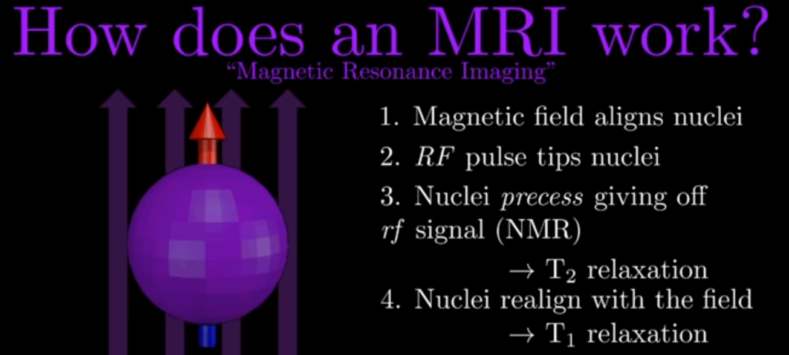
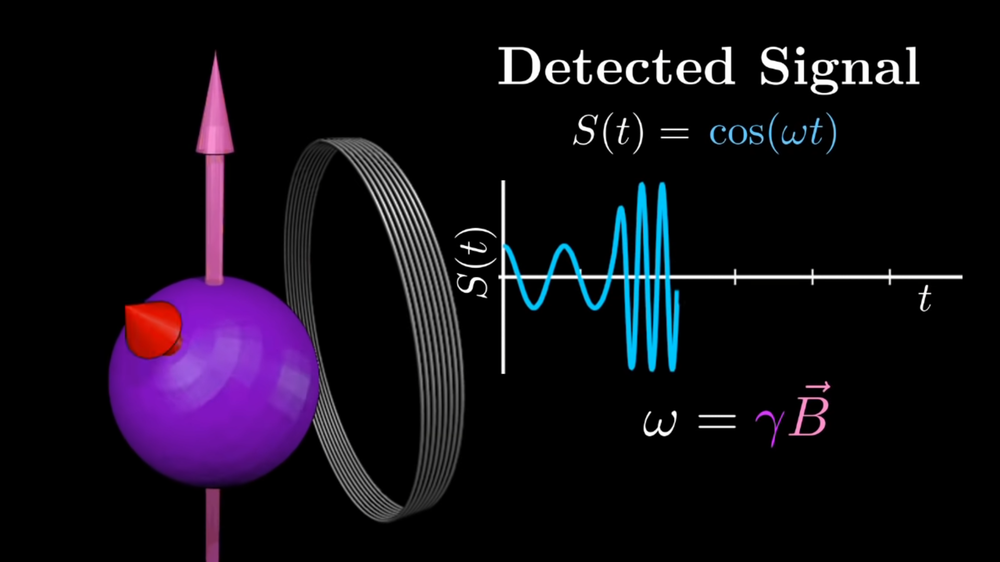
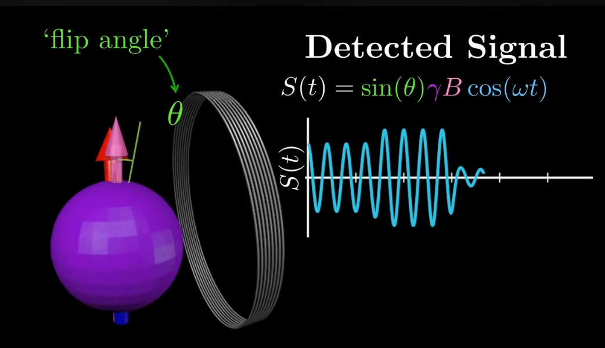
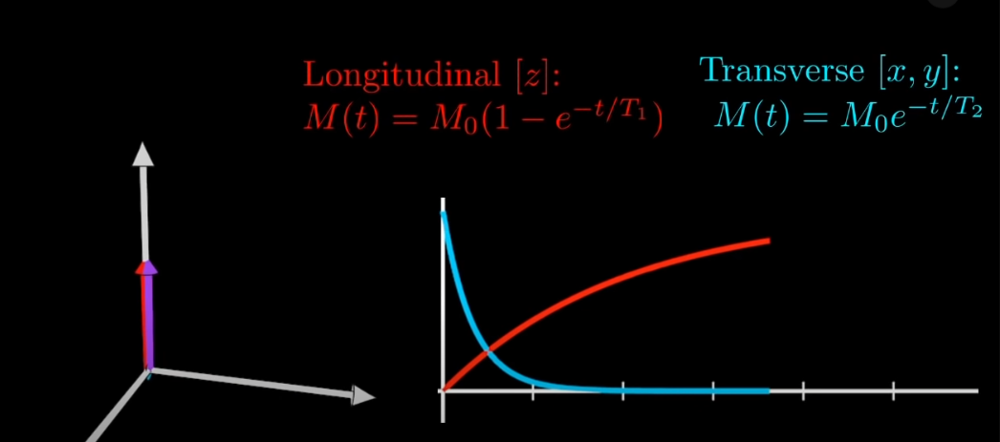
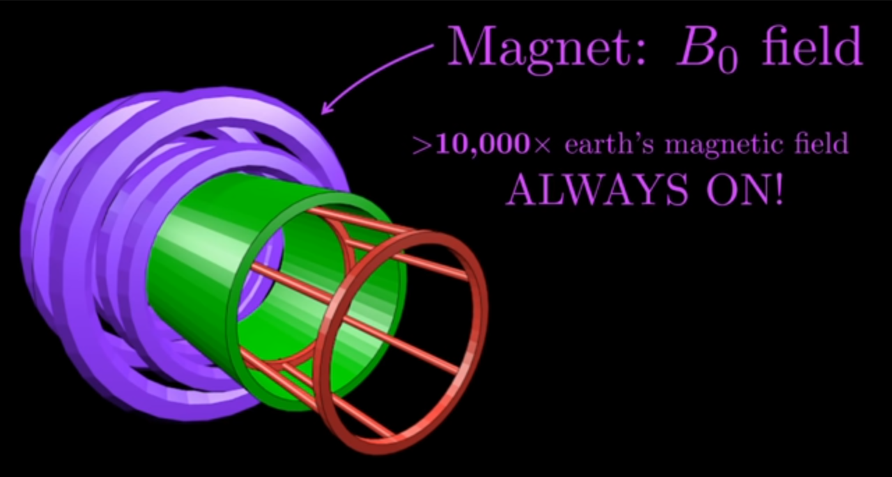
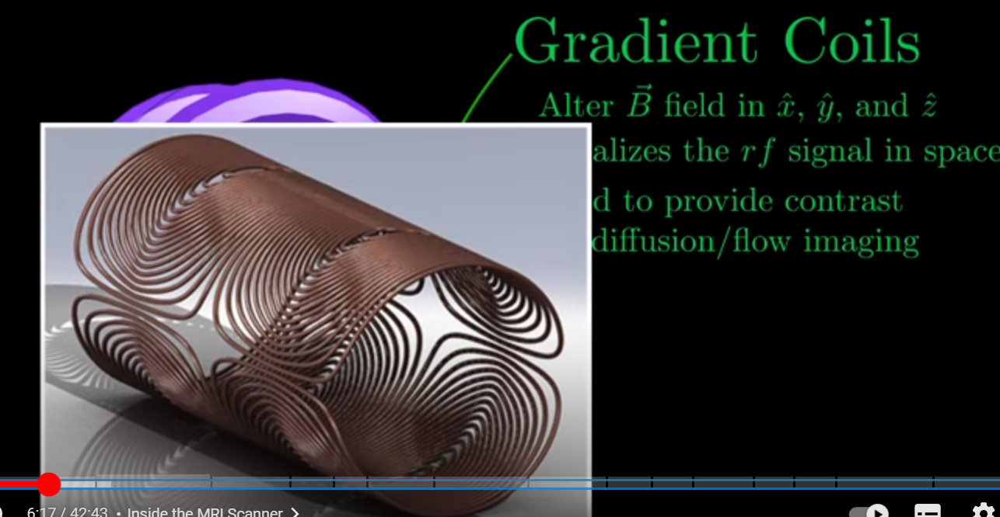
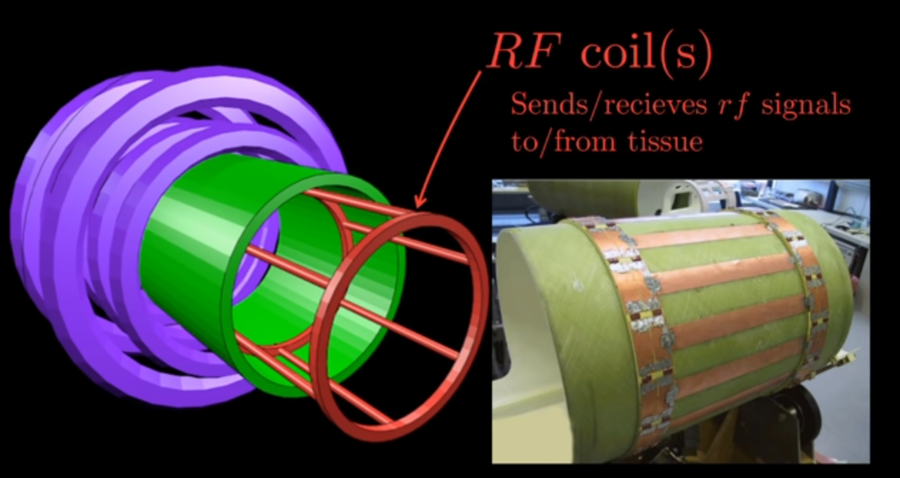

- Reference
	- [How MRI Works - Part 1 - NMR Basics - YouTube](https://www.youtube.com/watch?v=TQegSF4ZiIQ&t=628s)
	- [How MRI Works - Part 2 - The Spin Echo - YouTube](https://www.youtube.com/watch?v=M7yh0To6Wbs)
	- [Basic Pulse Sequences, TR, TE, T1 and T2 weighting - YouTube](https://www.youtube.com/watch?v=kF1hM1Y5Cho)
	- [MRI Sequences - YouTube](https://www.youtube.com/watch?v=mOt2FeGHjaY)
	- [核磁共振为何知道](https://www.bilibili.com/video/BV1di4y1y7au/?share_source=copy_web&vd_source=c03fdb1951bb4a936645ef8f5fff9461)
	- [Introduction to Clinical MRI Physics (part 1 of 3) - YouTube](https://www.youtube.com/watch?v=Yubg0cmXSQg)
	- [Introduction to MRI: Basics 1 - How we get Signal - YouTube](https://www.youtube.com/watch?v=5rjIMQqPukk)
	- https://www.ncbi.nlm.nih.gov/books/NBK564320/
	- ** [MRI Basics | Alignment - YouTube](https://www.youtube.com/watch?v=WHWI5UJ2dPc&list=PLu1MmgmmnvQTBaEKBj7UDnIaHQ_0uYiZu)
- {:height 259, :width 549}
- Quantum Related Knowledge to MRI
	- [[Quantum Mechanics Basic]]
	- Resonance Condition
		- Energy can be introduced into such a stable spin system by applying an electromagnetic wave of the same frequency as the Larmor frequency
	- Excitation
		- {{video https://www.youtube.com/watch?v=wZkoKVDz0rY}}
	- Detected Signal
		- {:height 406, :width 605}
	- Flip angle
		- {:height 314, :width 531}
	- Relaxation Time
		- {:height 245, :width 533}
- MRI Machine Structure
	- [Gradient coils - Questions and Answers ​in MRI (mriquestions.com)](https://mriquestions.com/gradient-coils.html)
	- {:height 228, :width 421}
	- {:height 233, :width 424}
	- {:height 238, :width 428}
- RF Pulse make Quantum Excitation
  id:: 643de787-0b12-4dfb-9890-4056d96d7a3f
	- {{video https://youtu.be/5rjIMQqPukk?t=353}}
	- {{video https://www.youtube.com/watch?v=-O-HY5EQJmw&list=PLu1MmgmmnvQTBaEKBj7UDnIaHQ_0uYiZu&index=4}}
- MRI Signal
	- {{video https://www.youtube.com/watch?v=yFPRtl1Ga08&list=PLu1MmgmmnvQTBaEKBj7UDnIaHQ_0uYiZu&index=7}}
- T1  Relaxation Time > 10 x T2 = 63% of original log
	- {{video https://www.youtube.com/watch?v=g11nuTHC_cQ&list=PLu1MmgmmnvQTBaEKBj7UDnIaHQ_0uYiZu&index=7}}
	- {{video https://youtu.be/1Mq-jy3HJao}}
- 90 degree RF Pulse
	- {{video https://youtu.be/wZkoKVDz0rY}}
- T2 Relaxation Time = 37 % of original log
	- {{video https://www.youtube.com/watch?v=Mf6r5Nqh-xI&list=PLu1MmgmmnvQTBaEKBj7UDnIaHQ_0uYiZu&index=8}}
	- {{video https://youtu.be/GBlT-64k42s}}
- 180 degree RF Pulse
	- {{video https://www.youtube.com/watch?v=yKmEbCPV4Cg}}
	- {{video https://www.youtube.com/watch?v=gqgC2XD0Oe8}}
- TR Time
	- 
	- {{video https://youtu.be/lxFfN8Ka05c}}
- slice selection, phase encoding and frequency encoding
	- [Phase-encoding - Questions and Answers ​in MRI (mriquestions.com)](https://mriquestions.com/what-is-phase-encoding.html)
- Mechanism
	- MRI (Magnetic Resonance Imaging) is a medical imaging technique that uses a strong magnetic field and radio waves to generate detailed images of the body's internal structures. The mechanism of MRI involves the following steps:
	- Alignment of hydrogen atoms: The human body contains millions of hydrogen atoms, which have a property called [[Spin]] . When placed in a strong magnetic field, these hydrogen atoms align themselves with the direction of the magnetic field.
	- Excitation of hydrogen atoms: A radiofrequency (RF) pulse is applied to the aligned hydrogen atoms, causing them to absorb energy and move away from their aligned state. This process is called resonance.
	- Relaxation of hydrogen atoms: After the RF pulse is turned off, the hydrogen atoms return to their aligned state and release the absorbed energy as electromagnetic signals.
	- Detection of electromagnetic signals: A receiver coil detects the electromagnetic signals released by the hydrogen atoms and sends them to a computer.
	- Image reconstruction: The computer processes the signals and creates a detailed image of the body's internal structures.
	- The strength of the magnetic field and the timing of the RF pulses are carefully controlled to produce different types of MRI images, such as T1-weighted, T2-weighted, and diffusion-weighted images. MRI can be used to image soft tissues, such as the brain, spinal cord, and internal organs, and is often used to diagnose a variety of medical conditions, including cancer, neurological disorders, and joint injuries.