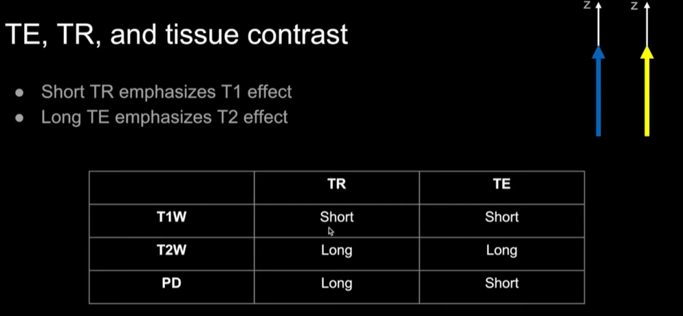
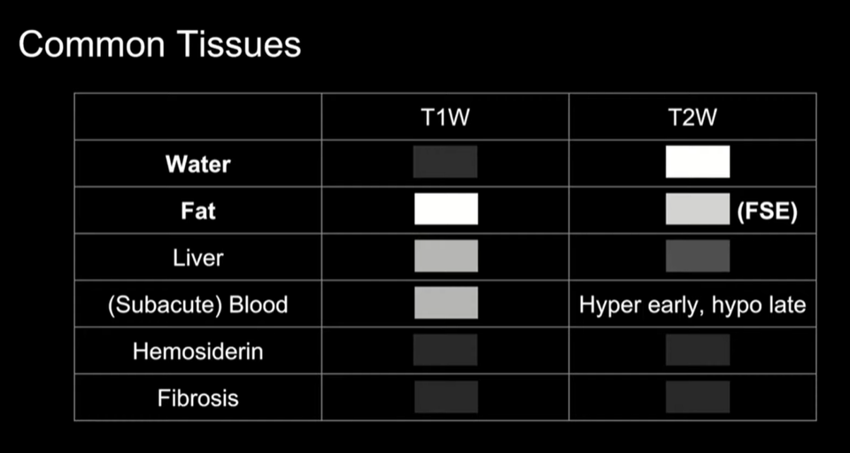

- .pdf)
- [Questions and Answers ​in MRI - MRI Questions & Answers; MR imaging physics & technology](https://mriquestions.com/index.html)
- {:height 430, :width 630}
	- [[Spin Echo Branch of MRI Sequence]]
	- [[Gradient Echo Branch of MRI Sequence]]
- 
- [[T2W T2-Weighted Image]]
- [[T1W T1-Weighted Image]]
- [[PD-Weighted Images]]
- [[FLAIR Fluid Attenuated Inversion Recovery]]
- [[STIR Short TI Inversion Recovery]]
- [[Gradient-Echo Images]]
- [[Angiographic Images]]
- [[DWI Diffusion-weighted magnetic resonance imaging]]
- T1 vs T2
  id:: 643f4d74-12c8-40d4-9da5-dabdab4e7a10
	- [T1 vs T2](https://www.radiologymasterclass.co.uk/tutorials/mri/t1_and_t2_images)
	- {:height 283, :width 609}
	- {:height 325, :width 609}
	- T1-weighted and T2-weighted images, often referred to as T1 and T2 images.
	- T1 and T2 are fundamental properties of all tissues. They describe the two kinds of relaxation
	  which allow the protons to get back to their equilibrium condition.
	- T1 is known as spin–lattice or longitudinal relaxation time and is always longer than T2.
	- T2 is known as spin–spin or transverse relaxation time.
	- T1 : bright is fat
		- T1 images can be thought of as a map of proton energy within fatty tissues of the body
		- Fatty tissues include subcutaneous fat (**SC fat**) and bone marrow of the vertebral bodies
		- Cerebrospinal fluid (**CSF**) contains no fat – so it appears black on T1-weighted images
	- T2 :  bright is fat and water
		- T2 images are a map of proton energy within fatty **AND** water-based tissues of the body
		- Fatty tissue is distinguished from water-based tissue by comparing with the T1 images – anything that is bright on the T2 images but dark on the T1 images is fluid-based tissue
		- For example, the **CSF** is white on this T2 image and dark on the T1 image above because it is free fluid and contains no fat
		- Note that the bone cortex is black – it gives off no signal on either T1 or T2 images because it contains no free protons