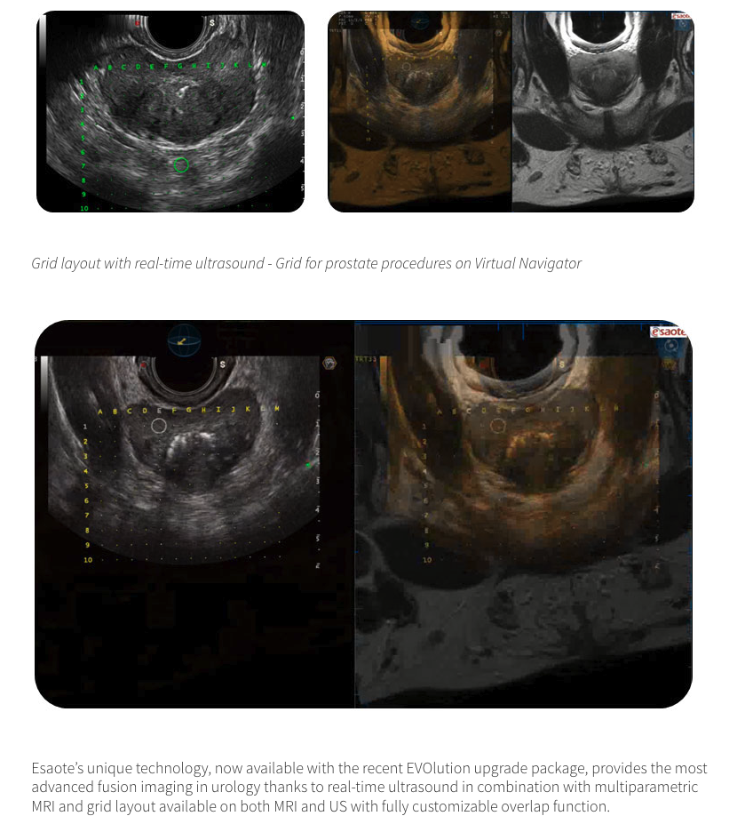
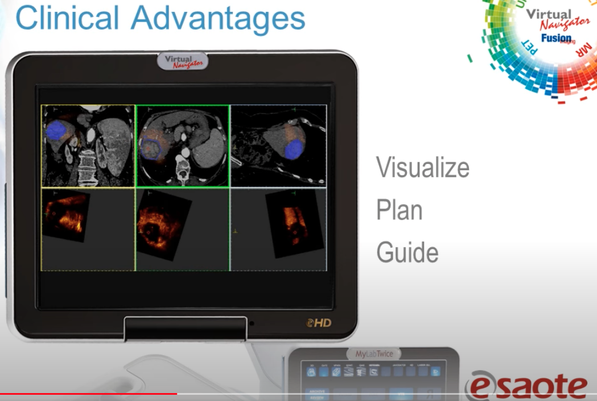

- [[Categories of  Image Fusion]]
  title:: Medical Image Fusion
- [[Methods of Image Fusion]]
	- > [[@A Review : Image Fusion Techniques and Applications]]
	- IHS Transform
	- Principal Component Analysis
	- Pyramid Techniques
	- High Pass Filtering
	- Wavelet Transform
	- Artificial Neural Network
	- Discrete Cosine Transform
- Application
	- Cancer staging
	- **Biopsy planning**
	- **Radiotherapy treatment planning**
	- Quantitative assessment of treatment response
	- Pre-surgical assessment of other conditions, e.g. epilepsy
	- As an effective communication tool when reporting to clinical meetings, referring physicians or to patients
	- Whenever multiple data sources may be better assessed together
- Papers
	- [[@A Review : Image Fusion Techniques and Applications]]
	- ~~No method mentioned [[@Real-Time Image Fusion Involving Diagnostic Ultrasound]]~~
	- [[@Medical image fusion: A survey of the state of the art]]
- Fusion Examples
	- [Philips Media Gallery](https://www.usa.philips.com/healthcare/product/HCNOCTN150/fusion-and-navigation-image-fusion-and-needle-navigation)
	- 
- Prostate Biopsy Device
	- UroNav (Philips/InVivo, Gainesville, Fl)
	  collapsed:: true
		- 
	- Artemis (Eigen)
	  collapsed:: true
		- 
	- Urostation (Koelis)
	  collapsed:: true
		- 
	- HI-RVS/Real-time Virtual Sonography (Hitachi) and Virtual Navigator (Esaote)
		- Esaote
			- 
			- 
	- BioJet (GeoScan Medical)
	- BiopSee (PiMedical/ MedCom)