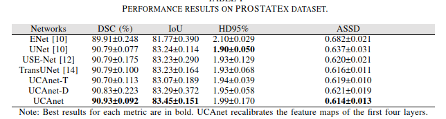
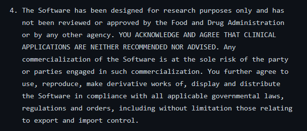

- # Dataset
	- Brain
		- [2012 MICCAI Multi-Atlas Labeling Challenge Data](http://www.neuromorphometrics.com/2012_MICCAI_Challenge_Data.html)
			- 30 manually labeled MRI brain scans, 25 unique subjects, 5 subjects scanned twice.
	- Prostate MRI dataset
	  id:: 64238f0e-d27f-42c4-8f37-ab486ddffd02
		- [Prostate158 - Training data](https://github.com/kbressem/prostate158)
			- [Prostate158 - Training data | Zenodo](https://zenodo.org/record/6481141)
			- [Prostate158 - test data | Zenodo](https://zenodo.org/record/6592345)
			- Permission is granted to view and use the Prostate158 dataset free of charge for personal, non-commercial research purposes only. Any commercial use, sale, or other form of monetization is prohibited.
		- [Promise12](https://promise12.grand-challenge.org/)
			- New* [PROMISE12: Data from the MICCAI Grand Challenge: Prostate MR Image Segmentation 2012 | Zenodo](https://zenodo.org/record/8026660)
			- Teams (research groups, companies, etc.) who are developing a segmentation algorithm can register and [download](http://promise12.grand-challenge.org/Download) multi-center, multi-vendor training data from this website to train their algorithms. Test data will also be supplied.
		- [ProstateX](https://prostatex.grand-challenge.org/)
			- New* [SPIE-AAPM-NCI PROSTATEx Challenges (PROSTATEx) - The Cancer Imaging Archive (TCIA) Public Access - Cancer Imaging Archive Wiki](https://wiki.cancerimagingarchive.net/pages/viewpage.action?pageId=23691656)
			- Studies include T2-weighted (T2W), proton density-weighted (PD-W), dynamic contrast-enhanced (DCE), and diffusion-weighted (DW) imaging.
			- The images were acquired on two different types of Siemens 3T MR scanners, the MAGNETOM Trio and Skyra.
			- T2-weighted images were acquired using a turbo spin echo sequence and had a resolution of around 0.5 mm in-plane and a slice thickness of 3.6 mm.
			- The DCE time series were acquired using a 3-D turbo flash gradient echo sequence with a resolution of around 1.5 mm in-plane, a slice thickness of 4 mm and a temporal resolution of 3.5 s.
			- The proton density weighted image was acquired prior to the DCE time series using the same sequence with different echo and repetition times and a different flip angle.
			- The DWI series were acquired with a single-shot echo planar imaging sequence with a resolution of 2 mm in-plane and 3.6 mm slice thickness and with diffusion-encoding gradients in three directions. Three b-values were acquired (50, 400, and 800), and subsequently, the ADC map was calculated by the scanner software. All images were acquired without an endorectal coil.
		- https://drive.google.com/drive/folders/1HqEgzS8BV2c7xYNrZdEAnrHk7osJJ--2
- # Tools #👩‍💻software
	- [[SAM Segment Anything Model]]
	- [[TotalSegmentator]]
	- [[Train your own dataset using nnUNet]]
	- [Biomedisa](https://biomedisa.de/)
	- [davidiommi/Pytorch--3D-Medical-Images-Segmentation--SALMON: Segmentation deep learning ALgorithm based on MONai toolbox: single and multi-label segmentation software developed by QIMP team-Vienna. (github.com)](https://github.com/davidiommi/Pytorch--3D-Medical-Images-Segmentation--SALMON)
	- 
		- 
- # Prostate Segmentation
	- ((64238f0e-d27f-42c4-8f37-ab486ddffd02))
	- Manually Segmentation Software #👩‍💻software
		- ~~[MedSeg (amazonaws.com)](http://htmlsegmentation.s3.eu-north-1.amazonaws.com/index.html)~~
		- ~~[BioImage Suite Web](https://bioimagesuiteweb.github.io/webapp/)~~
		- [Files · master · Kenneth Philbrick / rilcontour · GitLab](https://gitlab.com/Philbrick/rilcontour/tree/master)
		  id:: 641ab9a9-6067-4e77-832d-7066cfbd32c1
		- [The Medical Imaging Interaction Toolkit (MITK) - mitk.org](https://www.mitk.org/wiki/The_Medical_Imaging_Interaction_Toolkit_(MITK))
		- 3D Slicer
		- ITK-Snap
	- Segmentator: [Demo (deepinfer.org)](http://www.deepinfer.org/models/prostate-segmenter/)
		- Only 1 type of MRI is segmented, mainly the centre part (50%)
		- Using docker, each time only one image and need a new container
		- 
		-