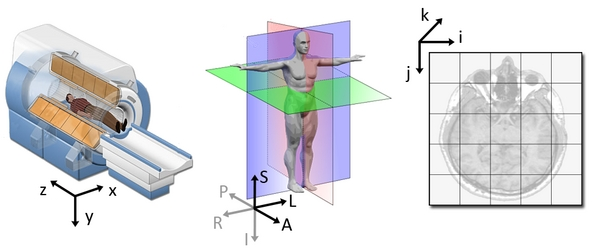
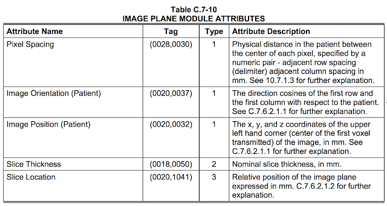
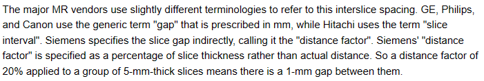
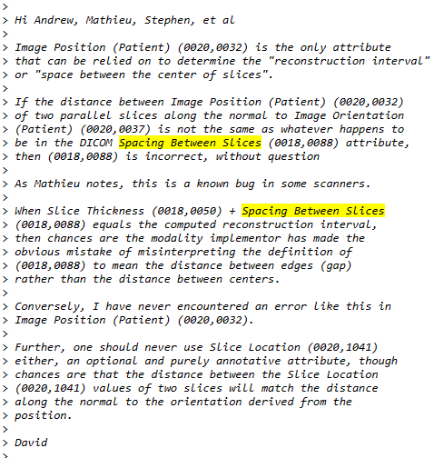
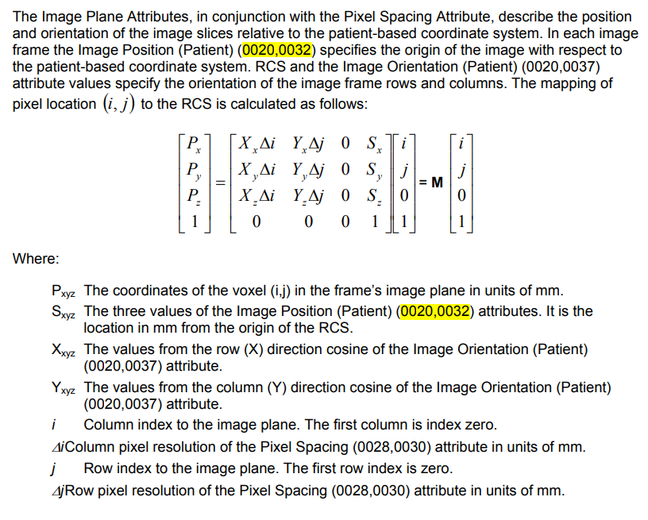

# Coordinate
	- Reference
		- [Coordinate systems - Slicer Wiki](https://www.slicer.org/wiki/Coordinate_systems)
		- [Medical Image Coordinate Systems - MATLAB & Simulink (mathworks.com)](https://www.mathworks.com/help/medical-imaging/ug/medical-image-coordinate-systems.html)
		- [Coordinate Systems in Medical Data Science — a rant | by Max Rohleder | Geek Culture | Medium](https://medium.com/geekculture/coordinate-systems-in-medical-data-science-a-rant-90394f60b27)
	- **world**, **anatomical** and the **image coordinate system**
		- 
		- World coordinate system:
			- Cartesian coordinate system
			- Every model (e.g. a MRI scanner or a patient) inside has its own coordinate system
		- Anatomical coordinate system
			- {:height 309, :width 691}
			- If the patient lies face up in the MRI or CT System as shown in the image above, the *xyz *world system and the *lps *patient system will coincide. This is the assumed standard system in DICOM.
		- Image coordinate system
			- The 𝑖 axis increases to the right, the 𝑗 axis to the bottom and the 𝑘 axis backwards.
- # NRRD
	- [Teem: nrrd: Definition of NRRD File Format (sourceforge.net)](https://teem.sourceforge.net/nrrd/format.html#space)
	- NRRD Header
		- ```
		  NRRD0004
		  # Complete NRRD file format specification at:
		  # http://teem.sourceforge.net/nrrd/format.html
		  type: unsigned short
		  dimension: 3
		  space: left-posterior-superior  //here, we can find the coordinate type - LPS
		  sizes: 384 384 23
		  space directions: (0.52076933113286539,-0.0081635581693292429,0) (0.0081635581693292429,0.52076933113286539,0) (0,0,3.5000000000000009)
		  kinds: domain domain domain
		  endian: little
		  encoding: raw
		  space origin: (-99.58852389999997,-44.180069000000024,-58.925540900000037)
		  ```
		- {:height 245, :width 510}
	- Voxel space to physical space
		- {:height 184, :width 723}
- # DICOM
	- Reference
		- The DICOM Homepage: [https://dicom.nema.org/](https://dicom.nema.org/)
		- DICOM on wikipedia: [https://en.wikipedia.org/wiki/DICOM](https://en.wikipedia.org/wiki/DICOM)
		- [DICOM is easy](http://dicomiseasy.blogspot.com/) (*)
		- [ITK reads DICOM](https://examples.itk.org/src/io/gdcm/readdicomseriesandwrite3dimage/documentation)
		- [Tutorial: Pydicom reads DICOM Tags](https://towardsdatascience.com/understanding-dicoms-835cd2e57d0b)
	- ## [Intro of DICOM](https://theaisummer.com/medical-image-coordinates/#introduction-to-dicom-for-machine-learning-engineers)
		- DICOM has naturally become the industry standard.
		- DICOM is both a file format and a networking protocol.
		- it contains a huge amount of meta-data with the image (and usually redundant).
			- The meta-data contains critical information that must be kept within the file to ensure they are never separated from each other.
			- {:height 223, :width 691}
		- A DICOM *data set* is a ordered list of data elements.
			- The order of the list is the order of the tags of the data elements.
			- Ultrasound image structure can refer from [here](https://dicom.innolitics.com/ciods/us-image).
			- {:height 448, :width 665}
	- ## DICOM Element
		- Every DICOM Element has a Tag, a Data Type called VR (acronym for Value Representation), Length and Value.
			- _1721710110910_0.PNG)
		- In the dump above the lines starts with the tag number (gggg,eeee), then the VR Code, then the value (strings are printed in square brackets) and then a hash sign ( # ) followed by the element value length, a comma, then Value multiplicity (which we'll talk about later) and the tag name.
			- _1721710124311_0.PNG)
		- The tag name and multiplicity are add by the dump method.
	- ## DICOM Module
		- Image related modules:
			- _1721710169439_0.PNG)
		- ### Image Pixel Module
			- [in DICOM Standard](https://dicom.nema.org/medical/Dicom/2017c/output/chtml/part03/sect_C.7.6.3.html)
			- All DICOM Objects must include the SOP (The classes of the DICOM static data model) Common Module and modules from the four main IE’s (Information Entities): Patient, Study, Series and Image
			- Rows (0028,0010) and Columns (0028,0011) define the size of the image as Height (Y) and Width (X).
			- Samples per pixel (0028,0002) define the number of color channels.  
			  In grayscale images like CT and MR it is set to 1 for the single grayscale channel and for color images like in our case it is set to 3 for the three color channels Red, Green and Blue.
			- Photometric interpretation (0028,0004)  is the color space used to encode the image.
				- "RGB" meaning the first channel ir Red, the second is Green and the third is Blue.
				- "MONOCHROME2" meaning its grayscale and 0 should be interpreted as Black.
			- Planar configuration (0028,0006) defines how the color channels are arranged in the pixel data buffer. More in [Chapter 12: Pixel Data - dicomiseasy.blogspot.com](http://dicomiseasy.blogspot.com/2012/08/chapter-12-pixel-data.html)
			- Bits Allocated, Bits Stored and High Bit: More in [Chapter 12: Pixel Data - dicomiseasy.blogspot.com](http://dicomiseasy.blogspot.com/2012/08/chapter-12-pixel-data.html)
			- Pixel Representation (0028,0103) is either unsigned (0) or signed (1)
			- Number of Frames (0028,0008) defines how many frames are in the image.
			- Pixel data element (7FE0, 0010)
		- ### The Image Plane module
			- [in DICOM Standard](https://dicom.nema.org/medical/Dicom/2016b/output/chtml/part03/sect_C.7.6.2.html)
			- The Image Plane module is part of the CT Image IOD (Information Object Definition) and the MR Image IOD and any other object that have a frame of reference, i.e. that has a spatial coordinates system related to the patient or in other words is a 3D scan of the body.
			- 
		- ### Voxel space to physical space
			- RCS(Reference Coordinates System) in DICOM is LPH / LPS
			- {:height 416, :width 741}
				- Image Position (0020,0032) specifies the x, y, and z coordinates of the upper left hand corner of the image; it is the center of the first voxel transmitted.
				- Image Orientation (0020,0037) specifies the direction cosines of the first row and the first column with respect to the patient.
					- Image Orientation (Patient) (0020,0037) has 6 values (VM = 6).
					- It's two Normalized 3D vectors(i.e. directions) (Xx, Xy, Xz) (Yx, Yy, Yz)
					- These are direction cosines of the image plane relative to the RCS.
	- ## Tags
		- Look up tag
			- Clean and simple DICOM tag browser: [https://dicom.innolitics.com](https://dicom.innolitics.com/)
			- A useful tag lookup site: [http://dicomlookup.com/](http://dicomlookup.com/)
			- A hyperlinked version of the standard: [https://web.archive.org/web/20180624030937/http://dabsoft.ch/dicom/](https://web.archive.org/web/20180624030937/http://dabsoft.ch/dicom/)
		- ### Spacing Between Slices (0018, 0088)
			- different vendors use the **same** dicom tags for addressing different things. For instance, the attribute Spacing Between Slices (0018, 0088) means two **different** things depending on the vendor
			  [MRI Acronyms - Options - MR-TIP.com](https://www.mr-tip.com/serv1.php?type=cam&sub=1)
			  
			- [Slice cross-talk - Questions and Answers ​in MRI (mriquestions.com)](https://mriquestions.com/cross-talk.html)
			  
		- ### Slice thickness (0018,0050)
			- should not use *spacing between slices (0018,0088)* and *slice location (0020,1041)*
			  [[Insight-users] Slice spacing of DICOM series (itk.org)](https://itk.org/pipermail/insight-users/2008-November/027903.html)
			  
			- [Slice position and accuracy - Questions and Answers ​in MRI (mriquestions.com)](https://mriquestions.com/slice-parameters.html)
			  [Tag (0018,0050) Slice Thickness does not correspond to what I calculate in the image - Support - 3D Slicer Community](https://discourse.slicer.org/t/tag-0018-0050-slice-thickness-does-not-correspond-to-what-i-calculate-in-the-image/27438)
			  
			- Slice distance calculation [How to calculate space between dicom slices for MPR? - Stack Overflow](https://stackoverflow.com/questions/14930222/how-to-calculate-space-between-dicom-slices-for-mpr)
			  {:height 322, :width 397}