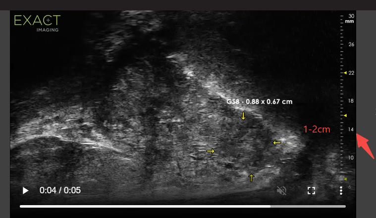
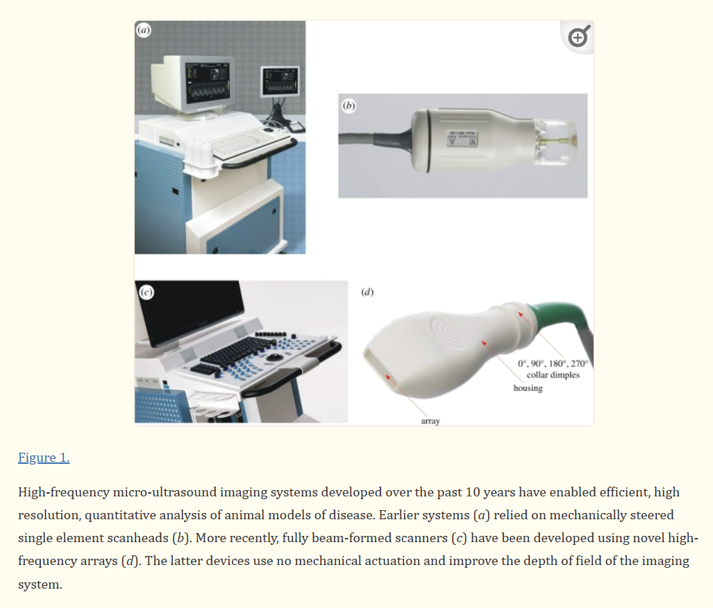
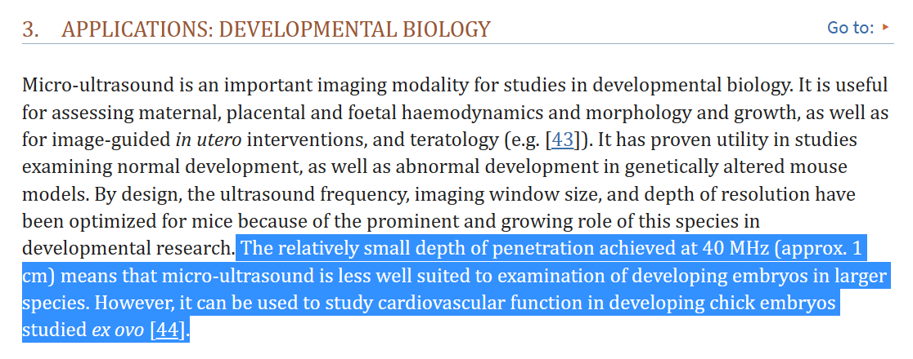

- First invented for animal (mouse) ultrasound examination
	- [2006 Award of Distinction - Dr. Stuart Foster for Non-Invasive Ultrasound Imaging - YouTube](https://youtu.be/RV6EqzJZj7k)
- [Micro-Ultrasound IMAGE GALLERY - Exact Imaging.](https://www.exactimaging.com/image-gallery)
	- 
- [Micro-ultrasound for preclinical imaging - PMC (nih.gov)](https://www.ncbi.nlm.nih.gov/pmc/articles/PMC3262267/)
	- 
	- 
- [Vevo F2 for Small to Larger Animals | FUJIFILM VisualSonics](https://www.visualsonics.com/product/imaging-systems/vevo-f2-preclinical)
	- 