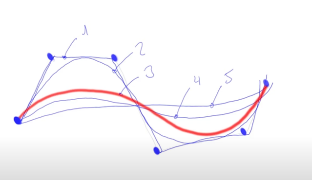
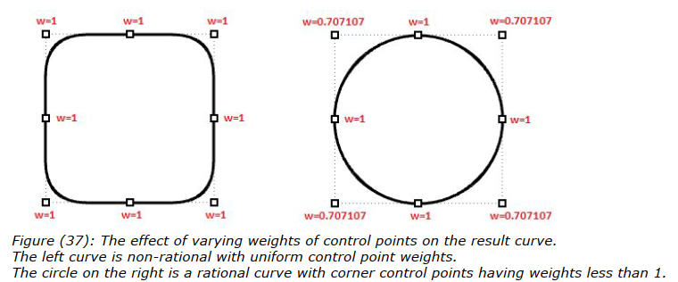
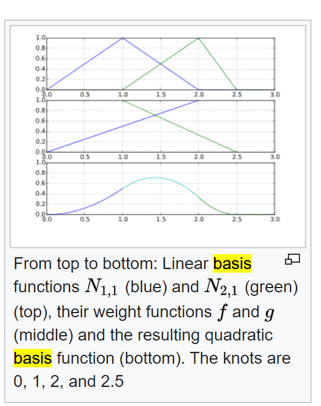
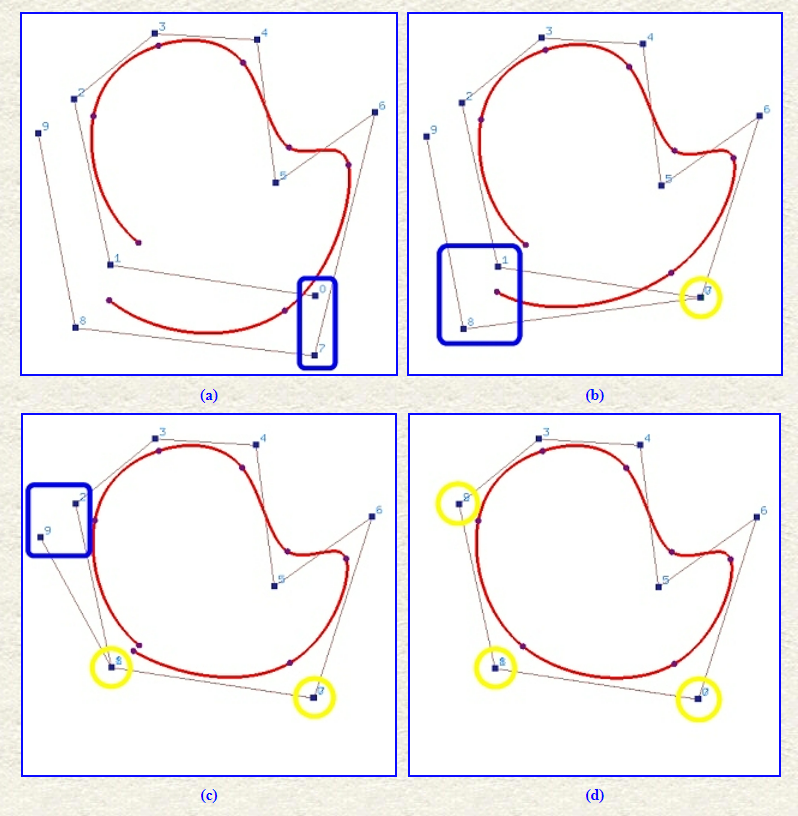
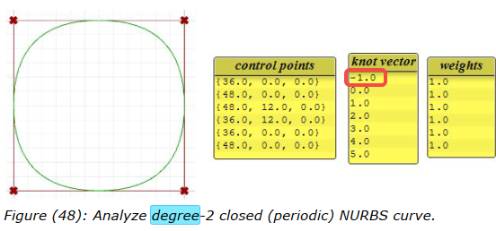
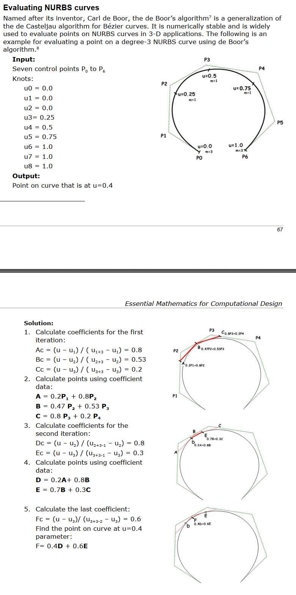
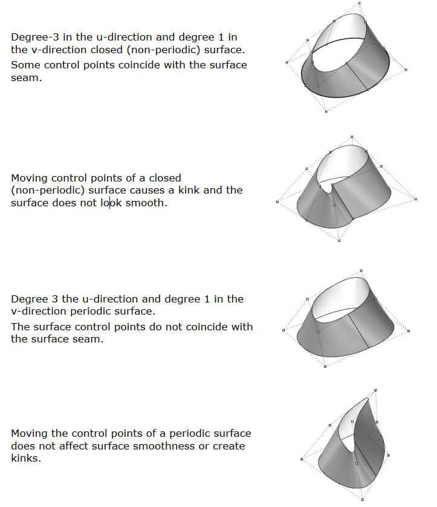
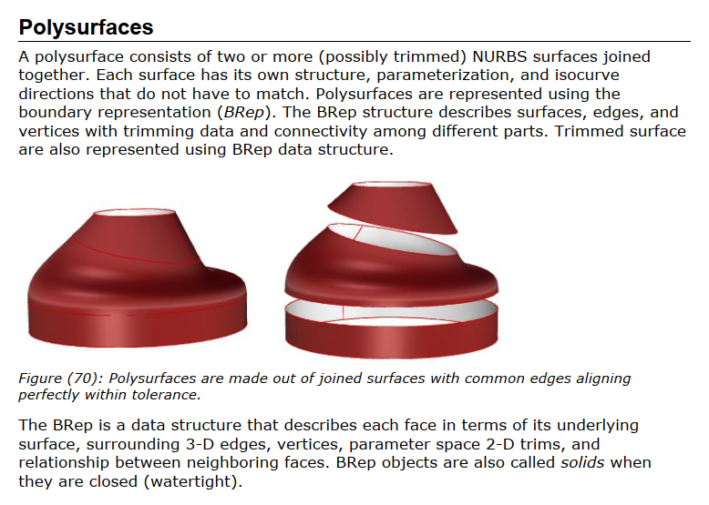
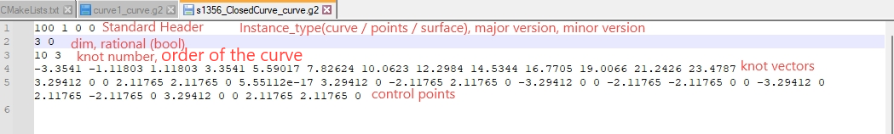

- * [NURBS Part 1: An introduction to NURBS - YouTube](https://www.youtube.com/watch?v=GJnXuSsjtZo)
- ** [4.1 Introduction to NURBS Geometry - Intro to Parametric Modeling](https://youtu.be/HofbVh--LKg)
- *** https://wiki.mcneel.com/rhino/home/essentialmathematics
	- 
- NURBS
	- Degree
		- 2nd Degree is just tangent to control polygon
		- {:height 252, :width 426}
	- Weights of the Control points
		- 
	- Knot
		- define the effective range of basic function, in corresponding to control points
	- Basic function
		- {:height 395, :width 309}
	- Close curve
		- {:height 486, :width 466}
		- 
	- Evaluate
		- {:height 1083, :width 536}
	- Closed Surface
		- {:height 573, :width 488}
	- Polysurfaces
		- 
- NURBS Library
	- [SINTEF-Geometry/SISL](https://github.com/SINTEF-Geometry/SISL)
		- C++
		- 
		- Installation
			- Viewer
				- Need to download freeglut
				- And find gl.h in windows using `everything` software
		- File format: g2
			- Curve
				- 
				  id:: 64585808-c815-417b-923b-b313a50baa5d
	- [mcneel/opennurbs](https://github.com/mcneel/opennurbs/tree/v7.11.21285.13001)
		- will read and write openNURBS 3D model files (*.3dm*).
		- [Rhino - The openNURBS initiative (rhino3d.com)](https://www.rhino3d.com/it/features/developer/opennurbs/)
	- [msteinbeck/tinyspline](https://github.com/msteinbeck/tinyspline#documentation)
		- ANSI C library for NURBS, B-Splines, and Bézier curves with interfaces for C++, C#, D, Go, Java, Javascript, Lua, Octave, PHP, Python, R, and Ruby. (github.com)
		- MIT License: free for company
		- C++: [TinySpline: /tinyspline/src/tinyspline.h File Reference (msteinbeck.github.io)](https://msteinbeck.github.io/tinyspline/tinyspline_8h.html)
		- just spline no surface
	- [NURBS-Python](https://github.com/orbingol/NURBS-Python)
		- [examples](https://github.com/orbingol/geomdl-examples)