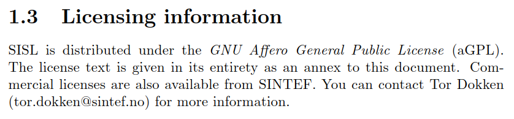

- [NURBS Part 1: An introduction to NURBS - YouTube](https://www.youtube.com/watch?v=GJnXuSsjtZo)
- NURBS Library
	- [SINTEF-Geometry/SISL: The SINTEF Spline Library (github.com)](https://github.com/SINTEF-Geometry/SISL)
		- 
		- Installation
			- Viewer: Tried for 2022, 2019, 2015, all failed 
	- [mcneel/opennurbs at v7.11.21285.13001 (github.com)](https://github.com/mcneel/opennurbs/tree/v7.11.21285.13001)
		- will read and write openNURBS 3D model files (*.3dm*).
		- [Rhino - The openNURBS initiative (rhino3d.com)](https://www.rhino3d.com/it/features/developer/opennurbs/)
	- [msteinbeck/tinyspline: ANSI C library for NURBS, B-Splines, and Bézier curves with interfaces for C++, C#, D, Go, Java, Javascript, Lua, Octave, PHP, Python, R, and Ruby. (github.com)](https://github.com/msteinbeck/tinyspline#documentation)
		- MIT License: free for company
		- C++: [TinySpline: /tinyspline/src/tinyspline.h File Reference (msteinbeck.github.io)](https://msteinbeck.github.io/tinyspline/tinyspline_8h.html)
		- just spline no surface