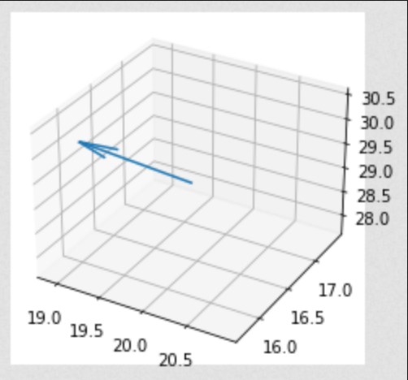
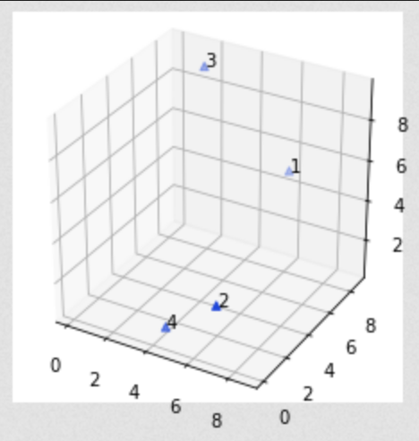
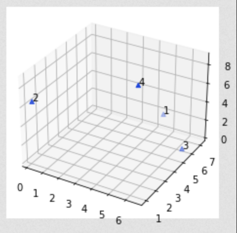
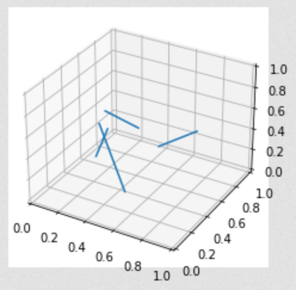

# Numpy notes


```python
import numpy as np
```
- ## `np.r_[]`, `np.c_[]`
	- ```python
	  np.r_[-1:1:6j, [0]*3, 5, 6]
	  ```
	  
	    [-1.  -0.6 -0.2  0.2  0.6  1.   0.   0.   0.   5.   6. ]
	    [[1 4]
	     [2 5]
	     [3 6]]
	  
	  
	  
	  ```python
	  np.c_[[1,2,3],[4,5,6]]
	  ```
	  
	  
	  
	  
	    array([[1, 4],
	           [2, 5],
	           [3, 6]])
- ## `np.hstack()`
	- ```python
	  a = np.array((1,2,3))
	  b = np.array((4,5,6))
	  np.hstack((a,b))
	  ```
	  
	  
	  
	  
	    array([1, 2, 3, 4, 5, 6])
	  
	  
	  
	  
	  ```python
	  a = np.array([[1],[2],[3]])
	  b = np.array([[4],[5],[6]])
	  np.hstack((a,b))
	  ```
	  
	  
	  
	  
	    array([[1, 4],
	           [2, 5],
	           [3, 6]])
- ## `np.argwhere()` vs `np.where()`
	- `np.argwhere()` return index
	  
	  `np.where()` return index in tuple, use the index direct on other array
	  
	  
	  ```python
	  np.argwhere(np.arange(6).reshape(2,3)>1)
	  ```
	  
	  
	  
	  
	    array([[0, 2],
	           [1, 0],
	           [1, 1],
	           [1, 2]], dtype=int64)
	  
	  
	  
	  
	  ```python
	  np.where([[True, False], [True, True]],
	         [[1, 2], [3, 4]],
	         [[9, 8], [7, 6]])
	  ```
	  
	  
	  
	  
	    array([[1, 8],
	           [3, 4]])
- ## `np.intersect1d()`
	- select common element from 2 1d array
	  
	  
	  ```python
	  np.intersect1d([1, 3, 4, 3], [3, 1, 2, 1])
	  ```
	  
	  
	  
	  
	    array([1, 3])
- ## `np.unique()`
	- axis apply able
	  
	  
	  ```python
	  a = np.array([[1, 0, 0], [1, 0, 0], [2, 3, 4]])
	  np.unique(a, axis=0)
	  ```
	  
	  
	  
	  
	    array([[1, 0, 0],
	           [2, 3, 4]])
	- ### unique row in array, find same row in array
	- ```python
	  a = np.array([1,1,1,2,3,4,1,2,3,2,3,4]).reshape(-1,3)
	  temp1 = [tuple(row) for row in np.sort(a,axis=1)]
	  temp2,counts = np.unique(temp1,axis=0,return_counts=True)
	  print(temp1)
	  print(temp2)
	  print(counts) # duplicate times for temp2's row in temp1
	  ```
	  
	    [(1, 1, 1), (2, 3, 4), (1, 2, 3), (2, 3, 4)]
	    [[1 1 1]
	     [1 2 3]
	     [2 3 4]]
	    [1 1 2]
- ## `np.linalg.det()`
	- can handle all $\dots \times \dots \times n\times n$ multi-dimensional array
	  
	  
	  ```python
	  a = np.array([ [[1, 2], [3, 4]], [[1, 2], [2, 1]], [[1, 3], [3, 1]] ])
	  a.shape
	  (3, 2, 2)
	  np.linalg.det(a).shape
	  ```
	  
	  
	  
	  
	    (3,)
- ## `np.all()`
	- ```python
	  np.all([[True,False],[True,True]], axis=0)
	  ```
	  
	  
	  
	  
	    array([ True, False])
- ## `np.cross()`
	- ```python
	  x = np.array([[1,2,3], [4,5,6]])
	  y = np.array([[4,5,6], [1,2,3]])
	  np.cross(x, y)
	  ```
	  
	  
	  
	  
	    array([[-3,  6, -3],
	           [ 3, -6,  3]])
	  
	  
	  
	  
	  ```python
	  np.cross(x, y, axisc=0)
	  ```
	  
	  
	  
	  
	    array([[-3,  3],
	           [ 6, -6],
	           [-3,  3]])
- ## `np.isin()`
	- find elements not in sub-array
	  
	  
	  ```python
	  x = np.array([1,3,5,7])
	  y = np.arange(9)
	  y[np.isin(y,x,invert=True)]
	  ```
	  
	  
	  
	  
	    array([0, 2, 4, 6, 8])
- ## `np.flatten()` & `np.squeeze()`
	- ```python
	  x = np.array([[[0], [1], [2]]])
	  
	  print(x)
	  print(x.flatten())
	  print(np.squeeze(x))
	  print(np.squeeze(x, axis=0))
	  ```
	  
	    [[[0]
	      [1]
	      [2]]]
	    [0 1 2]
	    [0 1 2]
	    [[0]
	     [1]
	     [2]]
- ## `np.linalg.norm()` :unitfy the vector
	- ```python
	  x = np.arange(6).reshape(-1,2)
	  
	  x = x / np.linalg.norm(x,axis=-1)[:,None]
	  np.linalg.norm(x,axis=-1)
	  ```
	  
	  
	  
	  
	    array([1., 1., 1.])
- ## `np.linalg.det()`
	- ```python
	  a = np.array([ [[1, 2], [3, 4]], [[1, 2], [2, 1]], [[1, 3], [3, 1]] ])
	  b = np.linalg.det(a)
	  print(a.shape)
	  print(b.shape)
	  print(b)
	  ```
	  
	    (3, 2, 2)
	    (3,)
	    [-2. -3. -8.]
- ## `np.einsum()`
- ### multi-dimensional tensor product
	- ```python
	  a = np.random.rand(6,4,3)
	  # aj tensor product ak
	  aj_t_k = np.einsum('ijl,ikn->ijkln',a,a)
	  # ak tensor produce aj
	  ak_t_j = np.einsum('ijl,ikn->ijknl',a,a)
	  print(aj_t_k[2,1,2])
	  print(ak_t_j[2,2,1])
	  ```
	  
	    [[0.37252991 0.43198341 0.45613034]
	     [0.17406449 0.20184412 0.21312677]
	     [0.04924295 0.05710183 0.0602937 ]]
	    [[0.37252991 0.43198341 0.45613034]
	     [0.17406449 0.20184412 0.21312677]
	     [0.04924295 0.05710183 0.0602937 ]]
- ### set diagnoal for multi-dimensional matrix
	- ```python
	  a = np.zeros((6,4,4,3,3))
	  np.einsum('...jj->...j',a)[...] = np.arange(3)[None,None,None,:]
	  print(a[0,0,0],'\n',a[3,2,1])
	  ```
	  
	    [[0. 0. 0.]
	     [0. 1. 0.]
	     [0. 0. 2.]] 
	     [[0. 0. 0.]
	     [0. 1. 0.]
	     [0. 0. 2.]]
- ## `np.repeat()` & `np.tile()`
	- ```python
	  x = np.array([[1,2],[3,4]])
	  print(np.repeat(x,2).reshape(2,-1))
	  print(np.repeat(x, [1, 2], axis=1))
	  print(np.tile(x,(1,2)))
	  ```
	  
	    [[1 1 2 2]
	     [3 3 4 4]]
	    [[1 2 2]
	     [3 4 4]]
	    [[1 2 1 2]
	     [3 4 3 4]]
- # Matplotlib
	- ```python
	  import matplotlib.pyplot as plt
	  ```
- ## Plot without break code
	- ```python
	  plt.show(block=False)
	  ```
- ## 3D plot
	- ```python
	  fig = plt.figure()
	  ax = plt.axes(projection='3d')
	  ps = np.random.rand(4,3)*10
	  ax.scatter(ps[:,0],ps[:,1],ps[:,2],marker='^',c='#1E46DA')
	  ```
	  
	  
	  
	  
	    <mpl_toolkits.mplot3d.art3d.Path3DCollection at 0x2510cf1adc8>
	  
	  ​ 
- ## Multiple 3D Subplot
	- ```python
	  def create_axs(subplot_n,block=False):
	    r = int(np.floor(np.sqrt(subplot_n)))
	    c = int(subplot_n/r)
	    fig = plt.figure(figsize=plt.figaspect(0.5))
	    axs = {}
	    for i in range(subplot_n):
	        axs[i] = fig.add_subplot(r, c, i+1, projection='3d')
	    return axs
	  ```
- ## Equal Axis for 3D plot
	- require matplotlib 3.5
	  
	  
	  ```python
	  def plt_equal(ax):
	    ax.set_box_aspect((1, 1, 1))  # IMPORTANT - this is the new, key line
	    set_axes_equal(ax)  # IMPORTANT - this is also required
	    
	  def set_axes_equal(ax: plt.Axes):
	        """Set 3D plot axes to equal scale.
	  
	        Make axes of 3D plot have equal scale so that spheres appear as
	        spheres and cubes as cubes.  Required since `ax.axis('equal')`
	        and `ax.set_aspect('equal')` don't work on 3D.
	        """
	        limits = np.array([
	            ax.get_xlim3d(),
	            ax.get_ylim3d(),
	            ax.get_zlim3d(),
	        ])
	        origin = np.mean(limits, axis=1)
	        radius = 0.5 * np.max(np.abs(limits[:, 1] - limits[:, 0]))
	        _set_axes_radius(ax, origin, radius)
	  
	  def _set_axes_radius(ax, origin, radius):
	    x, y, z = origin
	    ax.set_xlim3d([x - radius, x + radius])
	    ax.set_ylim3d([y - radius, y + radius])
	    ax.set_zlim3d([z - radius, z + radius]) 
	  
	  ```
	  
	  
	  ```python
	  from mpl_toolkits.mplot3d.art3d import Line3DCollection
	  fig = plt.figure()
	  ax = fig.add_subplot(projection='3d')
	  ps = np.random.rand(4,3)*10
	  ax.scatter(ps[:,0],ps[:,1],ps[:,2],marker='^',c='#1E46DA')
	  for i in range(4):  ax.text(ps[i, 0], ps[i, 1], ps[i, 2], f'{i + 1}')
	  plt_equal(ax)
	  ```
	  
	   
	  ​
- ## Add Text
	- ```python
	  fig = plt.figure()
	  ax = plt.axes(projection='3d')
	  ps = np.random.rand(4,3)*10
	  ax.scatter(ps[:,0],ps[:,1],ps[:,2],marker='^',c='#1E46DA')
	  for i in range(4):  ax.text(ps[i, 0], ps[i, 1], ps[i, 2], f'{i + 1}')
	  ```
	  
	  
	  ​    
	   
	  ​
- ## Draw line segments
	- ```python
	  from mpl_toolkits.mplot3d.art3d import Line3DCollection
	  
	  line_segs = np.random.rand(4,2,3)
	  
	  lc = Line3DCollection(line_segs.reshape(-1, 2, 3))
	  
	  fig = plt.figure()
	  ax = plt.axes(projection='3d')
	  ax.add_collection(lc)
	  ```
	  
	  
	  
	  
	    <mpl_toolkits.mplot3d.art3d.Line3DCollection at 0x2510cb51288>
	  
	  
	  
	  
	   
	  ​
- ## Draw vector
	- ```python
	  v = np.random.rand(3)*2-1
	  p = np.random.rand(3)*20+10
	  fig = plt.figure()
	  ax = plt.axes(projection='3d')
	  ax.quiver(p[0],p[1],p[2],v[0],v[1],v[2])
	  ```
	  
	  
	  
	  
	    <mpl_toolkits.mplot3d.art3d.Line3DCollection at 0x1c951cea448>
	  
	  ​    
	   
	  ​
- # Json
	- ```python
	  import json
	  ```
- ## save and load
	- numpy array is not allowed, need to use `.tolist()`
	  
	  
	  ```python
	  #save
	  data_dict ={1:[2,3,1],"this":["i","2","s"]}
	  with open('data.json','w') as f:
	    json.dump(data_dict,f)
	  
	  #load    
	  with open('data.json', 'r') as f:
	    data_dict = json.load(f)
	  ```
- # Python General
- ## Save dict key value to local
	- ```python
	  data_dict ={'s':[2,3,1],"this":["i","2","s"]}
	  for key, value in data_dict.items():
	    exec(key + '=np.array(value)')
	  print(s,this)
	  ```
	  
	    [2 3 1] ['i' '2' 's']
- ## pass **kwargs
	- ```python
	  def child(**kwargs):
	    print('I am child, i found')
	    for key, value in kwargs.items():
	        print(f'{key}: {value}')
	        
	  def parent(**kwargs):
	    print('I am parent, i give')
	    for key, value in kwargs.items():
	        print(f'{key}: {value}')
	    child(**kwargs)
	  parent(a = 1, b="st",c=np.random.rand(3))
	  ```
	  
	    I am parent, i give
	    a: 1
	    b: st
	    c: [0.11453608 0.92654534 0.6779164 ]
	    I am child, i found
	    a: 1
	    b: st
	    c: [0.11453608 0.92654534 0.6779164 ]
- ## Load `.mat` file
	- ```python
	  import scipy.io
	  mat = scipy.io.loadmat('data.mat')
	  for k,v in mat.items():
	    exec(k+'=v')
	  ```
- ## Dict append value to key
	- ```python
	  dt = {}
	  for i in range(5):
	    for j in range(i):
	        dt.setdefault(i,[]).append(j)
	  print(dt)
	  ```
	  
	    {1: [0], 2: [0, 1], 3: [0, 1, 2], 4: [0, 1, 2, 3]}