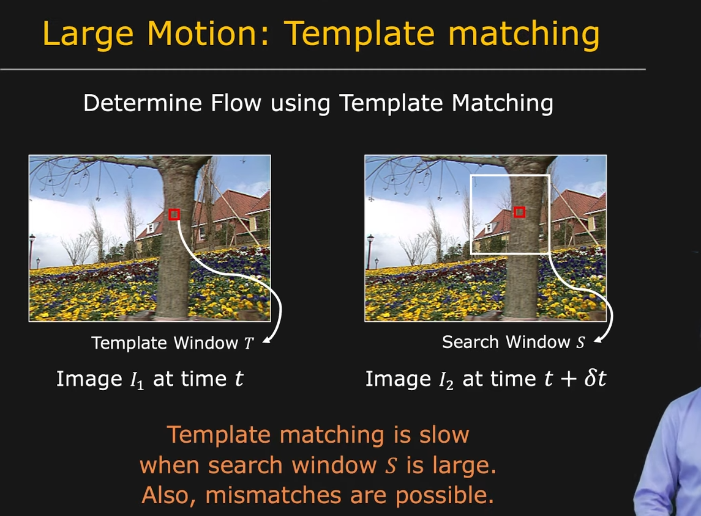

- Reference
	- [OpenCV explaination](https://docs.opencv.org/3.4/d4/dee/tutorial_optical_flow.html)
	- [Wiki](https://en.wikipedia.org/wiki/Optical_flow#:~:text=Optical%20flow%20or%20optic%20flow,brightness%20pattern%20in%20an%20image.)
	- [Optical flow from bottom up](https://nanonets.com/blog/optical-flow/)
	- [Lecture Notes](https://homes.cs.washington.edu/~shapiro/EE596/notes/Optical_Flow.pdf)
	- [Matlab Applications](https://www.mathworks.com/matlabcentral/fileexchange/17500-high-accuracy-optical-flow?s_tid=srchtitle)
- Applications
	- [A Youtube Playlist](https://youtube.com/playlist?list=PL2zRqk16wsdoYzrWStffqBAoUY8XdvatV&si=EnSIkaIECMiOmarE)
	- 
	- 
	- 
	- 
	- 
- Dataset
	- Middlebury Benchmark Dataset
	- KITTI
	- Sintel
- Theory
	- 
	- Assumption:
	  1. The pixel intensities of an object do not change between consecutive frames.
	  2. Neighbouring pixels have similar motion.
	- Steps:
	  
		- At time t, **Image intensity** $I(x,y,t)$
		- time $t+dt$, $I(x,y,t)=I(x+dx,y+dy,t+dt)$ based on **Assumption 1**
		- [taylor series](https://en.wikipedia.org/wiki/Taylor_series) approximation of right-hand side
		  	   $I(x+dx,y+dy,t+dt) = I(x,y,t) + \partial I/ \partial x * dx + \partial I/ \partial y * dy + \partial I/ \partial t * dt$
		  		$0 = \partial I/ \partial x * dx + \partial I/ \partial y * dy + \partial I/ \partial t * dt$
		- divide $dt$
		  	  $0 = \partial I/ \partial x * dx/dt + \partial I/ \partial y * dy/dt + \partial I/ \partial t * 1$
		- **Optical Flow** 
		  $Vx = dx/dt, Vy = dy/dt$
		  $Ix = \partial I/ \partial x$
		  for $Iy, Iz, It$
		  $0 = IxVx + IyVy + It$
		  =>$-It = IxVx +IyVy$
		- image convolution for Ix, Iy => [image kernel](https://setosa.io/ev/image-kernels/)
- Calculation methods
	- Phase correlation
	  collapsed:: true
		- [Phase correlation](https://en.wikipedia.org/wiki/Phase_correlation#:~:text=Phase%20correlation%20is%20an%20approach,calculated%20by%20fast%20Fourier%20transforms.)
		- inverse of normalized cross-power spectrum
		- 1. Apply window, e.g., Hamming
		  2. Fourier Transform, $G_i=\mathscr{F}(g_i)$
		  3. Find [Cross-Power Specturm](https://en.wikipedia.org/wiki/Spectral_density#Cross-spectral_density) $R=\frac{G_1\circ G_2}{|G_1\circ G_2|}$
		  4. Inverse Fourier Transform, $r=\mathscr{F}^{-1}(R)$
	- Block-based methods
	  collapsed:: true
		- minimizing sum of squared differences or sum of absolute differences, or maximizing normalized [cross-correlation](https://en.wikipedia.org/wiki/Cross-correlation)
	- Differential methods of estimating optical flow
		- based on partial derivatives of the image signal and/or the sought flow field and higher-order partial derivatives, such as:
		- [Wiki - image derivative](https://en.wikipedia.org/wiki/Image_derivative)
		- Lucas–Kanade method
			- **[Lucas–Kanade method](https://en.wikipedia.org/wiki/Lucas%E2%80%93Kanade_method)** – regarding image patches and an affine model for the flow field[10]
			- [Matlab Implementation](https://www.mathworks.com/matlabcentral/fileexchange/48744-lucas-kanade-tutorial-example-1)
			- The Lucas–Kanade method assumes that the **displacement** of the image contents between two nearby instants (frames) is **small** and approximately **constant** within a **neighborhood** of the point **p** under consideration. Thus the optical flow equation can be assumed to hold for all pixels within a window centered at p.
			- *Need points extraction first - ShiTomasi [[Corner Detection]] *
		- Horn–Schunck method
			- **[Horn–Schunck method](https://en.wikipedia.org/wiki/Horn%E2%80%93Schunck_method#:~:text=The%20Horn%E2%80%93Schunck%20method%20of,Optical%20Flow%20for%20further%20description)** – optimizing a functional based on residuals from the brightness constancy constraint
			- The Horn–Schunck method of estimating [optical flow](https://en.wikipedia.org/wiki/Optical_flow) is a global method which introduces a global constraint of *smoothness* to solve the *[aperture problem](https://en.wikipedia.org/wiki/Aperture_problem)*
			  collapsed:: true
				- *The motion direction of a contour is ambiguous, because the motion component parallel to the line cannot be inferred based on the visual input. This means that a variety of contours of different orientations moving at different speeds can cause identical responses in a motion sensitive neuron in the visual system.*
				- *The aperture problem refers to the fact that the motion of a one-dimensional spatial structure, such as a bar or edge, cannot be determined unambiguously if it is viewed through a small aperture such that the ends of the stimulus are not visible.*
			- Two main assumptions
				- **Brightness Constancy Assumption**: The brightness or intensity of a moving object remains constant between consecutive frames.
				- **Smoothness Assumption**: The motion of neighboring pixels in the image is expected to be similar, meaning that the optical flow field should be smooth.
			- minimizing an **energy function** that combines a data term (based on the brightness constancy assumption) and a smoothness term (based on the smoothness assumption).
			- particular regularization term expressing the expected smoothness of the flow field
		- Buxton–Buxton method
			- based on a model of the motion of edges in image sequences
		- Black–Jepson method
			- coarse optical flow via correlation
		- General variational methods
			- a range of modifications/extensions of Horn–Schunck, using other data terms and other smoothness terms.
		- Discrete optimization methods
			- the search space is quantized, and then image matching is addressed through label assignment at every pixel, such that the corresponding deformation minimizes the distance between the source and the target image.[12] The optimal solution is often recovered through Max-flow min-cut theorem algorithms, linear programming or belief propagation methods.
- Tips
	- 
	- 
	- 
- Sparse optical flow vs Dense optical flow
	- Sparse optical flow gives the flow vectors of some "interesting features" (say few pixels depicting the edges or [[Corner Detection]] of an object) within the frame while Dense optical flow, which gives the flow vectors of the entire frame (all pixels) - up to one flow vector per pixel. As you would've guessed, Dense optical flow has higher accuracy at the cost of being slow/computationally expensive.