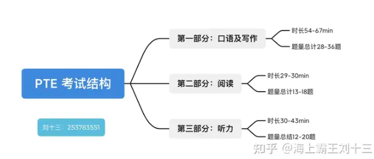

- References
	- [PTE 9炸自學指南: 兩個月備考攻略 (上) - 太陽彼得。闖。澳洲](https://sunpeteraustralia.com/pte/)
	- [PTE 9炸自學指南: 兩個月備考攻略 (下) - 太陽彼得。闖。澳洲](https://sunpeteraustralia.com/pte-2/)
- 
- # [[Famous Indian Brother Tutorial]]
	- {{video https://youtu.be/8EAnOFiQiqg?si=K9bsrxINcrvVt655}}
- # [[Personal Plan of PTE]]
- # 2025 Changes in PTE
	- {{video https://youtu.be/HhUKq-tDKsk?si=ItJ8zQWxufco08dX}}
	- Pitch problem ( above 130(m), above 200 (f))
		- Increase pitch (shouting)
		- Audio analyse App
	- Template banning
		- DI
		- Retell lecture
	- Writing
		- Giving more point to content
		- Related to the question
		- using complex and compound sentences
	- Conjunction
		- Fill in the blanks
	- Many collocation blanks
		- 12 - 20 collocation
	- 1 difficult write from dictation out of 3/4
		- 13 - 14 words
	- Reading section lengthy
		- Reading fill in the blanks
	- Tab button doesn't work
	- Trial question are back
		- Affect the score, try it