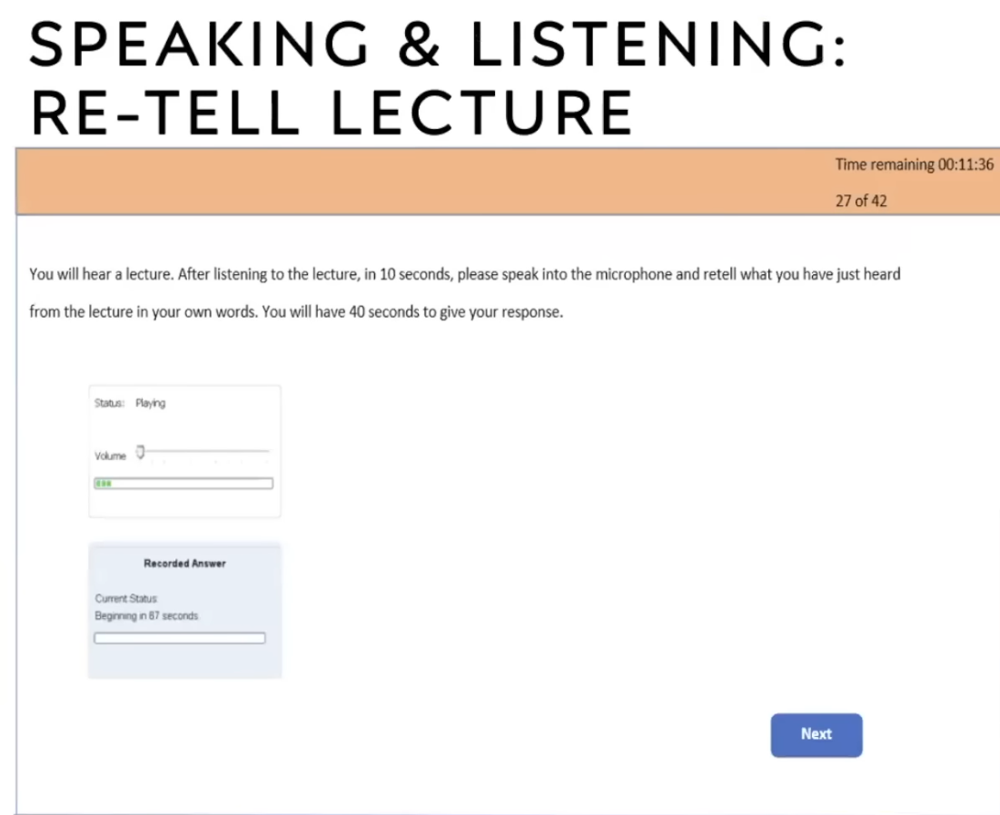

- {{video https://youtu.be/8EAnOFiQiqg?si=K9bsrxINcrvVt655}}
- # General
	- 2 h
	- 20 Types of Questions
	- Mic position: parallel to the mouth
	- Mic 3 seconds will stop
	- Speaking and Writing
		- 55 mins
		- Can take notes
	- Reading
		- 30 mins
		- 5 question types
	- Listening
		- 40 mins
		- 8 question types
- # Speaking
	- ## Read Aloud
		- Reading time + speaking time
			- {:height 302, :width 484}
		- Personal Introduction: name, doing, why this test
		- 6-7 questions
		- 35 masks to speaking, 35 masks to reading
		- Fluency (90%)> content > pronunciation
		- Skills
			- Skip difficult words
				- {:height 261, :width 389}
			- Speak 2 lines if you are not confident of reading full
				- {:height 261, :width 389}
			- Dont give preferences to "s" sounds
			- When not sure of how to speak, either skip or speak in your own way
			- Pitch issues: maintain 300 below for a girl and 130 above for a guy
		- ### Key tips
			- fluently
			- no fumble
			- skip difficult words
			- give natural pauses for comma and full stop
			- speak clearly, open the mouth
			- don't go fast / slow, use natural speed
	- ## Repeat Sentence
		- After audio, see recording and speak (NO Beep Sound)
			- {:height 261, :width 389}
		- 10-12 questions
		- 30 marks to speaking, 30 marks to listening
		- Fluency 5 (90%), content 3, pronunciation 5 (clarity)
		- 50 percent match at least but need fluent
		- ### Key Tips
			- repeat at 60 percent of content, don't try to speak everything
			- NO fumble or hesitate
			- Maintain speaking speed and pauses
	- ## Describe Image
		- 4-6 questions
		- 8-10 marks to speaking
		- {:height 261, :width 389}
		- Fluency 5 (100%), pronunciation 5 (100%), content 1%
		- Give preference to fluency alone
		- Template (2025)
			- New skill
				- {{video https://youtu.be/d3PQaSMiyyI?si=INF_04lbtB4viBAp}}
				- {:height 261, :width 389}
				- Identify 3 things in 20s, write sentences in 20s
		- ### Key Tips
			- Need to speak more than 20s
			- Don't use template
			- Speak long sentence
			- Content related to image
	- ## Re-tell Lecture
		- 1-2 questions
		- 8-10 marks to speaking
		- 8-10 marks to listening
		- After lecture will given 10s
			- {:height 261, :width 389}
		- 5s listen, 5s write, when listen dont write, when write dont listen
		- Write 4-5 small phrases (not only keywords)
		- Use template and just speak like read aloud
		- Template
			- fill in the phrases in one by one
			- {:height 261, :width 389}
			- If points not enough, just repeat
		- ### Key Tips
			- No fumble
			- normal speed
			- listen or write, not at the same time
			- Write phrases instead of words
	- ## Answer short question
		- 5-8 questions
		- max 1-2 marks
		- not a high priority
		- {:height 261, :width 389}
		- Speak the answer if you know else repeat the question
			- {:height 261, :width 389}
- # Writing
	- ## Summarize written text
		- {:height 261, :width 389}
		- 1 sentence
		- 40-50 words
		- 1-2 questions
		- contributes marks to writing and reading
		- 4-5 marks max
			- Spelling and grammar will lead to zero
		- Copy 2 sentences, add comma and connector
			- {:height 261, :width 389}
	- ## Write Essay
		- Not a priority
		- {:height 261, :width 389}
		- Marks
			- Form grammar spelling
			- {:height 261, :width 389}
		- Template
			- {:height 261, :width 389}
			- Although such topics, in all likelihood, never will yield a consensual agreement, a constructive dialogue on ___can lead to thought-provoking discussions. My view is that, irrespective of the numerous arguments that exist on either side, _____. Through the course of this essay, I shall put forth my points and calculations by considering both sides of the argument. 
			  There are a number of reasons in favor of my viewpoint.
			- Firstly _______. This is because ______. For example, _____. In conclusion, the aforementioned discussion constructively justifies my stance. 
			  Another interesting point is that____ . This is mainly due to the fact that ___. To quote an example, the research conducted by department of the American society also reflects on the similar line, and hence, it can be said that the proposition is convincingly justified. 
			  I see that there is equally potential evidence to support the arguments I have provided, and hence, my opinion is that the topic of the statement does reflect on the justification that is provided here.
		- Simple sentence, complex sentence and compound sentence
		-