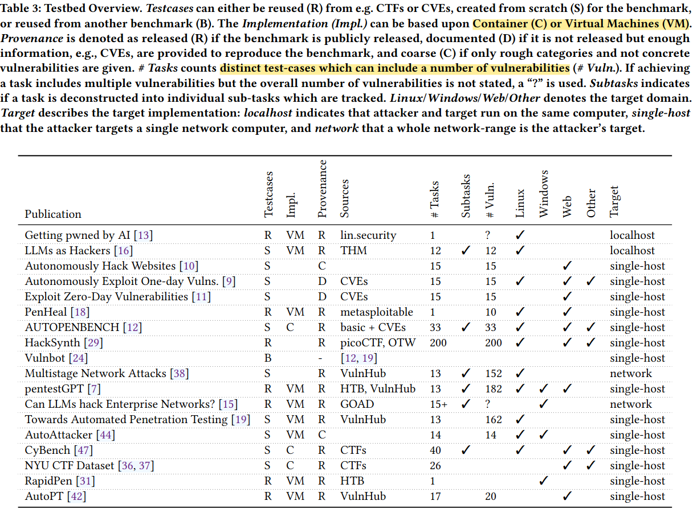

- Comparison table of 20+ published pentest benchmarks.
- See also: [[LLM-Assisted Penetration Testing]]
- ## Venue Guide
	- | Abbrev.        | Full Name                                                  | Type       | Field            |
	  | -------------- | ---------------------------------------------------------- | ---------- | ---------------- |
	  | **USENIX Sec** | USENIX Security Symposium                                  | Conference | Security (Big 4) |
	  | **ASIA CCS**   | ACM Asia Conf. on Computer and Communications Security     | Conference | Security         |
	  | **IEEE TIFS**  | IEEE Trans. on Information Forensics and Security          | Journal    | Security         |
	  | **ICLR**       | International Conf. on Learning Representations            | Conference | ML (Top-tier)    |
	  | **NeurIPS**    | Neural Information Processing Systems                      | Conference | ML (Top-tier)    |
	  | **EMNLP**      | Empirical Methods in Natural Language Processing           | Conference | NLP (Top-tier)   |
	  | **FSE**        | ACM SIGSOFT Foundations of Software Engineering            | Conference | SE (Top-tier)    |
	  | **UMAP**       | ACM Conf. on User Modeling, Adaptation and Personalization | Conference | HCI              |
	  | **AuCy**       | Workshop on Autonomous Cyber                               | Workshop   | AI + Security    |
- **Legend:** Testcases: R=Reused, S=Scratch, B=Both | Impl: C=Container, VM=Virtual Machine | Provenance: R=Public, D=Reproducible (CVEs given), C=Vague (categories only) | Target: localhost → single-host → network
- ## Benchmark Comparison Table
	- | Publication                                | Venue          | Cite | Testcases | Impl. | Provenance | Sources        | # Tasks | Subtasks | # Vuln. | Linux | Windows | Web | Other | Target      |
	  | ------------------------------------------ | -------------- | ---- | --------- | ----- | ---------- | -------------- | ------- | -------- | ------- | ----- | ------- | --- | ----- | ----------- |
	  | **PentestAgent (2025)**                    | ASIA CCS '25   | 34   | R         | C     | R          | VulHub, HTB    | 78      | ✓        | 32 CWE  | ✓     | ✓       | ✓   | ✓     | single-host |
	  | **TermiBench (2025)**                      | arXiv          | -    | S         | C     | R          | GitHub, CVEs   | 510     |          | 30 CVE  | ✓     |         | ✓   | ✓     | network     |
	  | pentestGPT [7]                             | USENIX Sec '24 | 111  | R         | VM    | R          | HTB, VulnHub   | 13      | ✓        | 182     | ✓     | ✓       | ✓   |       | single-host |
	  | AutoPT [42]                                | IEEE TIFS '25  | 13   | R         | VM    | R          | VulnHub        | 17      |          | 20      |       |         |     | ✓     | single-host |
	  | AUTOPENBENCH [12]                          | EMNLP '25      | 33   | S         | C     | R          | basic + CVEs   | 33      | ✓        | 33      | ✓     |         | ✓   | ✓     | single-host |
	  | CyBench [47]                               | ICLR '25       | 105  | S         | C     | R          | CTFs           | 40      | ✓        |         | ✓     |         | ✓   | ✓     | single-host |
	  | NYU CTF Dataset [36, 37]                   | NeurIPS '24    | 31   | S         | C     | R          | CTFs           | 26      |          |         |       |         | ✓   | ✓     | single-host |
	  | Towards Automated Penetration Testing [19] | UMAP '25       | 51   | S         | VM    | R          | VulnHub        | 13      |          | 162     | ✓     |         |     |       | single-host |
	  | Getting pwned by AI [13]                   | FSE '23        | 188  | R         | VM    | R          | lin.security   | 1       |          | ?       | ✓     |         |     |       | localhost   |
	  | PenHeal [18]                               | AuCy '23       | 60   | R         | VM    | R          | metasploitable | 1       |          | 10      | ✓     |         | ✓   |       | single-host |
	  | Autonomously Hack Websites [10]            | arXiv          | 122  | S         |       | C          |                | 15      |          | 15      |       |         | ✓   |       | single-host |
	  | AutoAttacker [44]                          | arXiv          | 134  | S         | VM    | C          |                | 14      |          | 14      | ✓     | ✓       |     |       | single-host |
	  | Autonomously Exploit One-day Vulns. [9]    | arXiv          | 144  | S         |       | D          | CVEs           | 15      |          | 15      | ✓     | ✓       | ✓   |       | single-host |
	  | Vulnbot [24]                               | arXiv          | 44   | B         |       | -          | [12, 19]       |         |          |         |       |         |     |       | single-host |
	  | HackSynth [29]                             | arXiv          | 33   | R         |       | R          | picoCTF, OTW   | 200     |          | 200     | ✓     |         | ✓   | ✓     | single-host |
	  | LLMs as Hackers [16]                       | arXiv          | 35   | S         | VM    | R          | THM            | 12      | ✓        | 12      | ✓     |         |     |       | localhost   |
	  | Exploit Zero-Day Vulnerabilities [11]      | arXiv          | 72   | S         |       | D          | CVEs           | 15      |          | 15      |       |         | ✓   |       | single-host |
	  | Multistage Network Attacks [38]            | arXiv          | 15   | S         |       | R          | VulnHub        | 13      | ✓        | 152     | ✓     |         |     |       | network     |
	  | Can LLMs hack Enterprise Networks? [15]    | arXiv          | 14   | R         | VM    | R          | GOAD           | 15+     | ✓        | ?       |       | ✓       |     |       | network     |
	  | RapidPen [31]                              | arXiv          | 15   | R         | VM    | R          | HTB            | 1       |          |         |       |         | ✓   |       | single-host |
- ## Detailed Benchmarks
	- [[PentestAgent Benchmark]]
	- [[TermiBench]]
	- ### Survey
		- ref: [Benchmarking Practices in LLM-driven Offensive Security: Testbeds, Metrics, and Experiment Design](https://arxiv.org/abs/2504.10112)
		- 
	- [[PentestGPT Benchmark]]
	- [[AutoPenBench Benchmark]]
	- [[AutoPT Benchmark]]
	- [[HackSynth Benchmark]]
	- [[CIPHER Benchmark]]
	- [[AI Pentest Benchmark]]
- ## OWASP Benchmark
	- [[OWASP Benchmark]]
