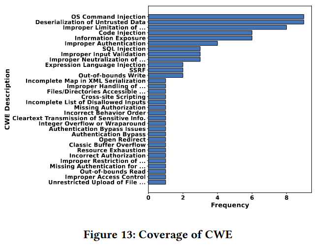

- PentestAgent benchmark details (ASIA CCS '25).
- See also: [[Pentest Benchmark Comparison]]
- ## How to build
	- Source: VulHub (pre-built Docker) and HackTheBox
	- GitHub: https://github.com/nbshenxm/pentest-agent
- ## Specs
	- 78 targets total (67 VulHub + 11 HTB CTF)
	- OWASP Top 10 (8/10), 32 CWE
	- Difficulty (CVSS exploitability): 50 easy, 11 medium, 6 hard + 11 CTF
	- Platforms: Linux, Windows, Web
	- Success criterion: functional exploit execution
- CWE Distribution:
	- 
