- Date: 2025
- # General Guide
	- 口语：RA，RS, DI, RL
	- 写作： SWT. WE. FIB_RW(阅读)，SST（听力），WFD（听力）
	- 阅读： RO，FIB_R, FIB_RW, RA(口语)，SWT（写作），HIW（听力
	- 听力：SST, FIB_L, HIW, WFD, RS(口语), RL(口语)
	- 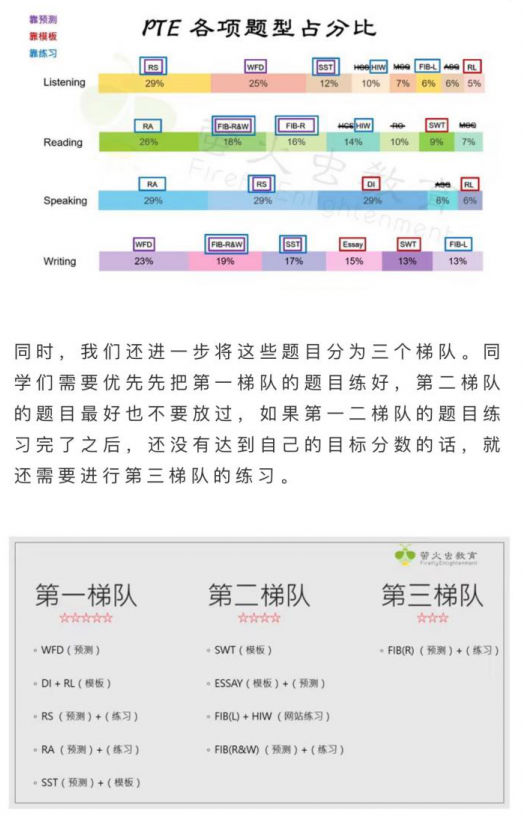
- # First mock test (right after turtorial)
  collapsed:: true
	- 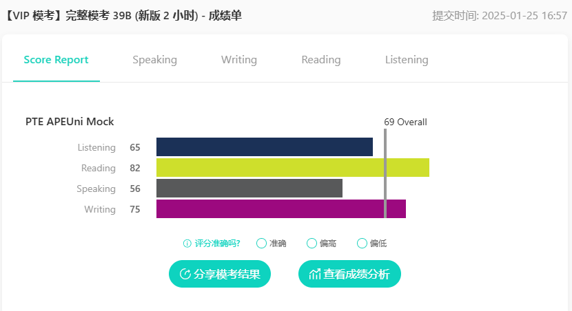{:height 261, :width 462}
	- ## Speaking
		- 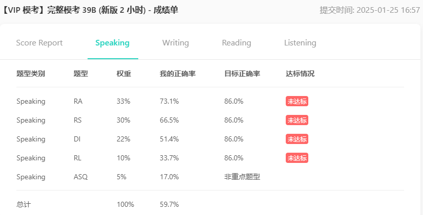{:height 261, :width 462}
	- ## Writing
		- 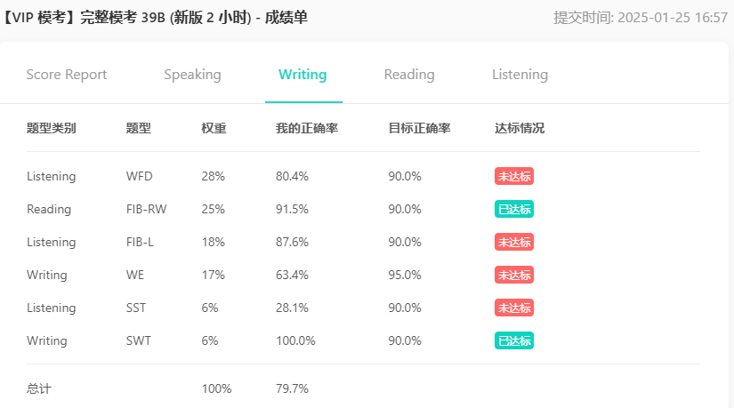{:height 261, :width 462}
	- ## Reading
		- 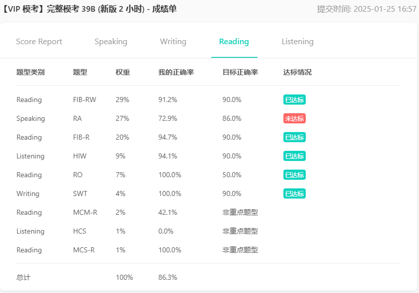{:height 261, :width 462}
	- ## Listening
		- 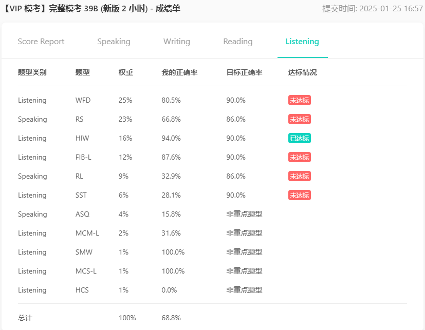{:height 261, :width 462}
	- AI Suggestion Plan
		- 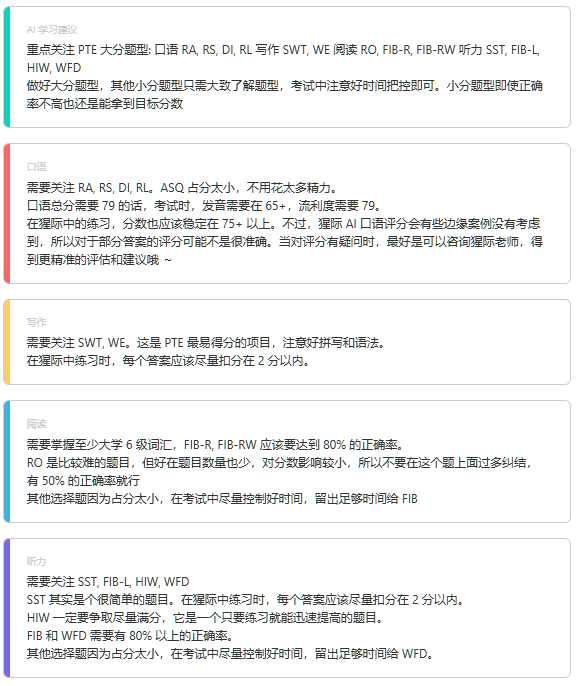
- # One month plan
	- Reference
		- [PTE 9炸自學指南: 兩個月備考攻略 (下) - 太陽彼得。闖。澳洲](https://sunpeteraustralia.com/pte-2/)
	- ## Practice Order
		- WFD → SST →RS, RA→DI, RL→ROP , FIB_R&W , FIB_R→WE, SWT→FIB_L, ASQ
		  collapsed:: true
			- **WFD **【黑科技高頻】以1.25倍速刷5遍(一二刷全部, 三四五刷錯題，生詞整理在Quizlet)
			- **SST **【螢火蟲預測】刷4遍，(四刷都刷全部)看螢火蟲參考答案，每篇整理3~4重點。每次寫完都給grammarly檢查，生詞整理在Quizlet
			- **RS **【螢火蟲預測】以1.25倍速刷3遍(一刷全部，標記錯題，二三刷錯題)，做到可以新句子覆述50%以上，且沒有停頓
			- **RA **【螢火蟲預測】刷2遍(一二刷全部)
			- **DI **【猩際預測】刷2遍(特別是圖片題)(一刷分類刷，二刷刷錯題)，做到可以給圖就說
			- **RL **【猩際預測】刷2遍，做到可以聽完音頻套模板，流利說出40s，內容不重要
			- **WE **【螢火蟲預測】刷1遍，參考螢火蟲觀點，不用每篇都寫，記熟觀點並能默寫模板，考前寫五篇即可，寫完都給grammarly檢查
			- **SWT **【螢火蟲預測】刷2遍(一二刷全部)，了解全文，並參考螢火蟲答案，整理在筆記裡
			- **RO **【黑科技高頻】刷4遍 (一二刷全部, 三四刷錯題,生詞整理在Quizlet)
			- **FIB_RW **【黑科技高頻】刷4遍 (一二刷全部, 三四刷錯題,生詞整理在Quizlet)
			- **FIB_R** 【黑科技高頻】刷4遍 (一二刷全部, 三四刷錯題,生詞整理在Quizlet)
			- **AQS **【螢火蟲全部!】刷2遍 (一刷全部，標記錯題，二刷錯題)
			- **FIB_Q** 【螢火蟲單字!】Quizlet單字聽寫模式刷1遍
	- 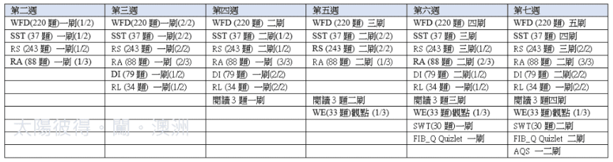
	- ## First Level
		- ### WFD
			- [PTE - Listening Write From Dictation 终极练习技巧（2019）](https://www.youtube.com/watch?v=99BPVyFmvzk)
			- 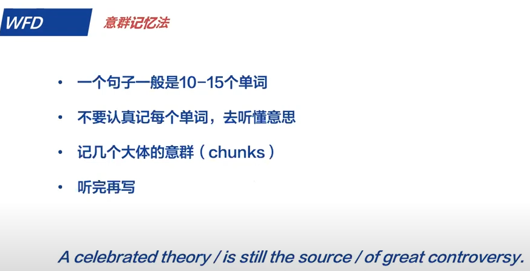{:height 232, :width 437}
			- 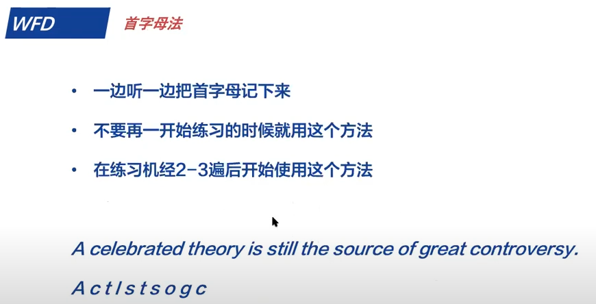{:height 232, :width 437}
			- 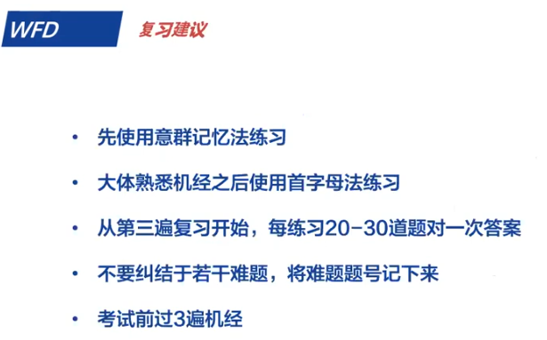{:height 232, :width 437}
			- 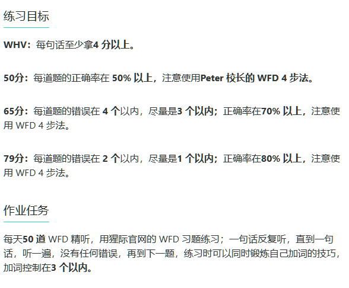{:height 232, :width 437}
		- ### SST ⭐️
			- 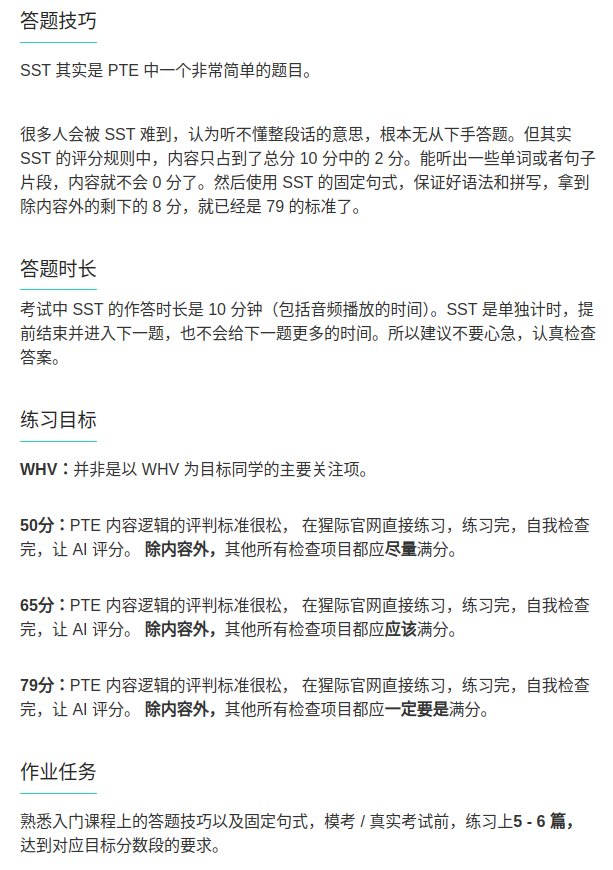{:height 232, :width 437}
			- The lecture discusses _.
			  In the beginning, the speaker explains about _.
			  Later, the speaker says _.
			  Here, the speaker also mentions _.
			  In conclusion, the lecture effectively summarizes _.
			- The talk was about _. 
			  Firstly, the speaker talked about_. 
			  Later, the speaker said _. 
			  Furthermore, the speaker mentioned that  _. 
			  In the end, the speaker emphasized that _.
		- ### RA ⭐️ > 80
			- 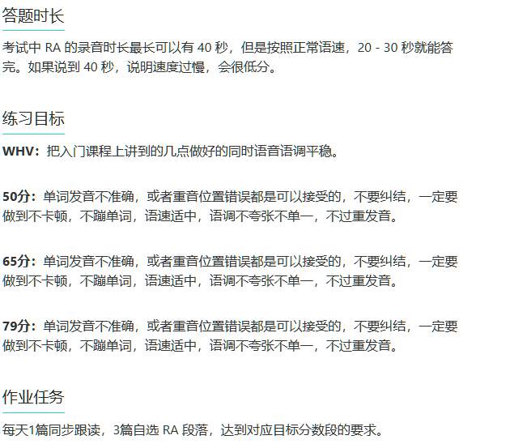{:height 232, :width 437}
		- ### RS ⭐️
			- 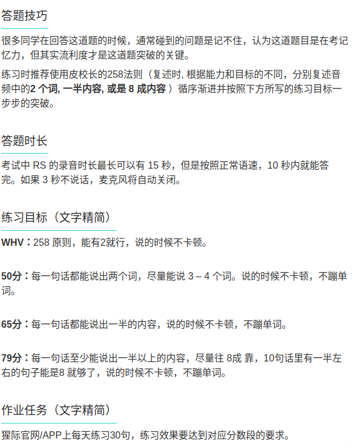{:height 232, :width 437}
		- ### DI ⭐️ 📃
			- 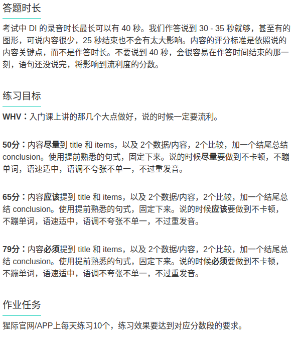{:height 232, :width 437}
			- Line / Bar
				- The graph shows us the ...
				- According to the graph, the value of ... appears to be ...
				- From the graph, it can be seen that the number of ... is around, which is greater / lower
				- The highest value of .. is displayed in, which is
				- the smallest value of ..  is found in, with a total of
				- Overall, the graph shows an increase / decrease in
			- Flow
				- The graph shows us ...
				- The first step is ..
				- Moving on, the second step is
				- After this, the next step involves
				- In addition, the .. step shows
				- The next action is
				- The following step leads to
				- The final step demonstrates
				- In summary, the graph shows us details about
			- Graph
				- The graph shows us ... in ...
				- The background is ...
				- In the middle of the graph, I observe that the ... shape / color / number is ..
				- On the left of the graph, the ... is
				- What's more, we can see from the graph that, at the right corner, there is ...
				- At the top of the image, we can see ...
				- At the bottom of the graph, we find ...
				- In conclusion, this graph outlines ...
		- ### RL ⭐️ 📃
			- 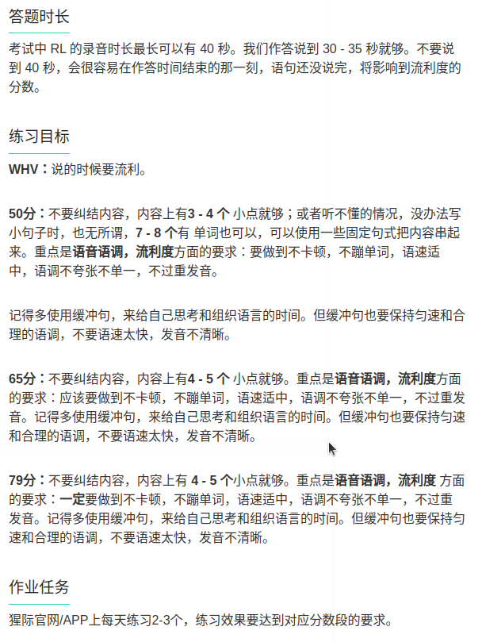{:height 232, :width 437}
			- The lecture discusses __.
			- In the beginning, the speaker explained about ___.
			- Later, the speaker said  __.
			- Here, the speaker also mentioned __.
			- In the end, the speaker talked about __.
		- ### SST
			- The lecture discusses __.
			- In the beginning, the speaker explained about ___.
			- Later, the speaker talked about  __.
			- Here, the speaker also mentioned __.
			- In conclusion, the lecture effectively summarized __ .
	- ## Second Level
		- ### ROP
			- {:height 232, :width 437}
			- 大原则
			- 1、首次出现的特定名词，一般在前；
			- 2、句中出现代词，一般在后；指代上句的尾巴；
			- 3、句首出现转折词，一般在后；
			- 4、出现the + n. ，一般在后，指代前一个主语
			- 首尾原则，换话题用首尾法，上一句尾巴接上一句头，主题词看动词前
			- 同主语不同动词顺序看含义，人看动作，物看性质，先指出 pointed to 再理论化 theorized
			- 找抓眼的信息，像时间点信息，一般按时间顺序排
			- 人名信息时，一般先“全名”，再“Ms/Mr xx”，最后用指示代词she/he said。（但是也要看首尾法double check一下）
			- 长句子里，最后介词引导的句子不影响整句逻辑，可以先不用看。只看关键的主语+谓语+宾语
			- 逻辑关系：感觉英文的文章大部分都是总分或者总分总，每个小点也是总分或者总分总，没有分总的情况。
		- ### HIW
			- 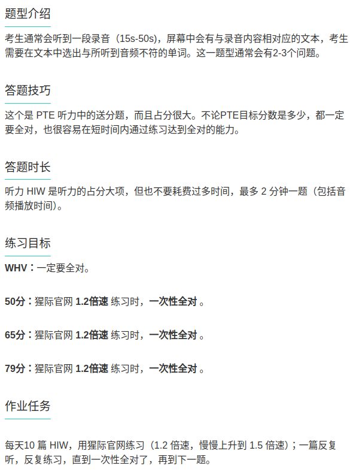
		- ### FIB - RW
			- 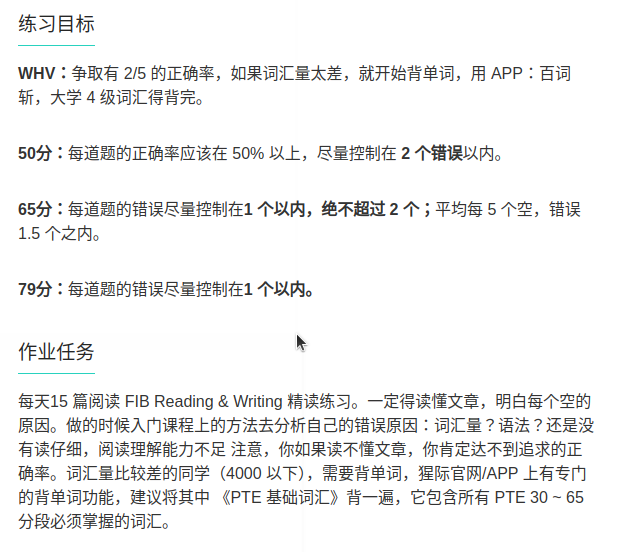{:height 232, :width 437}
		- ### FIB - L
			- 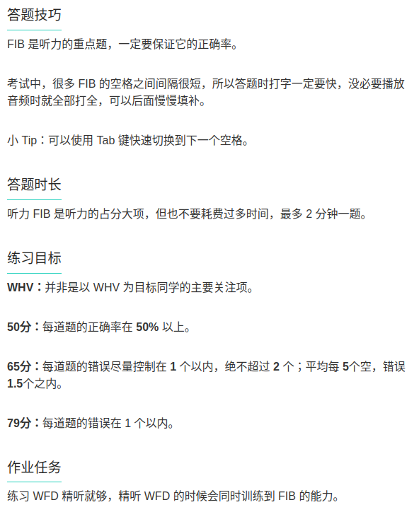{:height 232, :width 437}
	- ## Third Level
		- ### WE 📃
			- {:height 232, :width 437}
			- Better version
			- Indian Brother version
				- For text compare
				  collapsed:: true
					- Although such topics, in all likelihood, never will yield a consensual agreement, a constructive dialogue on * can lead to thought-provoking discussions. My view is that, irrespective of the numerous arguments that exist on either side, *
					  Through the course of this essay, I shall put forth my points and calculations by considering both sides of the argument.
					- There are a number of reasons in favor of my viewpoint.
					- Firstly, * . This is because * . For example, * . In conclusion, the aforementioned discussion constructively justifies my stance.
					- Another interesting point is that * . This is mainly due to the fact that * . To quote an example, the research conducted by the department of the American society also reflects on the similar line, and hence, it can be said that the proposition is convincingly justified.
					- I see that there is equally potential evidence to support the arguments I have provided, and hence, my opinion is that the topic of the statement does reflect on the justification that is provided here.
				- Although such topics, in all likelihood, never will yield a consensual agreement, a constructive dialogue on ___can lead to thought-provoking discussions. My view is that, irrespective of the numerous arguments that exist on either side, _____. Through the course of this essay, I shall put forth my points and calculations by considering both sides of the argument. 
				  There are a number of reasons in favor of my viewpoint.
				- Firstly _______. This is because ______. For example, _____. In conclusion, the aforementioned discussion constructively justifies my stance. 
				  Another interesting point is that____ . This is mainly due to the fact that ___. To quote an example, the research conducted by the department of the American society also reflects on the similar line, and hence, it can be said that the proposition is convincingly justified. 
				  I see that there is equally potential evidence to support the arguments I have provided, and hence, my opinion is that the topic of the statement does reflect on the justification that is provided here.
			- XJ version
				- It has become far more widespread these days that ________（题目中引题的话）. While some people argue that ________（别人的观点）, I believe that ________（你自己的总体观点）. 
				  To begin with, we have to acknowledge that ________（你自己的观点原因 A）. That is to say, 
				  ________（换种说法或者复写原因 A）. A relevant example of this is ________（编写一个例子）. 
				  Therefore, it is beyond the shadow of a doubt that ________（改写或复写你的观点原因 A）. 
				  What is more | However（此处根据题目要求选择是否要反面说）, another point to be taken into 
				  consideration is that ________（你自己的观点原因 B）. In other words, ________（换种说法或者复写
				  原因 B）. The recent research conducted by the professors at ________（大学名注意首字母大写）
				  University shows that ________（编一个例子）. Therefore, it is undoubted that ________（改写或复
				  写你自己的观点 B）. 
				  In conclusion, while there are strong arguments on both sides of the case, I firmly believe that 
				  _____（复写你自己的总体观点）.
		- ### SWT 📃
			- 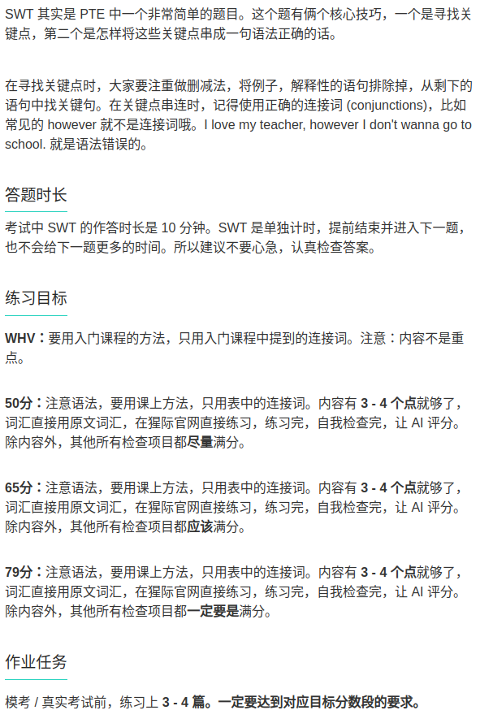{:height 232, :width 437}
		- ### FIB - R
			- 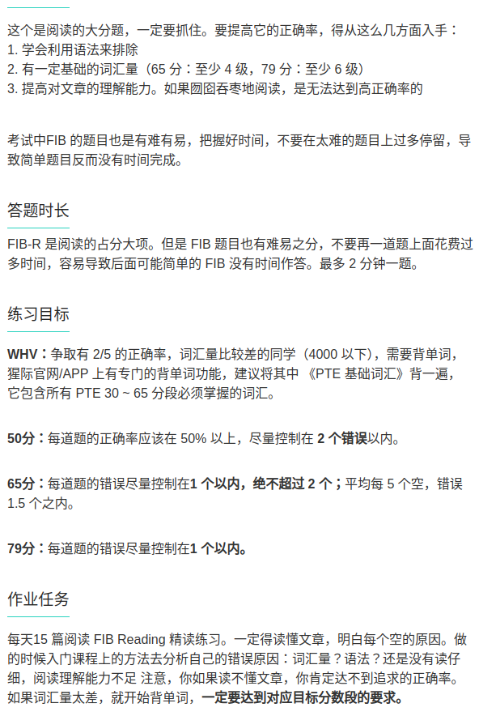{:height 232, :width 437}
	- one two three four five six seven eight nine ten eleven twelve thirteen fourteen fifteen sixteen seventeen eighteen nineteen twenty twenty one thirty forty fifty sixty seventy eighty ninety hundred thousand million billion
	- ## Practice Note from PTE 猩际
		- WFD: 50 daily, 79: accuracy 80%, error < 2, added words < 3
		- SST: 5 daily, >79, < 70 words
		- RA: 1 following, 3 self selected daily, >70+
		- RS: 30 daily, >79
		- DI: 10 daily, >79, 30 - 35s
		- RL: 5 daily, >79
		- Second level
			- FIB-RW: 10-15 daily, >79
			- ROP: 2-3 daily, need to finish in 2 minutes
			- HIW: 10 daily, 1.2 times of speed
			- FIB-L: 5 daily, error <1
			- Third level
				- WE: 2 essay per week, daily typing the template
				- SWT: 2 daily, < 75 words
				- FIB-R: 15 daily (2 hard), error < 1, 2 mins