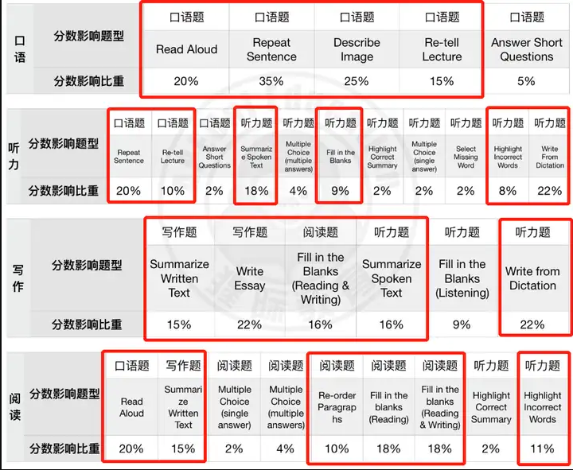

- Date: 2025
- General Guide
	- **WFD**→**SST**→**RS, RA**→**DI, RL**→**RO , FIB_R&W , FIB_R**→**WE, SWT**→**FIB_L**, **ASQ**
	- 口语：RA，RS, DI, RL
	- 写作： SWT. WE. FIB_RW(阅读)，SST（听力），WFD（听力）
	- 阅读： RO，FIB_R, FIB_RW, RA(口语)，SWT（写作），HIW（听力
	- 听力：SST, FIB_L, HIW, WFD, RS(口语), RL(口语)
	- 
- # First mock test
  collapsed:: true
	- {:height 261, :width 462}
	- ## Speaking
		- {:height 261, :width 462}
	- ## Writing
		- {:height 261, :width 462}
	- ## Reading
		- {:height 261, :width 462}
	- ## Listening
		- {:height 261, :width 462}
	- AI Suggestion Plan
		- 
-
-