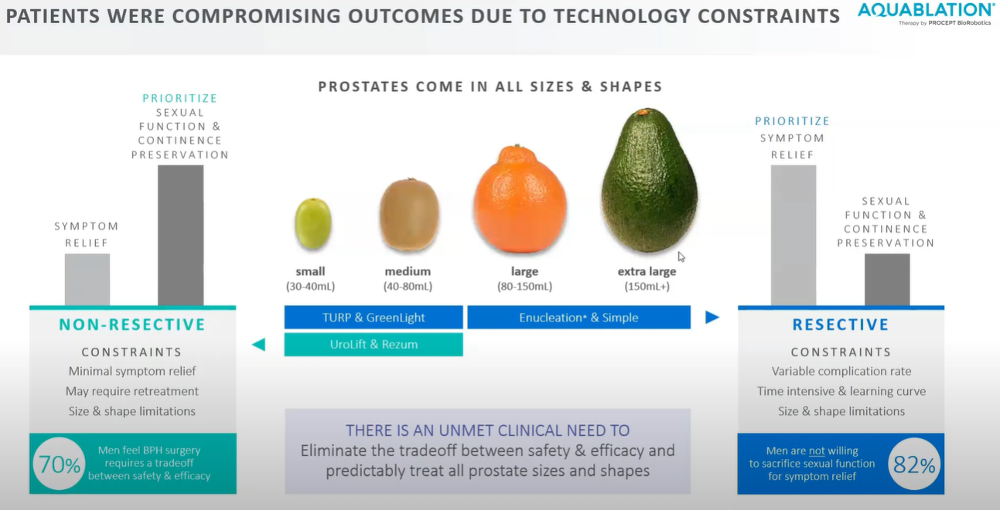
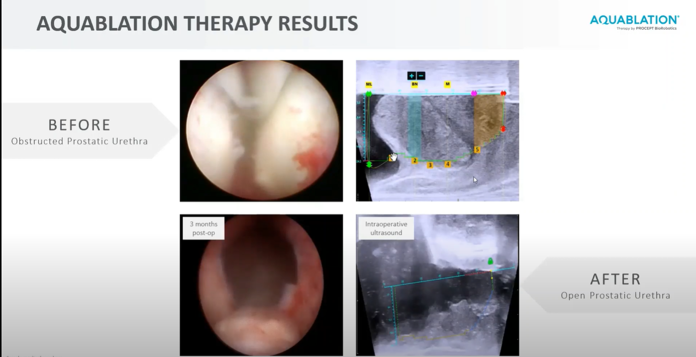
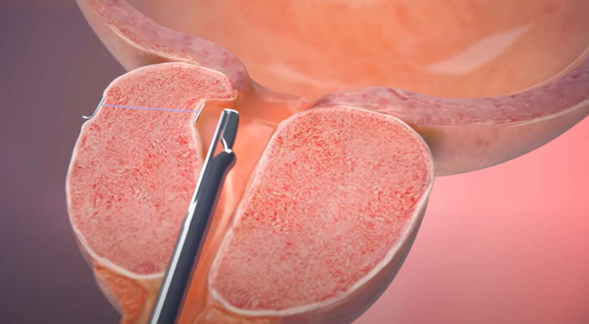

- [Urology Robotic Assisted Surgery | Surgeons | Intuitive](https://www.intuitive.com/en-us/healthcare-professionals/surgeons/urology)
	- prostatectomies, cystectomies, partial nephrectomies, pyeloplasties, and procedures for other urologic conditions.
	- [Da Vinci Surgery | Urology Robotic Assisted Surgery (intuitive.com)](https://www.intuitive.com/en-us/patients/procedures/urology)
	  {:height 221, :width 438}
- # BPH Benign prostatic hyperplasia
	- Definition
		- enlarged prostate block urinary
		- {:height 323, :width 612}
	- ## Transurethral Resection of the Prostate (TURP)
		- {:height 281, :width 574}
		- [TURP Transurethral Resection Prostate Surgery, patient education series](https://youtu.be/CB7ff7QFZkQ?t=24)
	- ## Aquablation
		- Robotic System with water jet, destroying the cells
		- {:height 451, :width 861}
		- [New treatment for enlarged prostates](https://www.youtube.com/watch?v=Q0_hQAqxhNY)
		- [Robotic Aquablation: A novel technology to treat prostate enlargement - YouTube](https://youtu.be/gVN_bwpu-l0?t=140)
		- [Aquablation - BPH Surgery Reimagined](https://youtu.be/2AJO2Tkwn6Q?t=714)
	- ## Rezum
		- Heating tissue to kill cells in [TZ zone](((643c962f-61e1-4b94-b480-cc4079ed8013)))
		- {:height 332, :width 540}
		- [Rezūm Water Vapor Therapy Procedure Animation for Physicians - YouTube](https://www.youtube.com/watch?v=ukQpfBE0oMg)
		- [Rezum procedure for enlarged prostate less invasive with great results - Medical Minute - YouTube](https://www.youtube.com/watch?v=U0-EGEqVNJ4)
	- ## UroLift
		- 4-6 implants
		- {:height 217, :width 386}
		- {:height 249, :width 440}
		- [UroLift® System Procedure Animation - YouTube](https://www.youtube.com/watch?v=e20Ak49YD6E)
- # Cancer
	- [[Prostate Biopsy]]
	- ## Brachytherapy
		- [Cancer Treatment: Brachytherapy - YouTube](https://www.youtube.com/watch?v=MZRfzLQb92A)
		- Temporary or Permanent
		- 
		- 
		- Advantage
			- 