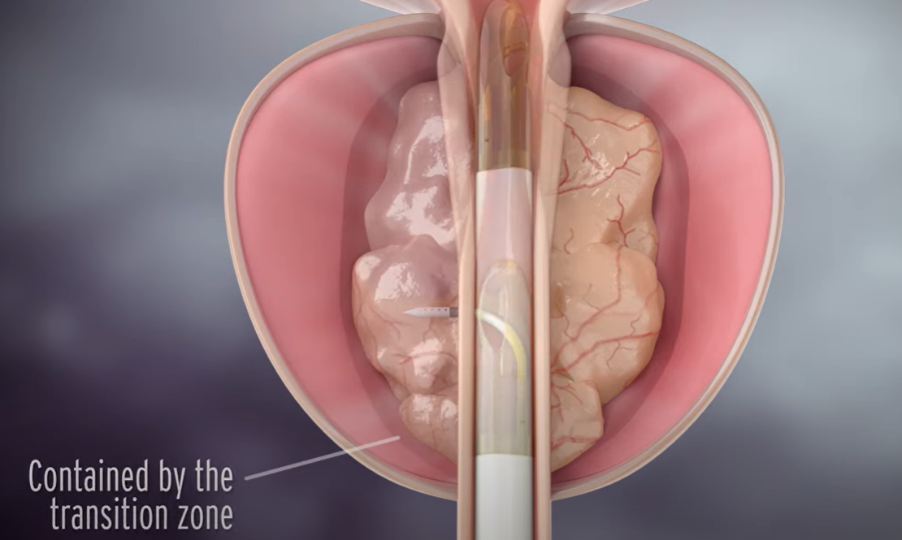

- BPH Benign prostatic hyperplasia
	- enlarged prostate block urinary
	- 
	- Transurethral Resection of the Prostate (TURP)
		- {:height 281, :width 574}
		- [TURP Transurethral Resection Prostate Surgery, patient education series](https://youtu.be/CB7ff7QFZkQ?t=24)
	- Aquablation
		- Robotic System with water jet, destroying the cells
		- {:height 451, :width 861}
		- [New treatment for enlarged prostates](https://www.youtube.com/watch?v=Q0_hQAqxhNY)
		- [Robotic Aquablation: A novel technology to treat prostate enlargement - YouTube](https://youtu.be/gVN_bwpu-l0?t=140)
		- [Aquablation - BPH Surgery Reimagined](https://youtu.be/2AJO2Tkwn6Q?t=714)
	- Rezum
		- Heating tissue to kill cells in [TZ zone](((643c962f-61e1-4b94-b480-cc4079ed8013)))
		- {:height 332, :width 540}
		- [Rezūm Water Vapor Therapy Procedure Animation for Physicians - YouTube](https://www.youtube.com/watch?v=ukQpfBE0oMg)
		- [Rezum procedure for enlarged prostate less invasive with great results - Medical Minute - YouTube](https://www.youtube.com/watch?v=U0-EGEqVNJ4)
	- UroLift
		- implant
		- {:height 217, :width 386}
		- [UroLift® System Procedure Animation - YouTube](https://www.youtube.com/watch?v=e20Ak49YD6E)